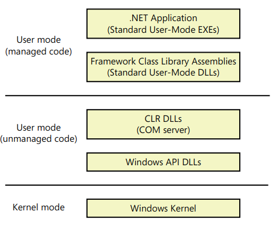
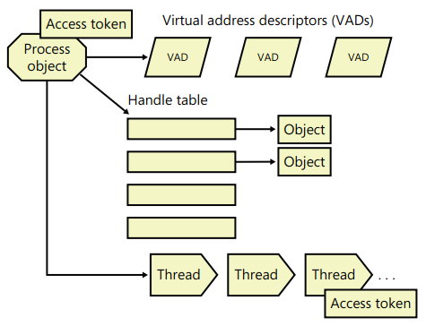
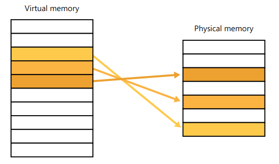
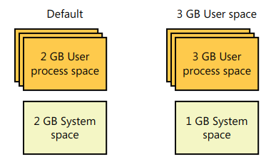
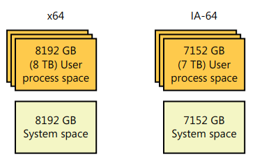

# Chapter 1 Concepts and Tools

- The Microsoft NET Framework consists of a library of classes called the **Framework Class Library (FCL)** and a **Common Language Runtime (CLR)** that provides a managed code execution environment with features such as just-in-time compilation, type verification, garbage collection, and code access security.
- Dotnet compiler converts the source code to an intermediate form (bytecode) called **Common Intermediate Language (CIL)**, which then processed by CLR to produce native code.
- The CLR is implemented as a classic **COM server** whose code resides in a standard user-mode Windows DLL. Nothing from .NET runs in kernel mode.
- All components of the dotnet framework are implemented as a standard user mode windows DLL.
- Managed code (code executed by the CLR), unmanaged code (for example, native code APIs, such as Win32).

- At the highest level of abstraction, a Windows process comprises the following:
  - A private **virtual address space (VAS)**, which is a set of virtual memory addresses that the process can use.
  - An **executable program**, which defines initial code and data and is mapped into the process’ VAS.
  - A list of **open handles** to various system resources—such as semaphores, communication ports, and files — that are accessible to all threads in the process.
  - A **security context** called an access token that identifies the user, security groups, privileges, User Account Control (UAC) virtualization state, session, and limited user account state associated with the process.
  - A unique identifier called a **process ID** (internally part of an identifier called a client ID).
  - At least **one thread of execution** (although an “empty” process is possible, it is not useful).
- Each process also points to its parent or creator process. If the parent no longer exists, this information is not updated.
- Windows maintains only the creator process ID, not a link back to the creator of the creator, and so forth.
- Just as note, a process with "non responding" state, means the threat might be running or **waiting for I/O** or some Windows synchronization object.
- A **thread** includes the following essential components:
  - Set of **CPU registers** representing the **state** of the processor.
  - **Two stacks**: one for the thread to use while executing in kernel mode and one for executing in user mode.
  - A private storage area called **thread-local storage (TLS)** for use by subsystems, run-time libraries, and DLLs
  - A unique identifier called a **thread ID** (part of an internal structure called a client ID—process IDs and thread IDs are generated out of the same namespace, so they never overlap).
  - Threads sometimes have their own **security context**, or token, that is often used by multithreaded server applications that impersonate the security context of the clients that they serve.
- The volatile registers, stacks, and private storage area are called the thread’s context (Use `GetThreadContext()` or `Wow64GetThreadContext()` to get the context.)
- Switching execution between threads involves the kernel scheduler and it can be an expensive operation, to reduce this cost, Windows implements two mechanisms:
  - **Fibers**:
    - Allow an app to schedule its own “threads” of execution rather than rely on the priority-based scheduling mechanism built into Windows.
    - More lightweight.
    - Invisible to the kernel because they’re implemented in user mode in `Kernel32.dll`.
    - Think of goroutines in golang.
  - **UMS (User mode scheduling)**.
    - Available only on 64-bit versions of Windows.
    - Provide the same basic advantages as fibers, without many of the disadvantage.
    - Have their **own kernel thread state** and are therefore visible to the kernel, which allows multiple UMS threads to issue blocking system calls, share and contend on resources, and have per-thread state.
    - However, as long as two or more UMS threads only need to perform work in user mode, they can periodically switch execution contexts (by yielding from one thread to another) **without involving the scheduler**: the context switch is done in user mode.
    - From the kernel’s perspective, the same kernel thread is still running and nothing has changed When a UMS thread performs an operation that requires entering the kernel (such as a system call), it switches to its dedicated kernel-mode thread (called a directed context switch).
- All the threads in a process have full read-write access to the process virtual address space.
- Threads cannot accidentally reference the address space of another process, however, unless the other process makes available part of its private address space as a **shared memory section** (called file mapping object in the Windows API) or unless one process has the right to open another process to use cross-process memory functions such as `ReadProcessMemory()` and `WriteProcessMemory()`.

- The **virtual address descriptors (VADs)** are data structures that the memory manager uses to keep track of the virtual addresses the process is using.
- By default, threads don’t have their own access token, but they can obtain one, thus allowing individual threads to impersonate the security context of another process—including processes on a remote Windows system—without affecting other threads in the process.

## Job

- Windows provides an extension to the process model called a **job**.
- A job object’s main function is to allow groups of processes to be managed and manipulated as a unit.
- In some ways, the job object **compensates for the lack of a structured process tree** in Windows—yet in many ways it is more powerful than a UNIX-style process tree.

## Virtual Memory

- Windows implements a virtual memory system based on a flat (linear) address space that provides each process with the illusion of having its own large, private address space.
- At run time, the memory manager, with assistance from hardware, translates, or maps, the virtual addresses into physical addresses, where the data is actually stored.
- By controlling the protection and mapping, the OS can ensure that individual processes don’t bump into one another or overwrite OS data .

- Because most systems have much less physical memory than the total virtual memory in use by the running processes, the memory manager transfers, or pages, some of the memory contents to disk.
- Paging data to disk frees physical memory so that it can be used for other processes or for the OS itself.
- When a thread accesses a VA that has been paged to disk, the virtual memory manager loads the information back into memory from disk.
- Applications don’t have to be altered in any way to take advantage of paging because hardware support enables the memory manager to page without the knowledge or assistance of processes or threads.
- The size of the virtual address space varies for each hardware platform.
- On 32-bit x86, a process can address **4GB of memory space**.
  - By default, Windows allocates half this address space (the lower half of the 4-GB virtual address space, from **0x00000000 through 0x7FFFFFFF**) to processes for their unique private storage.
  - And uses the other half (the upper half, addresses **0x80000000 through 0xFFFFFFFF**) for its own protected OS memory utilization.
  - Windows supports boot-time options (the `increaseuserva` qualifier in the Boot Configuration Database that give processes running specially marked programs (the large address space aware flag must be set in the header of the executable image) the ability to use up to **3 GB of private address space** (leaving 1 GB for the kernel).
  

  - Although 3 GB is better than 2 GB, it’s still not enough virtual address space to map very large (multi-gigabyte) databases.
  - To address this need on 32-bit systems, Windows provides a mechanism called **Address Windowing Extension (AWE)**, which allows a 32-bit application to allocate up to **64 GB** of physical memory and then map views, or windows, into its 2-GB virtual address space.
  - Although using AWE puts the burden of managing mappings of virtual to physical memory on the programmer, it does address the need of being able to directly access more physical memory than can be mapped at any one time in a 32-bit process address space.
- 64-bit Windows provides a much larger address space for processes:
  - **7152 GB** on IA-64 systems.
  - **8192 GB** on x64 systems.
  - Note that these sizes do not represent the architectural limits for these platforms.
  - 64 bits of address space is over 17 billion GB, but current 64-bit hardware limits this to smaller values.
  - And Windows implementation limits in the current versions of 64-bit Windows further reduce this to 8192 GB (8 TB)
  

### Kernel Mode vs. User Mode

- To prevent user applications to modify critical OS data, Windows uses two processor access modes (even if the processor on which Windows is running supports more than two): **user mode** and **kernel mode**.
- User application code runs in user mode, whereas OS code (such as system services and device drivers) runs in kernel mode.
- Kernel mode refers to a mode of execution in a processor that grants access to all system memory and all CPU instructions.
- Although each Windows process has its own private memory space, the kernel-mode OS and device driver code **share a single virtual address space**.
- Each page in virtual memory is tagged to indicate what **access mode** the processor must be in to read and/or write the page.
- Pages in system space can be accessed only from kernel mode, whereas all pages in the user address space are accessible from user mode.
- Read-only pages (such as those that contain static data) are **not writable from any mode**.
- Additionally, on processors that support **no-execute memory protection**, Windows marks pages containing data as non-executable, thus preventing inadvertent or malicious code execution in data areas.
- 32-bit Windows doesn’t provide any protection to private read/write system memory being used by components running in kernel mode.
- In other words, once in kernel mode, OS and device driver code has complete access to system space memory and can bypass Windows security to access objects.

## Terminal Services and Multiple Sessions

- Terminal Services refers to the support in Windows for multiple interactive user sessions on a single system.
- With Windows Terminal Services, a remote user can establish a session on another machine, log in, and run applications on the server.
- The server transmits the graphical user interface to the client (as well as other configurable resources such as audio and clipboard), and the client transmits the user’s input back to the server.
- Similar to the **X Window System**, Windows permits running individual apps on a server system with the display remoted to the client instead of remoting the entire desktop.
- Note that _Windows Client_ support only one remote user to connect to the machine, however in _Windows Server_, it supports **2 simultaneous remote connections**.

### Objects and Handles

- In the windows OS, for example: a file, process, thread or event object are examples of **kernel objects**, they are based on low level objects that Windows creates and manages (object manager).
- These objects are **opaque** meaning that you must call an object service to get/set data into it.
- Not all data structures in Windows are objects. Only data that needs to be shared, protected, named, or made visible to user-mode programs (via system services) is placed in objects .

## Security

- Windows has three forms of access control over objects:
  - **Discretionary Access Control (DAC)**.
  - **Privileged access control (PAC)**.
  - **Mandatory Integrity Control (MAC)**.

## Registry

- Most internal Windows strings are implemented in **Unicode**, when you use the ANSI version of an API, Windows have to convert it to unicode and also when returning back from the API, this have a small performance impact.

## Digging into Windows Internals

- **Performance Monitor** is a valuable tool for system monitoring, it also contains performance counter logs.
- It includes hundreds of base and extensible counters for various objects
- **Resource Monitor** shows four primary system resources: CPU, Disk, Network, and Memory.
- Example of information you can grab using these tools:
  - Per-process CPU usage.
  - CPU usage of each service hosting process.
  - Physical memory bar graph displays the current organization of physical memory into either hardware reserved, in use, modified, standby, and free memory.
  - Per-file information for I/Os in a way that makes it easy to identify the most accessed, written to, or read from files on the system.
  - Active network connections and which processes own them, as well as how much data is going through them.

## Kernel debugging

- Kernel debugging means examining internal kernel data structures and/or stepping through functions in the kernel.
- User mode debugging has 2 modes to attach to a process:
- **Invasive**:
  - Unless specified otherwise, when you attach to a running process, the `DebugActiveProcess()` API is used to establish a connection between the debugger and the debugee.
  - This permits examining and/or changing process memory, setting breakpoints, and performing other debugging functions.
  - Windows allows you to stop debugging without killing the target process, as long as the debugger is detached, not killed
- **Noninvasive**:
  - The debugger simply opens the process with the `OpenProcess()` API.
  - It does not attach to the process as a debugee.
  - This allows you to examine and/or change memory in the target process, but you cannot set breakpoints.
- There are two debuggers that can be used for kernel debugging:
  - Command-line version **(Kd.exe)**
  - Graphical user interface (GUI) version **(Windbg exe)**
- Both provide the same set of commands, so which one you choose is a matter of personal preference.
- **LiveKd** is a free tool from _Sysinternals_ that allows you to use the standard Microsoft kernel debuggers just described to examine the running system **without booting the system in debugging mode**.
  - Useful when kernel-level troubleshooting is required on a machine that wasn’t booted in debugging mode.
  - Certain issues might be hard to reproduce reliably, so a reboot with the debug option enabled might not readily exhibit the error.

## Windows Software Development Kit (SDK)

- Contains the documentation, C header files, and libraries necessary to compile and link Windows applications.
- The header files contained in the Windows SDK always match the latest version of Windows, whereas the version that comes with Visual C++ might be an older version that was current when Visual C++ was released).
- Items of interest in the Windows SDK include the Windows API header files `(\Program Files\Microsoft SDKs\Windows\v7.0A\Include)`. A few of these tools are also shipped as sample source code in both the Windows SDK and the MSDN Library.

## Windows Driver Kit (WDK)

- Aimed at device driver developers, it is an abundant source of Windows internals information.
- Contains a comprehensive description of all the Windows kernel support functions and mechanisms used by device drivers in both a tutorial and reference form.
- Contains header files (in particular, `ntddk.h`, `ntifs.h`, and `wdm.h`) that define key internal data structures and constants as well as interfaces to many internal system routines.

## Sysinternals Tools

- Various tools which helps diagnose, troubleshoot, and monitor the windows OS.
- The most popular tools include Process Explorer and Process Monitor.
- Heavily used in malware analysis.
