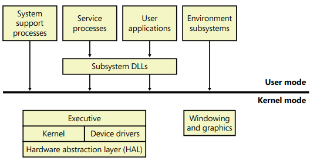
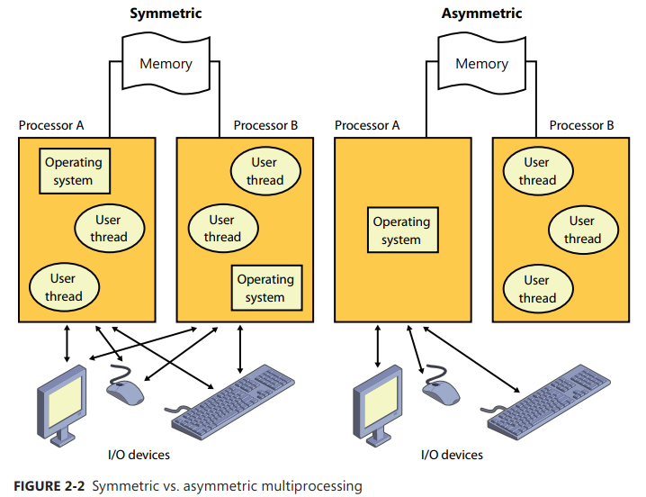
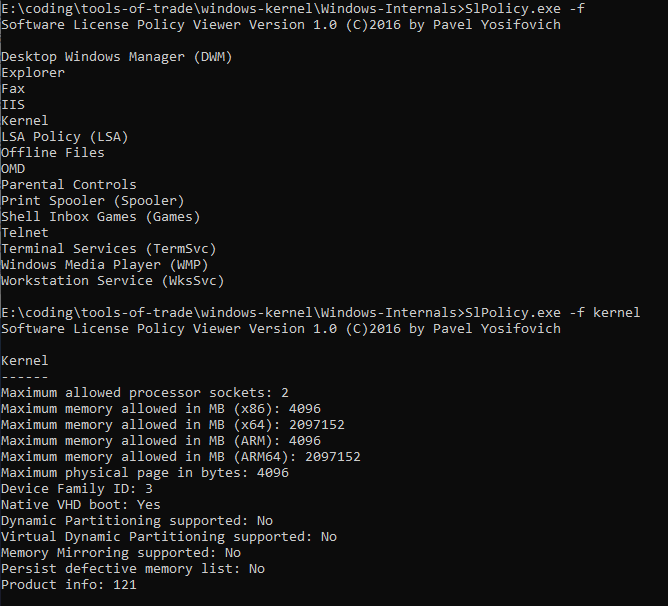
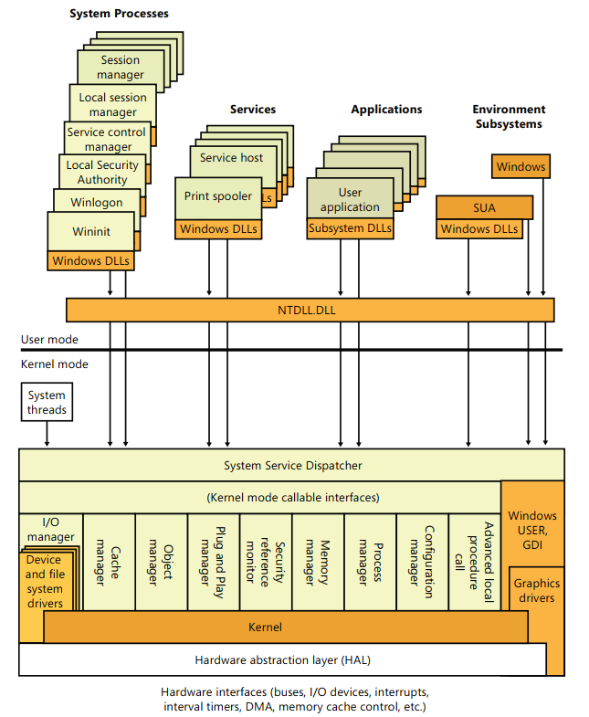

# Chapter 2: System Architecture

## Operating System Model

- Windows is similar to most UNIX systems in that it’s a **monolithic** OS in the sense that the bulk of the OS and device driver code **shares the same kernel-mode** protected memory space.
- Here is a simplified version of this architecture: <p align="center"></p>
- The four basic types of user-mode processes are described as follows:
  - Fixed (or hardwired) **system support processes**, such as the logon process and the Session Manager, that are not Windows services.
  - **Service processes** that host Windows services, such as the _Task Scheduler_ and _Print Spooler_ services. Services generally have the requirement that they run independently of user logons.
  - **User applications**, which can be one of the following types: Windows 32-bit or 64-bit, Windows 3 1 16-bit, MS-DOS 16-bit, or POSIX 32-bit or 64-bit. Note that 16-bit applications can be run only on 32-bit Windows.
  - **Environment subsystem server processes**, which implement part of the support for the OS environment, or personality, presented to the user and programmer. Windows NT originally shipped with three environment subsystems: Windows, POSIX, and OS/2 However, the POSIX and OS/2 subsystems last shipped with Windows 2k. The Ultimate and Enterprise editions of Windows client as well as all of the server versions include support for an enhanced POSIX subsystem called **Subsystem for Unix-based Applications (SUA)**.
- User applications don’t call the native Windows OS services directly; rather, they go through one or more **subsystem dynamic-link libraries (DLLs)**.
- The role of the subsystem DLLs is to translate a documented function into the appropriate internal (and generally undocumented) native system service calls. This translation might or might not involve sending a message to the environment subsystem process that is serving the user application.
- The kernel-mode components of Windows include the following:
  - The Windows executive.
  - The Windows kernel.
  - Device drivers.
  - The hardware abstraction layer (HAL).
  - The windowing and graphics system.
- List of important file names of the core Windows OS components:
<p align="center"></p>

### Portability

- Windows was designed with a variety of hardware architectures. Back in time, _MIPS, Alpha AXP_ and _PowerPC_ were supported but got dropped later due to changing market demands which left only _Intel x86/x64_ the only one kept being supported.
- Windows has a **layered design**, with low-level portions of the system that are processor architecture-specific or platform-specific **isolated** into separate modules so that upper layers of the system can be shielded from the differences between architectures and among hardware platforms.
- The vast majority of Windows is written in **C**, with **some portions in C++**. **Assembly** is used only for those parts of the OS that need to communicate directly with system hardware (such as the interrupt trap handler) or that are extremely performance-sensitive (such as context switching).

### Symmetric Multiprocessing

- **Multitasking** is the OS technique for sharing a single processor among multiple threads of execution.
- When a computer has more than one processor, however, it can execute multiple threads simultaneously.
- Thus, whereas a **multitasking** OS only appears to execute multiple threads at the same time, a **multiprocessing** OS actually does it, executing one thread on each of its processors.
- Windows is a **symmetric multiprocessing (SMP)** OS.
  - There is no master processor.
  - the OS as well as user threads can be scheduled to run on any processor.
  - Also, all the processors share just one memory space.
- This model contrasts with **asymmetric multiprocessing (ASMP)**, in which the OS typically selects one processor to execute OS kernel code while other processors run only user code.
- Windows also supports three modern types of multiprocessor systems: **multicore, Hyper-Threading enabled, and NUMA** (non-uniform memory architecture).
<p align="center"></p>

### Scalability

- One of the key issues with multiprocessor systems is **scalability**.
- Windows incorporates several features that are crucial to its success as a multiprocessor OS:
  - The ability to run OS code on any available processor and on multiple processors at the same time.
  - Multiple threads of execution within a single process, each of which can execute simultaneously on different processors.
  - Fine-grained synchronization within the kernel (such as **spinlocks**, **queued spinlocks**, and **pushlocks**).
  - Programming mechanisms such as I/O completion ports (that facilitate the efficient implementation of multithreaded server processes that can scale well on multiprocessor systems).

### Differences Between Client and Server Versions

- Windows ships in both client and server retail packages.
- The client version differs by (Pro, Ultimate, Home, ...):
  - The number of processors supported (in terms of sockets, not cores or threads).
  - The amount of physical memory supported.
  - The number of concurrent network connections supported.
  - And features like: Multi-Touch, Aero, Desktop Compositing, etc...
- The server systems are optimized by default for **system throughput** as high performance application servers, whereas the client version (although it has server capabilities) is optimized for **response time** for **interactive desktop use**.
- Look for `GetVersion(Ex)` or `RtlGetVersion` to determine which editions of Windows you are running on. Worth checking as well: `VerifyVersionInfo()` or `RtlVerifyVersionInfo()`.
- Windows supports more than 100 different features that can be enabled through the software licensing mechanism.
- You can use the `SlPolicy` tool available [here](https://github.com/zodiacon/WindowsInternals/tree/master/SlPolicy) to display these policy values: <p align="center"></p>

### Checked vs Free builds

- **Checked build** is a recompilation of the Windows source code with a compile time flag defined called `DBG`:
  - Easier to understand the machine code, the post-processing of the Windows binaries to optimize code layout for faster execution is not performed.
  - Aid device driver developers because it performs more stringent error checking on kernel-mode functions called by device drivers or other system code.
  - Additional detailed informational tracing that can be enabled for certain components.
- **Free build** is used in production environments: is built with full compiler optimization.

### Windows Architecture

<p align="center"></p>

### Environment Subsystems and Subsystem DLLs

- The role of an environment subsystem is to **expose** some subset of the base Windows executive system services to application programs.
- User applications don’t call Windows system services **directly**. Instead, they go through one or more subsystem DLLs.
- These libraries export the documented interface that the programs linked to that subsystem can call. For example, the Windows subsystem DLLs (such as `kernel32.dll`, `advapi32.dll`, `user32.dll`, and `gdi32.dll`) implement the Windows API functions. The **SUA** subsystem DLL (`psxdll.dll`) implements the **SUA API** functions.
- When an application calls a function in a subsystem DLL, one of three things can occur:
  - The function is **entirely implemented in user mode** inside the subsystem DLL. Examples of such functions include `GetCurrentProcess` (which always returns –1, a value that is defined to refer to the current process in all process-related functions) and `GetCurrentProcessId` (The process ID doesn’t change for a running process, so this ID is retrieved from a cached location, thus avoiding the need to call into the kernel).
  - The function requires **one or more calls** to the Windows executive For example, the Windows `ReadFile` and `WriteFile` functions involve calling the underlying internal (and undocumented) Windows I/O system services `NtReadFile` and `NtWriteFile`, respectively.
  - The function requires some work to be done in the **environment subsystem process** (The environment subsystem processes, running in user mode, are responsible for maintaining the state of the client applications running under their control). In this case, a client/server request is made to the environment subsystem via a message sent to the subsystem to perform some operation. The subsystem DLL then waits for a reply before returning to the caller. Some functions can be a combination of the second and third items just listed, such as the Windows `CreateProcess` and `CreateThread` functions.
- The Windows subsystem consists of the following major components:
  - For each session, an instance of the **environment subsystem process (csrss.exe)** loads three DLLs (Basesrv.dll, Winsrv.dll, and Csrsrv.dll).
  - A **kernel-mode device driver (Win32k.sys)** includes (Window manager, GDI & wrappers for DirectX).
  - The **console host process (Conhost exe)**, which provides support for console (character cell) applications.
  - **Subsystem DLLs** (such as Kernel32.dll, Advapi32.dll, User32.dll, and Gdi32.dll) that translate documented Windows API functions into the appropriate and mostly undocumented kernel-mode system service calls in Ntoskrnl exe and Win32k sys.

### Subsystem Startup

- Subsystems are **started** by the **Session Manager (Smss exe)** process.
- The Required value lists the subsystems that load when the system boots.
- The Windows value contains the file specification of the Windows subsystem, **Csrss.exe**, which stands for _Client/Server Run-Time Subsystem_.

### Windows Subsystem

- To avoid duplicating code, the SUA subsystem calls services in the Windows subsystem to perform display I/O.
- The Windows subsystem consists of the following major components:
  - For each session, an instance of the environment subsystem process (Csrss.exe) loads three DLLs (Basesrv.dll, Winsrv.dll, and Csrsrv.dll)
  - A kernel-mode device driver (Win32k.sys): Window manager + GDI + Wrappers for DirectX.
  - The console host process (Conhost.exe), which provides support for console (character cell) applications.
  - Subsystem DLLs: the bridge to Ntoskrnl exe and Win32k.sys.
  - Graphics device drivers for hardware-dependent graphics display drivers, printer drivers, and video miniport drivers.

#### Console Window Host

- In the original Windows subsystem design, the subsystem process (Csrss exe) was responsible for the managing of console windows and each console application (such as Cmd exe, the command prompt) communicated with Csrss.
- Windows now uses a separate process, the **console window host (Conhost exe)**, for each console window on the system (A single console window can be shared by multiple console applications, such as when you launch a command prompt from the command prompt By default, the second command prompt shares the console window of the first.)

### Subsystem for Unix-based Applications

- SUA enables compiling and running custom UNIX-based applications on a computer running Windows Server or the Enterprise or Ultimate editions of Windows client.

### Ntdll.dll

- special system support library primarily for the use of subsystem DLLs It contains two types of functions:
  - System service dispatch stubs to Windows executive system services
  - Internal support functions used by subsystems, subsystem DLLs, and other native images:
    - image loader functions (Ldr) + the heap manager
    - Windows subsystem process communication functions (Csr)
    - run-time library routines (Rtl) + user-mode debugging (DbgUi)
    - Event Tracing for Windows (Etw)
    - user-mode asynchronous procedure call (APC) dispatcher and exception dispatcher.
    - a small subset of the C Run-Time (CRT) routines.

### Executive

- is the upper layer of Ntoskrnl exe (The kernel is the lower layer, it includes the following types of functions:
  - **System services**: Functions that are exported and callable from user mode.
  - Device driver functions that are called through the use of the `DeviceIoControl()`.
  - Functions that are exported and callable from kernel mode but are **not documented** in the WDK (like functions called by the boot video driver `Inbv`)
  - Functions that are defined as **global symbols** but are not exported.
    - `Iop` (internal I/O manager support functions) or `Mi` (internal memory management support functions)
  - Functions that are internal to a module that are not defined as global symbols.
- The executive contains the following major components, each of which is covered in detail in a subsequent chapter of this book:
  - **configuration manager**: responsible for implementing and managing the system registry.
  - **process manager** creates and terminates processes and threads. The underlying support for processes and threads is implemented in the Windows kernel; the executive adds additional semantics and functions to these lower-level objects.
  - **security reference monitor** enforces security policies on the local computer. It guards operating system resources, performing run-time object protection and auditing.
  - **I/O manager** implements device-independent I/O and is responsible for dispatching to the appropriate device drivers for further processing.
  - **Plug and Play (PnP)** manager determines which drivers are required to support a particular device and loads those drivers.
  - **power manager** coordinates power events and generates power management I/O notifications to device drivers.
  - **Windows Driver Model Windows Management Instrumentation routines** enable device drivers to publish performance and configuration information and receive commands from the user-mode WMI service.
  - **cache manager** improves the performance of file-based I/O by causing recently referenced disk data to reside in main memory for quick access.
  - **memory manager** implements virtual memory, a memory management scheme that provides a large, private address space for each process that can exceed available physical memory.
  - **logical prefetcher** and **Superfetch** accelerate system and process startup by optimizing the loading of data referenced during the startup of the system or a process.
- Additionally, the executive contains four main groups of support functions that are used by the executive components just listed. About a third of these support functions are documented in the WDK because device drivers also use them. These are the four categories of support functions:
  - **object manager** which creates, manages, and deletes Windows executive objects and abstract data types that are used to represent operating system resources such as processes, threads, and the various synchronization objects.
  - **advanced LPC facility** (ALPC): passes messages between a client process and a server process on the same computer. Among other things, ALPC is used as a local transport for remote procedure call (RPC), an industry-standard communication facility for client and server processes across a network.
  - A broad set of **common run-time library** functions, such as string processing, arithmetic operations, data type conversion, and security structure processing.
  - **executive support routines**, such as system memory allocation (paged and nonpaged pool), interlocked memory access, as well as three special types of synchronization objects: resources, fast mutexes, and pushlocks.
- The executive also contains a variety of other infrastructure routines:
  - **kernel debugger library**, which allows debugging of the kernel from a debugger supporting KD.
  - user-mode debugging framework.
  - **kernel transaction manager**, which provides a common, two-phase commit mechanism to resource managers, such as the _transactional registry (TxR)_ and _transactional NTFS (TxF)_.
  - **hypervisor library** provides kernel support for the virtual machine environment and optimizes certain parts of the code when the system knows it’s running in a client partition (virtual environment)
  - **errata manager** provides workarounds for nonstandard or noncompliant hardware devices.
  - **driver verifier** implements optional integrity checks of kernel-mode drivers and code
    \_ **event tracing for windows (ETW)** provides helper routines for systemwide event tracing for kernel-mode and user-mode components
  - **Windows diagnostic infrastructure** enables intelligent tracing of system activity based on diagnostic scenarios
  - **Windows hardware error architecture** support routines provide a common framework for reporting hardware errors
  - **file-system runtime library** provides common support routines for file system drivers.

### Kernel

- Consists of a set of functions in `Ntoskrnl.exe` that provides fundamental mechanisms such as:
  - **thread scheduling** and **synchronization services** used by the executive components, as well as low-level hardware architecture–dependent support (such as **interrupt and exception dispatching**) that is different on each processor architecture.
  - Written mostly in C + assembly for specialized processor instructions.
  - Expose many functions documented in the WDK (Ke).

### Kernel Objects

- Outside the kernel, the executive represents threads and other shareable resources as objects.
- These objects require some **policy overhead**, such as object handles to manipulate them, security checks to protect them, and resource quotas to be deducted when they are created.
- This overhead is eliminated in the kernel, which implements a set of simpler objects, called **kernel objects**, that help the kernel control central processing and support the creation of executive objects.
- Most executive-level objects encapsulate one or more kernel objects, incorporating their kernel-defined attributes.
- The executive uses kernel functions to create instances of kernel objects, to manipulate them, and to construct the more complex objects it provides to user mode

### Kernel Processor Control Region and Control Block (KPCR and KPRCB)

- The kernel uses a data structure called the **kernel processor control region**, or KPCR, to store processor-specific data:
  - IDT, TSS, GDT.
  - interrupt controller state, which it shares with other modules, such as the ACPI driver and the HAL.
  - can be accessed via fs/gs register on 32bit/64bits Winsows system correspondingly.
  - On IA64 systems, the KPCR is always located at `0xe0000000ffff0000`
- KPCR also contains an embedded data structure called the **kernel processor control block** or KPRCB.
  - is a private structure used only by the kernel code in Ntoskrnl.exe
  - contains scheduling information such as the current, next, and idle threads scheduled for execution on the processor
  - the dispatcher database for the processor (which includes the ready queues for each priority level)
  - the DPC queue
  - CPU vendor and identifier information (model, stepping, speed, feature bits);
  - CPU and NUMA topology (node information, cores per package, logical processors per core, and so on)
  - cache sizes
  - time accounting information (such as the DPC and interrupt time); and more
  - also contains all the statistics for the processor, such as I/O statistics, cache manager statistics, DPC statistics, and memory manager statistics
  - sometimes used to store cache-aligned, per-processor structures to optimize memory access, especially on NUMA systems
    - For example, the nonpaged and paged-pool system look-aside lists are stored in the KPRCB.

```c
0: kd> !pcr
KPCR for Processor 0 at fffff80002c4a000:
    Major 1 Minor 1
	NtTib.ExceptionList: fffff80000b95000
	    NtTib.StackBase: fffff80000b94000
	   NtTib.StackLimit: 0000000000000000
	 NtTib.SubSystemTib: fffff80002c4a000
	      NtTib.Version: 0000000002c4a180
	  NtTib.UserPointer: fffff80002c4a7f0
	      NtTib.SelfTib: 000000007efdb000

	            SelfPcr: 0000000000000000
	               Prcb: fffff80002c4a180
	               Irql: 0000000000000000
	                IRR: 0000000000000000
	                IDR: 0000000000000000
	      InterruptMode: 0000000000000000
	                IDT: 0000000000000000
	                GDT: 0000000000000000
	                TSS: 0000000000000000

	      CurrentThread: fffff80002c5a1c0
	         NextThread: fffffa800586bb50
	         IdleThread: fffff80002c5a1c0

	          DpcQueue:

0: kd> !prcb
PRCB for Processor 0 at fffff80002c4a180:
Current IRQL -- 13
Threads--  Current fffff80002c5a1c0 Next fffffa800586bb50 Idle fffff80002c5a1c0
Processor Index 0 Number (0, 0) GroupSetMember 1
Interrupt Count -- 000174c7
Times -- Dpc    00000012 Interrupt 00000012
         Kernel 00000574 User      00000072

0: kd> dt nt!_KPCR
   +0x000 NtTib            : _NT_TIB
   +0x000 GdtBase          : Ptr64 _KGDTENTRY64
   +0x008 TssBase          : Ptr64 _KTSS64
   +0x010 UserRsp          : Uint8B
   +0x018 Self             : Ptr64 _KPCR
   +0x020 CurrentPrcb      : Ptr64 _KPRCB
   +0x028 LockArray        : Ptr64 _KSPIN_LOCK_QUEUE
   +0x030 Used_Self        : Ptr64 Void
   +0x038 IdtBase          : Ptr64 _KIDTENTRY64
   +0x040 Unused           : [2] Uint8B
   +0x050 Irql             : UChar
   +0x051 SecondLevelCacheAssociativity : UChar
   +0x052 ObsoleteNumber   : UChar
   +0x053 Fill0            : UChar
   +0x054 Unused0          : [3] Uint4B
   +0x060 MajorVersion     : Uint2B
   +0x062 MinorVersion     : Uint2B
   +0x064 StallScaleFactor : Uint4B
   +0x068 Unused1          : [3] Ptr64 Void
   +0x080 KernelReserved   : [15] Uint4B
   +0x0bc SecondLevelCacheSize : Uint4B
   +0x0c0 HalReserved      : [16] Uint4B
   +0x100 Unused2          : Uint4B
   +0x108 KdVersionBlock   : Ptr64 Void
   +0x110 Unused3          : Ptr64 Void
   +0x118 PcrAlign1        : [24] Uint4B
   +0x180 Prcb             : _KPRCB

0: kd> dt nt!_KPRCB
   +0x000 MxCsr            : Uint4B
   +0x004 LegacyNumber     : UChar
   +0x005 ReservedMustBeZero : UChar
   +0x006 InterruptRequest : UChar
   +0x007 IdleHalt         : UChar
   +0x008 CurrentThread    : Ptr64 _KTHREAD
   +0x010 NextThread       : Ptr64 _KTHREAD
   +0x018 IdleThread       : Ptr64 _KTHREAD
   +0x020 NestingLevel     : UChar
   +0x021 PrcbPad00        : [3] UChar

```

### Hardware Support

- The other major job of the kernel is to **abstract** or **isolate** the executive and device drivers from variations between the hardware architectures supported by Windows:
  - includes handling variations in functions such as **interrupt handling**, **exception dispatching**, and **multiprocessor synchronization**.
- Some kernel interfaces (such as _spinlock_ routines) are actually implemented in the HAL because their implementation can vary for systems within the same architecture family.
- Other examples of architecture-specific code in the kernel include the interfaces to provide **translation buffer and CPU cache** support. This support requires different code for the different architectures because of the way caches are implemented.
- Another example is **context switching**:
  - Although at a high level the same algorithm is used for thread selection and context switching
  - there are architectural differences among the implementations on different processors
  - because the context is described by the processor state (registers and so on), what is saved and loaded varies depending on the architecture.

### Hardware Abstraction Layer

- HAL is a loadable kernel-mode module `Hal.dll` that provides the **low-level interface** to the hardware platform on which Windows is running.
- hides hardware-dependent details such as **I/O interfaces**, **interrupt controllers**, and **multiprocessor communication** mechanisms.

### Device Drivers

- are loadable kernel-mode modules (typically ending in sys) that interface between the **I/O manager** and the relevant **hardware**.
- they run in kernel mode in one of three contexts:
  - In the context of the user thread that initiated an I/O function
  - In the context of a kernel-mode system thread
  - As a result of an interrupt (and therefore not in the context of any particular process or thread—whichever process or thread was current when the interrupt occurred)
- they don’t manipulate **hardware directly**, but rather they call functions in the HAL to interface with the hardware.
  There are several types of device drivers: - **Hardware device drivers** manipulate hardware (using the HAL) to write output to or retrieve input from a physical device or network There are many types of hardware device drivers, such as _bus drivers_, _human interface drivers_, _mass storage drivers_, and so on - **File system drivers** are Windows drivers that accept file-oriented I/O requests and translate them into I/O requests bound for a particular device - **File system filter drivers**, such as those that perform disk mirroring and encryption, intercept I/Os, and perform some added-value processing before passing the I/O to the next layer - **Network redirectors and servers** are file system drivers that transmit file system I/O requests to a machine on the network and receive such requests, respectively - **Protocol drivers** implement a networking protocol such as _TCP/IP_, _NetBEUI_, and _IPX/SPX_. - **Kernel streaming filter drivers** are chained together to perform signal processing on data streams, such as recording or displaying audio and video.

#### Windows Driver Model (WDM)

- _Windows 2000_ added support for **Plug and Play**, **Power Options**, and an extension to the Windows NT driver\_ model called the **Windows Driver Model (WDM)**.
- From the WDM perspective, there are three kinds of drivers:
  - **bus driver** services a bus controller, adapter, bridge, or any device that has child devices.
    - are required drivers, and Microsoft generally provides them; each type of bus (such as **PCI**, **PCMCIA**, and **USB**) on a system has one bus driver.
    - third parties can write bus drivers to provide support for new buses, such as **VMEbus**, **Multibus**, and **Futurebus**
  - **function driver** is the main device driver and provides the operational interface for its device.
    - It is a required driver unless the device is used raw (an implementation in which I/O is done by the bus driver and any bus filter drivers, such as _SCSI PassThru_).
    - A function driver is by definition the driver that knows the most about a particular device, and it is usually the only driver that accesses device-specific registers.
  - **filter driver** is used to add functionality to a device (or existing driver) or to modify I/O requests or responses from other drivers (and is often used to fix hardware that provides incorrect information about its hardware resource requirements)
    - are optional and can exist in any number, placed above or below a function driver and above a bus driver.
    - usually, system original equipment manufacturers (OEMs) or independent hardware vendors (IHVs) supply filter drivers

#### Windows Driver Foundation (WDF)

- simplifies Windows driver development by providing two frameworks:
  - the **Kernel-Mode Driver Framework (KMDF)** and the **User-Mode Driver Framework (UMDF**.
  - developers can use KMDF to write drivers for Windows 2000 SP4 and later, while UMDF supports Windows XP and later.
- provides a simple interface to WDM.
- hides its complexity from the driver writer without modifying the underlying bus/function/filter model.
- KMDF drivers respond to events that they can register and call into the KMDF library to perform work that isn’t specific to the hardware they are managing, such as **generic power management** or **synchronization** .
  - Previously, each driver had to implement this on its own.
  - In some cases, more than 200 lines of WDM code can be replaced by a single KMDF function call.
- UMDF enables certain classes of drivers (mostly USB-based or other high-latency protocol buses) such as those for video cameras, MP3 players, cell phones, PDAs, and printers—to be implemented as user-mode drivers.
  - UMDF runs each user-mode driver in what is essentially a **usermode service**, and it uses **ALPC** to communicate to a kernel-mode wrapper driver that provides actual access to hardware.
  - If a UMDF driver crashes, the process dies and usually restarts, so the system doesn’t become unstable. The device simply becomes unavailable while the service hosting the driver restarts.
  - UMDF drivers are written in C++ using COM-like classes and semantics, further lowering the bar for programmers to write device drivers

#### Peering into Undocumented Interfaces

- looking at the list of functions in **ntdll.dll** gives you the list of all the system services that Windows provides to user-mode subsystem DLLs versus the subset that each subsystem exposes.
- although many of these functions map clearly to documented and supported Windows functions, several are not exposed via the Windows API.
- another interesting image to dump is **Ntoskrnl.exe**, although many of the exported routines that kernel-mode device drivers use are documented in the Windows Driver Kit, quite a few are not.
- a common convention in the major executive components function naming:
  - the first letter of the prefix followed by an i (for **internal**) or ;
  - the full prefix followed by a p (for **private**) .
  - for example, _Ki_ represents internal kernel functions, and _Psp_ refers to internal process support functions.
- commonly Used Prefixes:
  |Prefix | Component|
  |-------|---------|
  |Alpc | Advanced Local Inter-Process Communication|
  |Cc | Common Cache|
  |Cm |Configuration manager|
  |Dbgk | Debugging Framework for User-Mode|
  |Em | Errata Manager|
  |Etw | Event Tracing for Windows|
  |Ex | Executive support routines|
  |FsRtl | File system driver run-time library|
  |Hvl | Hypervisor Library|
  |Io | I/O manager|
  |Kd | Kernel Debugger|
  |Ke | Kernel|
  |Lsa | Local Security Authority|
  |Mm | Memory manager|
  |Nt | NT system services (most of which are exported as Windows functions)|
  |Ob | Object manager|
  |Pf | Prefetcher|
  |Po | Power manager|
  |Pp | PnP manager|
  |Ps | Process support|
  |Rtl | Run-time library|
  |Se | Security|
  |Sm | Store Manager|
  |Tm | Transaction Manager|
  |Vf | Verifier|
  |Wdi |Windows Diagnostic Infrastructure|
  |Whea | Windows Hardware Error Architecture|
  |Wmi | Windows Management Instrumentation|
  |Zw | Mirror entry point for system services (beginning with Nt) that sets previous access mode to kernel, which eliminates parameter validation, because Nt system services validate parameters only if previous access mode is user|
- the general format: `<Prefix><Operation><Object>`

### System Processes

- the following system processes appear on every Windows system.
- two of these `Idle and System` are not full processes because they are not running a user-mode executable.
  - Idle process (contains one thread per CPU to account for idle CPU time).
  - System process (contains the majority of the kernel-mode system threads).
  - Session manager (**Smss.exe**).
  - Local session manager (**Lsm.exe**).
  - Windows subsystem (**Csrss.exe**).
  - Session 0 initialization (**Wininit.exe**).
  - Logon process (**Winlogon.exe**).
  - Service control manager (**Services.exe**) and the child service processes it creates (such as the system-supplied generic service-host process, Svchost exe).
  - Local security authentication server (**Lsass.exe**).

<p align="center"></p>

#### System Idle Process

- this process (as well as the process named System) isn’t running a real user-mode image.
- its name differs from utility to utility (because of implementation details).

#### System Process and System Threads

- the System process (**PID 4**) is the home for a special kind of thread that runs only in kernel mode: a **kernel-mode system thread**.
- differs from user-mode trheats in that they run only in kernel-mode executing code loaded in system space, whether that is in Ntoskrnl exe or in any other loaded device driver.
- don’t have a user process address space and hence must allocate any dynamic storage from operating system memory heaps, such as a paged or nonpaged pool.
- are created by the `PsCreateSystemThread()`

#### Session Manager (Smss)

- first user-mode process created in the system.
- by creating multiple instances of itself during boot-up and Terminal Services session creation,
  Smss can create multiple sessions at the same time (at maximum, four concurrent sessions, plus one
  more for each extra CPU beyond one) - enhances logon performance on Terminal Server systems where multiple users connect at the same time.
- the master Smss performs the following one-time initialization, among them:
  - creates named pipes and mailslots used for communication between Smss, Csrss, and Lsm.
  - initializes paging file(s)
  - init the registry
  - creates the Smss to initialize session 0 (noninteractive session)
  - creates the Smss to initialize session 1 (interactive session)
- a session startup instance of Smss does the following:
  - calls `NtSetSystemInformation` with a request to set up kernel-mode session data structures
  - creates the subsystem process(es) for the session (by default: **Csrss.exe**)
- creates an instance of **Winlogon** (interactive sessions) or **Wininit** (for session 0)
- then this intermediate Smss process exits (leaving the subsystem processes and Winlogon or Wininit as parent-less processes)

#### Windows Initialization Process (Wininit.exe)

- performs the following system initialization functions:
  - initializes the user-mode scheduling infrastructure
  - creates the %windir%\temp folder.
  - creates a window station (Winsta0) and two desktops (Winlogon and Default) for processes to run on in session 0
  - creates **Services.exe** (Service Control Manager or SCM)
  - starts **Lsass.exe** (Local Security Authentication Subsystem Server)
  - starts **Lsm.exe** (Local Session Manager)
  - waits forever for system shutdown

#### Service Control Manager (SCM)

- services are like UNIX _daemon processes_ or VMS _detached processes_ in that they can be
  configured to start automatically at system boot time without requiring an interactive logon.
- can be started manually, most often, does not interact with the logged-on user.
- service control manager is a special system process running the image `%SystemRoot% \System32\Services.exe` that is responsible for starting, stopping, and interacting with service processes.
- there isn’t always one-to-one mapping between service processes and running services.

#### Local Session Manager (Lsm.exe)

- manages the state of terminal server sessions on the local machine.
- sends requests to `Smss` through the ALPC port _SmSsWinStationApiPort_ to start new sessions (for example, creating the `Csrss` and `Winlogon` processes) such as when a user selects _Switch User from Explorer_
- `Lsm` also communicates with `Winlogon` and ``Csrss`` (using a local system RPC)
- It notifies Csrss of events such as connect, disconnect, terminate, and broadcast system message. It receives notification from `Winlogon` for the following events:
  - Logon and logoff
  - Shell start and termination
  - Connect to a session
  - Disconnect from a session
  - Lock or unlock desktop

#### Winlogon, LogonUI, and Userinit

- the Windows logon process `%SystemRoot%\System32\Winlogon.exe` handles interactive user logons and logoffs.
- Winlogon is notified of a user logon request when the **secure attention sequence (SAS)** keystroke combination is entered `CTRL+ALT+DEL`.
- identification and authentication aspects of the logon process are implemented through DLLs called **credential providers**.
- the standard Windows credential providers implement the default Windows authentication interfaces: password and smartcard. However, developers can provide their own credential providers.
- the logon dialog box run inside a child process of Winlogon called **LogonU**.
- once the user name and password have been captured, they are sent to the local security
  authentication server process `%SystemRoot%\System32\Lsass.exe` to be authenticated. LSASS calls the appropriate authentication package (implemented as a DLL) to perform the actual verification, such as checking whether a password matches what is stored in the Active Directory or the SAM.
- **Userinit** performs some initialization of the user environment (such as running the login script and applying group policies) and then looks in the registry at the Shell value (under the same Winlogon key referred to previously) and creates a process to run the system-defined shell (by default, **Explorer.exe**). Then Userinit exits leaving Explorer.exe with no parent.
