# Chapter 3 System Mechanisms

## Trap Dispatching

- __Interrupts__ and __exceptions__ are OS conditions that divert the processor to code outside the normal flow of control.
- The term __trap__ refers to a processor’s mechanism for capturing an executing thread when an exception or an interrupt occurs and transferring control to a fixed location in the OS.
- The processor transfers control to a __trap handler__, which is a function specific to a particular interrupt or exception.
- The kernel distinguishes between interrupts and exceptions in the following way:
    - An interrupt is an __asynchronous__ event (one that can occur at any time) that is unrelated to what the processor is executing.
        - Generated primarily by __I/O devices, processor clocks, or timers__, and they can be enabled or disabled.
    - An exception, in contrast, is a __synchronous__ condition that usually results from the execution of a particular instruction.
        - Running a program a second time with the same data under the same conditions can reproduce exceptions.
        - Examples of exceptions include __memory-access violations__, __certain debugger instructions__, and __divideby-zero__ errors.
        - The kernel also regards system service calls as exceptions (although technically they’re system traps).
    <p align="center"></p>
- Either hardware or software can generate exceptions and interrupts:
    - A __bus error__ exception is caused by a hardware problem, whereas a __divide-by-zero__ exception is the result of a software bug.
    - An __I/O device__ can generate an interrupt, or the kernel itself can issue a software interrupt such as an __APC or DPC__.
- When a hardware exception or interrupt is generated, the processor records enough machine state on the __kernel stack of the thread__ that’s interrupted to return to that point in the control flow and continue execution as if nothing had happened. If the thread was executing in user mode, Windows __switches to the thread’s kernel-mode stack__.
- Windows then creates a __trap frame__ on the kernel stack of the interrupted thread into which it stores the execution state of the thread
    ```c
    0: kd> dt nt!_ktrap_frame
    +0x000 P1Home           : Uint8B
    +0x008 P2Home           : Uint8B
    +0x010 P3Home           : Uint8B
    +0x018 P4Home           : Uint8B
    +0x020 P5               : Uint8B
    +0x028 PreviousMode     : Char
    +0x029 PreviousIrql     : UChar
    +0x02a FaultIndicator   : UChar
    +0x02a NmiMsrIbrs       : UChar
    +0x02b ExceptionActive  : UChar
    +0x02c MxCsr            : Uint4B
    +0x030 Rax              : Uint8B
    ...
    ```

### Interrupt Dispatching

- Hardware-generated interrupts typically originate from I/O devices that must notify the processor when they need service.
    - Interrupt-driven devices allow the OS to get the __maximum use out of the processor__ by overlapping central processing with I/O operations.
    - A thread starts an I/O transfer to or from a device and then can execute other useful work while the device completes the transfer.
    - When the device is finished, it interrupts the processor for service.
    - Pointing devices, printers, keyboards, disk drives, and network cards are generally __interrupt driven__.
- The kernel installs interrupt trap handlers to respond to device interrupts.
    - Those handlers transfer control either to an external routine (__Interrupt Service Routine ISR__) that handles the interrupt or ;
    - To an internal kernel routine that responds to the interrupt.
    - Device drivers supply ISRs to service device interrupts, and the kernel provides interrupt-handling routines for other types of interrupts.

#### Hardware Interrupt Processing

- On the hardware platforms supported by Windows, external I/O interrupts come into one of the lines on an __interrupt controller__.
- The controller, in turn, interrupts the processor on a single line.
- Once the processor is interrupted, it queries the controller to get the __interrupt request (IRQ)__.
- The interrupt controller translates the IRQ to an interrupt number, uses this number as an index into a structure called the __interrupt dispatch table (IDT)__, and transfers control to the appropriate interrupt dispatch routine.
- At system boot time, Windows fills in the IDT with pointers to the kernel routines that handle each interrupt and exception.
- Windows maps hardware IRQs to interrupt numbers in the IDT, and the system also uses the IDT to configure trap handlers for exceptions.
```c
kd> !idt

Dumping IDT: fffff8000a0d1000

00:	fffff80002be9100 nt!KiDivideErrorFaultShadow
01:	fffff80002be9180 nt!KiDebugTrapOrFaultShadow	Stack = 0xFFFFF8000A0D49E0
02:	fffff80002be9200 nt!KiNmiInterruptShadow	Stack = 0xFFFFF8000A0D47E0
03:	fffff80002be9280 nt!KiBreakpointTrapShadow
04:	fffff80002be9300 nt!KiOverflowTrapShadow
05:	fffff80002be9380 nt!KiBoundFaultShadow
06:	fffff80002be9400 nt!KiInvalidOpcodeFaultShadow
07:	fffff80002be9480 nt!KiNpxNotAvailableFaultShadow
08:	fffff80002be9500 nt!KiDoubleFaultAbortShadow	Stack = 0xFFFFF8000A0D43E0
09:	fffff80002be9580 nt!KiNpxSegmentOverrunAbortShadow
0a:	fffff80002be9600 nt!KiInvalidTssFaultShadow
0b:	fffff80002be9680 nt!KiSegmentNotPresentFaultShadow
0c:	fffff80002be9700 nt!KiStackFaultShadow
0d:	fffff80002be9780 nt!KiGeneralProtectionFaultShadow
0e:	fffff80002be9800 nt!KiPageFaultShadow
...
```
- Each processor has a separate IDT so that different processors can run different ISRs, if appropriate.

#### x86 Interrupt Controllers

- Most x86 systems rely on either the __i8259A Programmable Interrupt Controller (PIC)__ or a variant of the __i82489 Advanced Programmable Interrupt Controller (APIC)__.
- Today’s computers include an APIC.
- PIC:
    - Works only on __uni-processors__ systems.
    - Has only __eight__ interrupt lines
    - IBM PC arch extended it to __15__ interrupt lines (7 on master + 8 on slave).
- APIC:
    - Work with __multiprocessor__ systems.
    - Have __256__ interrupt lines. I
    - For compatibility, APIC supports a PIC mode.
    - Consists of several components:
        - __I/O APIC__ that receives interrupts from devices
        - __Local APICs__ that receive interrupts from the I/O APIC on the bus and that interrupt the CPU they are associated with.
        - An i8259A-compatible interrupt controller that translates APIC input into PIC-equivalent signals.
        <p align="center"></p>
- x64 Windows will not run on systems that do not have an APIC because they use the APIC for interrupt control.
- IA64 architecture relies on the __Streamlined Advanced Programmable Interrupt Controller (SAPIC)__, which is an evolution of the APIC. Even if __load balancing__ and __routing__ are present in the firmware, Windows does not take advantage of it; instead, it __statically__ assigns interrupts to processors in a __round-robin__ manner.
```c
0: kd> !pic
----- IRQ Number ----- 00 01 02 03 04 05 06 07 08 09 0A 0B 0C 0D 0E 0F
Physically in service:  .  .  .  .  .  .  .  .  .  .  .  .  .  .  .  .
Physically masked:      Y  Y  Y  Y  Y  Y  Y  Y  Y  Y  Y  Y  Y  Y  Y  Y
Physically requested:   Y  .  .  .  .  .  .  .  .  .  .  .  Y  .  .  .
Level Triggered:        .  .  .  .  .  .  .  Y  .  Y  Y  Y  .  .  .  .


0: kd> !apic
Apic @ fffe0000  ID:0 (60015)  LogDesc:01000000  DestFmt:ffffffff  TPR F0
TimeCnt: 00000000clk  SpurVec:3f  FaultVec:e3  error:0
Ipi Cmd: 02000000`00000c00  Vec:00  NMI       Lg:02000000      edg high
Timer..: 00000000`000300fd  Vec:FD  FixedDel    Dest=Self      edg high      m
Linti0.: 00000000`0001003f  Vec:3F  FixedDel    Dest=Self      edg high      m
Linti1.: 00000000`000004ff  Vec:FF  NMI  Dest=Self      edg high
TMR: 66, 76, 86, 96, B1
IRR: 2F, 96, D1
ISR: D1

0: kd> !ioapic
IoApic @ FEC00000  ID:2 (20)  Arb:2000000
Inti00.: 00000000`000100ff  Vec:FF  FixedDel  Ph:00000000      edg high      m
Inti01.: 03000000`00000981  Vec:81  LowestDl  Lg:03000000      edg high
Inti02.: 01000000`000008d1  Vec:D1  FixedDel  Lg:01000000      edg high
Inti03.: 00000000`000100ff  Vec:FF  FixedDel  Ph:00000000      edg high      m
Inti04.: 03000000`00000961  Vec:61  LowestDl  Lg:03000000      edg high
Inti05.: 00000000`000100ff  Vec:FF  FixedDel  Ph:00000000      edg high      m
Inti06.: 00000000`000100ff  Vec:FF  FixedDel  Ph:00000000      edg high      m
Inti07.: 00000000`000100ff  Vec:FF  FixedDel  Ph:00000000      edg high      m
Inti08.: 01000000`000009d2  Vec:D2  LowestDl  Lg:01000000      edg high
Inti09.: 03000000`0000a9b1  Vec:B1  LowestDl  Lg:03000000      lvl low
Inti0A.: 00000000`000100ff  Vec:FF  FixedDel  Ph:00000000      edg high      m
Inti0B.: 00000000`000100ff  Vec:FF  FixedDel  Ph:00000000      edg high      m
Inti0C.: 03000000`00000971  Vec:71  LowestDl  Lg:03000000      edg high
Inti0D.: 00000000`000100ff  Vec:FF  FixedDel  Ph:00000000      edg high      m
Inti0E.: 03000000`00000975  Vec:75  LowestDl  Lg:03000000      edg high
Inti0F.: 03000000`00000965  Vec:65  LowestDl  Lg:03000000      edg high
Inti10.: 03000000`0000a976  Vec:76  LowestDl  Lg:03000000      lvl low
Inti11.: 03000000`0000a986  Vec:86  LowestDl  Lg:03000000      lvl low
Inti12.: 03000000`0000e966  Vec:66  LowestDl  Lg:03000000      lvl low  rirr
Inti13.: 03000000`0000e996  Vec:96  LowestDl  Lg:03000000      lvl low  rirr
Inti14.: 00000000`000100ff  Vec:FF  FixedDel  Ph:00000000      edg high      m
Inti15.: 00000000`000100ff  Vec:FF  FixedDel  Ph:00000000      edg high      m
Inti16.: 00000000`000100ff  Vec:FF  FixedDel  Ph:00000000      edg high      m
Inti17.: 00000000`000100ff  Vec:FF  FixedDel  Ph:00000000      edg high      m
```

#### Software Interrupt Request Levels (IRQLs)

- Although interrupt controllers perform interrupt prioritization, Windows __imposes__ its own interrupt __priority__ scheme known as __interrupt request levels (IRQLs)__.
- The kernel represents IRQLs internally as a number from 0 through 31 on x86 and from 0 to 15 on x64 and IA64, with __higher numbers__ representing __higher-priority__ interrupts. <p align="center"></p>
- Interrupts are serviced in priority order, and a higher-priority interrupt preempts the servicing of a lower-priority interrupt.
- When a high-priority interrupt occurs, the processor saves the __interrupted thread’s state__ and invokes the trap dispatchers associated with the interrupt.
- The trap dispatcher raises the IRQL and calls the interrupt’s service routine.
- After the service routine executes, the interrupt dispatcher lowers the processor’s IRQL to where it was before the interrupt occurred and then loads the saved machine state. The interrupted thread resumes executing where it left off.
- When the kernel lowers the IRQL, lower-priority interrupts that were masked might materialize. If this happens, the kernel repeats the process to handle the new interrupts.
- IRQLs are also used to __synchronize__ access to kernel-mode data structures. As a kernel-mode thread runs, it raises or lowers the processor’s IRQL either directly by calling `KeRaiseIrql` and `KeLowerIrql` or, more commonly, indirectly via calls to functions that acquire kernel synchronization objects.
- For example, when an interrupt occurs, the trap handler (or perhaps the processor) raises the processor’s IRQL to the assigned IRQL of the interrupt source. This elevation __masks__ all interrupts __at and below that IRQL__ (on that processor only), which ensures that the processor servicing the interrupt isn’t waylaid by an interrupt at the __same level or a lower level__. The masked interrupts are either handled by another processor or held back until the IRQL drops. Therefore, all components of the system, including the kernel and device drivers, attempt to __keep the IRQL at passive level__ (sometimes called low level). They do this because device drivers can respond to hardware interrupts in a timelier manner if the IRQL isn’t kept __unnecessarily elevated for long periods__.
-  > :bangbang: An exception to the rule that raising the IRQL blocks interrupts of that level and lower relates to APC-level interrupts If a thread raises the IRQL to APC level and then is rescheduled because of a dispatch/DPC-level interrupt, the system might deliver an APC-level interrupt to the newly scheduled thread Thus, APC level can be considered a thread-local rather than processor-wide IRQL.
- Processor’s IRQL is always at __passive level__ when it’s executing usermode code. Only when the processor is executing kernel-mode code can the IRQL be higher.

#### Mapping Interrupts to IRQLs

- IRQL levels aren’t the same as the interrupt requests (IRQs) defined by interrupt controllers.
- In HAL in Windows, a type of device driver called a __bus driver__ determines the presence of devices on its bus (PCI, USB, and so on) and what interrupts can be assigned to a device.
- The bus driver reports this information to the __Plug and Play__ manager, which decides, after taking into account the acceptable interrupt assignments for all other devices, which interrupt will be assigned to each device.
- Then it calls a Plug and Play interrupt arbiter, which __maps interrupts to IRQLs__.

#### Predefined IRQLs

- The kernel uses __high level__ only when it’s halting the system in `KeBugCheckEx` and masking out all interrupts.
- __Power fail level__ originated in the original Windows NT design documents, which specified the behavior of system power failure code, but this IRQL has never been used.
- __Interprocessor interrupt level__ is used to request another processor to perform an action, such as updating the processor’s TLB cache, system shutdown, or system crash.
- __Clock level__ is used for the system’s clock, which the kernel uses to track the time of day as well as to measure and allot CPU time to threads.
- The system’s real-time clock (or another source, such as the local APIC timer) uses __profile level__ when kernel profiling (a performance-measurement mechanism) is enabled.
- The __synchronization IRQL__ is internally used by the dispatcher and scheduler code to protect access to global thread scheduling and wait/synchronization code.
- The __device IRQLs__ are used to prioritize device interrupts.
- The __corrected machine check interrupt level__ is used to signal the OS after a serious but corrected hardware condition or error that was reported by the CPU or firmware through the Machine Check Error (MCE) interface.
- __DPC/dispatch-level and APC-level interrupts__ are software interrupts that the kernel and device drivers generate.
- The lowest IRQL, __passive level__, isn’t really an interrupt level at all; it’s the setting at which normal thread execution takes place and all interrupts are allowed to occur.
> ‼️ One important restriction on code running at DPC/dispatch level or above is that it can’t wait for an object if doing so necessitates the scheduler to select another thread to execute, which is an illegal operation because the scheduler relies on DPC-level software interrupts to schedule threads.

> ‼️ Another restriction is that only nonpaged memory can be accessed at IRQL DPC/dispatch level or higher. This rule is actually a side effect of the first restriction because attempting to access memory that isn’t resident results in a page fault. When a page fault occurs, the memory manager initiates a disk I/O and then needs to wait for the file system driver to read the page in from disk. This wait would, in turn, require the scheduler to perform a context switch (perhaps to the idle thread if no user thread is waiting to run), thus violating the rule that the scheduler can’t be invoked (because the IRQL is still DPC/dispatch level or higher at the time of the disk read). A further problem results in the fact that I/O completion typically occurs at APC_LEVEL, so even in cases where a wait wouldn’t be required, the I/O would never complete because the completion APC would not get a chance to run.

#### Interrupt Objects

- The kernel provides a **portable** mechanism —a kernel control object called an **interrupt object**— that allows device drivers to **register ISRs** for their devices.
- An interrupt object contains all the information the kernel needs to associate a device ISR with a particular level of interrupt, including the **address of the ISR**, the **IRQL** at which the **device interrupts**, and the **entry** in the kernel’s interrupt dispatch table (**IDT**) with which the ISR should be associated.
- When an interrupt object is initialized, a few instructions of assembly language code, called the **dispatch code**, are copied from an interrupt-handling template, `KiInterruptTemplate`, and stored in the object . When an interrupt occurs, this code is executed.
<p align="center"></p>

To view the contents of the interrupt object associated with the interrupt, execute dt `nt!_kinterrupt` with the address following `KINTERRUPT` (get it via `!idt`):

```c
lkd> dt nt!_KINTERRUPT fffffa80045bad80
	+0x000 Type             : 22
	+0x002 Size             : 160
    +0x008 InterruptListEntry : _LIST_ENTRY [ 0x0000000000000000 - 0x0 ]
    +0x018 ServiceRoutine   : 0xfffff8800356ca04     unsigned char i8042prt!I8042KeyboardInterruptService+0 // <-- The ISR’s address
    +0x020 MessageServiceRoutine : (null)
	+0x028 MessageIndex
	+0x030 ServiceContext
	+0x038 SpinLock
	+0x040 TickCount
	+0x048 ActualLock
	+0x050 DispatchAddress  : 0xfffff80001a7db90 //
	+0x058 Vector           : 0x81
	+0x05c Irql             : 0x8 ''
	...
	+0x090 DispatchCode		: [4] 0x8d485550 // <-- interrupt code that executes when an interrupt occurs,
											 // it build the trap frame on the stack and then call the function
											 // stored in the DispatchAddress passing it a pointer to the interrupt object .
```

- Although there is **no direct mapping** between an **interrupt vector** and an **IRQ**, Windows does keep track of this translation when managing device resources through what are called *arbiters*.
- For each resource type, an arbiter maintains the relationship between **virtual resource** usage (such as an interrupt vector) and **physical resources** (such as an interrupt line).
- You can query the ACPI IRQ arbiter with the `!apciirqarb` command to obtain information on the ACPI IRQ arbiter.

```c
lkd> !acpiirqarb
	Processor 0 (0, 0):
	Device Object: 0000000000000000
	Current IDT Allocation:
	...
	0000000000000081 - 0000000000000081 D fffffa80029b4c20 (i8042prt) A:0000000000000000 IRQ:0
...
```

- You will be given the owner of the vector, in the type of a device object. You can then use the `!devobj` command to get information on the `i8042prt` device in this example (which corresponds to the PS/2 driver):

```c
lkd> !devobj fffffa80029b4c20

...
Entry 4 - Interrupt (0x2) Device Exclusive (0x1)
      Flags (0x01) - LATCHED
      Level 0x1, Vector 0x1, Group 0, Affinity 0xffffffff
```

> ‼️ Windows and Real-Time Processing
> Because Windows doesn’t enable controlled prioritization of device IRQs and user-level apps execute only when a processor’s IRQL is at passive level, Windows **isn’t** typically suitable as a **real-time OS**.
- Associating or disconnecting an ISR with a particular level of interrupt is called connecting or disconnecting an interrupt object.
	- Accomplished by calling `IoConnectInterruptEx` and `IoDisconnectInterruptEx`, which allow a device driver to “turn on” an ISR when the driver is loaded into the system and to “turn off” the ISR if the driver is unloaded.
	- :+1: Prevents device drivers from fiddling directly with interrupt hardware.
	- :+1: Aids in creating portable device drivers.

- Interrupt objects allow the kernel to easily call more than one ISR for any interrupt level.
	- Multiple device drivers create interrupt objects and connect them to the same IDT entry.
	- Allows the kernel to support *daisy-chain* configurations.

<details><summary>Line-Based vs. Message Signaled-Based Interrupts:</summary>

- Shared interrupts are often the cause of high interrupt latency and can also cause stability issues.
- Consuming four IRQ lines for a single device quickly leads to **IRQ line exhaustion**.
- PCI devices are each connected to only one IRQ line anyway, so we cannot use more than one IRQ in the first place.
- Provide poor scalability in multiprocessor environments.
- Message-signaled interrupts (MSI) model solves these issue: a device delivers a message to its driver by **writing to a specific memory address**.
- This action causes an interrupt, and Windows then calls the ISR with the message content (value) and the address where the message was delivered.
- A device can also deliver multiple messages (up to 32) to the memory address, delivering different payloads based on the event.
- The need for IRQ lines is removed ▶️ decreasing latency.
- Nullifies any benefit of sharing interrupts, decreasing latency further by directly delivering the interrupt data to the concerned ISR.
- MSI-X, an extension to the MSI model, introduced in PCI v3.0
- Add the ability to use a different address (which can be dynamically determined) for each of the MSI payloads ▶️ enabling NUMA.
- Improves latency and scalability.
</details>

<details><summary>Interrupt Affinity and Priority:</summary>

- On systems that both support ACPI and contain an APIC, Windows enables driver developers and administrators to somewhat control the processor affinity (selecting the processor or group of processors that receives the interrupt) and affinity policy (selecting how processors will be chosen and which processors in a group will be chosen).
- Configurable through a registry value called `InterruptPolicyValue` in the Interrupt Management\Affinity Policy key under the device’s instance key in the registry.
</details>

#### Software Interrupts

- Although hardware generates most interrupts, the Windows kernel also generates **software interrupts** for a variety of tasks:
	- Initiating thread dispatching
	- Non-time-critical interrupt processing
	- Handling timer expiration
	- Asynchronously executing a procedure in the context of a particular thread
	- Supporting asynchronous I/O operations

##### Dispatch or Deferred Procedure Call (DPC) Interrupts

- The kernel always raises the processor’s IRQL to DPC/dispatch level or above when it needs to **synchronize access to shared** kernel structures.
- When the kernel detects that **dispatching should occur**, it requests a DPC/dispatch-level interrupt.
-  The kernel uses DPCs to process **timer expiration** (and release threads waiting for the timers) and to **reschedule the processor** after a thread’s quantum expires.
- Device drivers use DPCs to process interrupts:
	- Perform the minimal work necessary to acknowledge their device, save volatile interrupt state, and defer data transfer or other less time-critical interrupt processing activity for execution in a DPC at DPC/dispatch IRQL.
- By default, the kernel places DPC objects at the end of the DPC queue of the **processor on which the DPC was requested** (typically the processor on which the **ISR executed**).
<p align="center"></p>

- DPC routines execute without regard to what thread is running, meaning that when a DPC routine runs, it **can’t** assume what process address space is **currently mapped**.
- DPC routines can call kernel functions, but they **can’t call system services**, generate page faults, or create or wait for dispatcher objects. They can, however, access nonpaged system memory addresses, because system address space is always mapped regardless of what the current process is.
DPCs are provided **primarily for device drivers**, but the kernel uses them too . The kernel most frequently uses a DPC to **handle quantum expiration**.
- At every tick of the system clock, an interrupt occurs at clock IRQL. The *clock interrupt handler* updates the system time
and then decrements a counter that tracks how long the current thread has run. When the counter **reaches 0**, the thread’s time quantum has expired and the kernel might need to reschedule the processor, a lower-priority task that should be done at DPC/dispatch IRQL.
- ‼️ Because DPCs execute **regardless of whichever thread is currently running** on the system, they are a primary cause for perceived system **unresponsiveness** of client systems or workstation workloads because even the highest-priority thread will be interrupted by a pending DPC. Some DPCs run long enough that users might perceive **video or sound lagging**, and even **abnormal mouse or keyboard latencies**, so for the benefit of drivers with long-running DPCs, Windows supports **threaded DPCs**.
- Threaded DPCs function by executing the DPC routine at **passive level** on a **real-time priority (priority 31) thread**.

##### Asynchronous Procedure Call (APC) Interrupts

- APCs provide a way for user programs and system code **to execute in the context of a particular user thread** (and hence a particular process address space).
- Because APCs are queued to execute in the context of a particular thread and run at an IRQL less than DPC/dispatch level, they don’t operate under the same restrictions as a DPC.
	- An APC routine can **acquire** resources (objects), **wait** for object handles, incur **page faults**, and call **system services**.
- Unlike the DPC queue, which is **systemwide**, the APC queue is **thread-specific** — each thread has its own APC queue.
- There are two kinds of APCs: **kernel mode** and **user mode**:
- Kernel mode APCs:
	- They don’t require **permission** from a target thread to run in that thread’s context, while user-mode APCs do.
	- Two types of kernel-mode APCs: **normal** and **special** .
		- Special APCs execute at **APC level** and allow the APC routine to **modify** some of the APC **parameters**.
		- Normal APCs execute at **passive level** and receive the modified parameters from the special APC routine (or the original parameters if they weren’t modified).
- Both normal and special APCs can be **disabled** by **raising the IRQL** to **APC level** or by calling `KeEnterGuardedRegion`.
- `KeEnterGuardedRegion` disables APC delivery by setting the `SpecialApcDisable` field in the calling thread’s `KTHREAD` structure.
- A thread can **disable normal APCs only** by calling `KeEnterCriticalRegion`, which sets the `KernelApcDisable` field in the thread’s `KTHREAD` structure.
- Kernel-mode APCs uses cases by the executive:
	- Direct a thread to stop executing an interruptible system service.
	- Record the results of an asynchronous I/O operation in a thread’s address space.
- Environment subsystems use special kernel-mode APCs to make a thread suspend or terminate itself or to get or set its user-mode execution context.
- Several Windows APIs—such as `ReadFileEx`, `WriteFileEx`, and `QueueUserAPC` use **user-mode APCs**.
	- For example, the `ReadFileEx` and `WriteFileEx` allow the caller to specify a **completion routine** to be called when the I/O operation finishes.
	- The I/O completion is implemented by queuing an APC to the thread that issued the I/O.
	- However, the callback to the completion routine doesn’t necessarily take place when the APC is queued because user-mode APCs are delivered to a thread only when it’s in an **alertable wait state**.
	- A thread can enter a wait state either by **waiting for an object handle** and specifying that its **wait is alertable** (with the Windows `WaitForMultipleObjectsEx()`) or by testing directly whether it has a pending APC (using `SleepEx()`).
	- In both cases, if a user-mode APC is pending, the kernel interrupts (alerts) the thread, transfers control to the APC routine, and resumes the thread’s execution when the APC routine completes.

### Timer Processing

- The system’s clock interval timer is probably the **most important device** on a Windows machine, as evidenced by its high IRQL value (`CLOCK_LEVEL`) and due to the critical nature of the work it is responsible for. Without this interrupt:
	- Windows would lose track of time, causing erroneous results in calculations of **uptime** and **clock time**;
	- And worst, causing timers **not to expire** anymore and **threads** never to **lose** their **quantum** anymore.
	- :arrow_forward: Windows would also not be a preemptive OS, and unless the current running thread yielded the CPU, critical background tasks and scheduling could never occur on a given processor.
- Windows programs the system clock to fire at the **most appropriate interval** for the machine, and subsequently allows drivers, apps, and administrators to **modify the clock interval** for their needs.
- The system clock is maintained either by the *PIT (Programmable Interrupt Timer)* chip that is present on all computers since the PC/AT, or the *RTC (Real Time Clock)*.
- On today’s machines, the APIC Multiprocessor HAL configures the RTC to fire every 15.6 milliseconds, which corresponds to about 64 times a second.

<details><summary>Identifying High-Frequency Timers:</summary>

- Windows uses ETW to trace all processes and drivers that request a change in the system’s clock interval, displaying the time of the occurrence and the requested interval.
- Can help identifying the causes of poor battery performance on otherwise healthy system.
- To obtain it, simply run `powercfg /energy` ; or with a debugger, for each process, the `EPROCESS` structure contains a number of fields that help identify changes in timer resolution:
```c
   +0x4a8 TimerResolutionLink : _LIST_ENTRY [ 0xfffffa80'05218fd8 - 0xfffffa80'059cd508 ]
   +0x4b8 RequestedTimerResolution : 0
   +0x4bc ActiveThreadsHighWatermark : 0x1d
   +0x4c0 SmallestTimerResolution : 0x2710
   +0x4c8 TimerResolutionStackRecord : 0xfffff8a0'0476ecd0 _PO_DIAG_STACK_RECORD
   // Then:
   lkd> !list "-e -x \"dt nt!_EPROCESS @$extret-@@(#FIELD_OFFSET(nt!_EPROCESS,TimerResolutionLink))
```
</details>

#### Timer Expiration

- One of the main tasks of the ISR associated with the interrupt that the RTC or PIT will generate is to **keep track of system time**, which is mainly done by the `KeUpdateSystemTime` routine.
- Its second job is to keep track of **logical run time**, such as **process/thread execution times** and the **system tick time**, which is the underlying number used by APIs such as `GetTickCount` that developers use to time operations in their applications. This part of the work is performed by `KeUpdateRunTime`. Before doing any of that work, however, `KeUpdateRunTime` checks whether any timers have expired.
- Because the clock fires at known interval multiples, the **bottom bits** of the current system time will be at one of 64 known positions (on an APIC HAL). Windows uses that fact to organize all driver and application timers into **linked lists** based on an **array** where each entry corresponds to a **possible multiple of the system time**. This table, called the *timer table*, is located in the `PRCB`, which enables each processor to perform its own independent timer expiration without needing to acquire a **global lock**.
- Each multiple of the system time that a timer can be associated with is called the *hand*, and it’s stored in the timer object’s **dispatcher header**.
- Therefore, to determine if a clock has expired, it is only necessary to check if there are any timers on the linked list associated with the current hand.
<p align="center"></p>

- Similarly to how a driver ISR queues a DPC to defer work, the clock ISR requests a DPC software interrupt, setting a flag in the `PRCB` so that the DPC draining mechanism knows timers need expiration.
- Likewise, when updating process/thread runtime, if the clock ISR determines that a thread has expired its quantum, it also queues a DPC software interrupt and sets a different `PRCB` flag.
- Once the IRQL eventually drops down back to `DISPATCH_LEVEL`, as part of DPC processing, these two flags will be picked up.

#### Processor Selection

- A critical determination that must be made when a timer is inserted is to pick the appropriate table to use—in other words, the most optimal processor choice.
- If the timer has **no DPC associated with it**, the kernel **scans all processors** in the current processor’s group that have not been parked. If the current processor is parked, it picks the next processor in the group; otherwise, the current processor is used.
- If the timer does **have an associated DPC**, the insertion code simply looks at the target processor associated with the DPC and selects that processor’s timer table.

<details><summary>Listing System Timers:</summary>

- You can use the kernel debugger to dump all the current registered timers on the system, as well as information on the DPC associated with each timer (if any) . See the following output for a sample:
```c
   lkd> !timer
   Dump system timers
   Interrupt time: 61876995 000003df [ 4/ 5/2010 18:58:09.189]
   List Timer    Interrupt Low/High     Fire Time              DPC/thread
   PROCESSOR 0 (nt!_KTIMER_TABLE fffff80001bfd080)
     5 fffffa8003099810   627684ac 000003df [ 4/ 5/2010 18:58:10.756]
   NDIS!ndisMTimerObjectDpc (DPC @ fffffa8003099850)
   13 fffffa8003027278   272dde78 000004cf [ 4/ 6/2010 23:34:30.510]  NDIS!ndisMWakeUpDpcX
   (DPC @ fffffa80030272b8)
       fffffa8003029278   272e0588 000004cf [ 4/ 6/2010 23:34:30.511]  NDIS!ndisMWakeUpDpcX
   (DPC @ fffffa80030292b8)
       fffffa8003025278   272e0588 000004cf [ 4/ 6/2010 23:34:30.511]  NDIS!ndisMWakeUpDpcX
   (DPC @ fffffa80030252b8)
       fffffa8003023278   272e2c99 000004cf [ 4/ 6/2010 23:34:30.512]  NDIS!ndisMWakeUpDpcX
   (DPC @ fffffa80030232b8)
    16 fffffa8006096c20   6c1613a6 000003df [ 4/ 5/2010 18:58:26.901]  thread
   fffffa8006096b60
   ...
```
</details>

#### Intelligent Timer Tick Distribution

- The figure below which shows processors handling the clock ISR and expiring timers, reveals that processor 1 wakes up a number of times (the solid arrows) even when there are no associated expiring timers (the dotted arrows).

<p align="center"></p>

- Because the only other work required that was referenced earlier is to update the overall system time/clock ticks, it’s sufficient to designate merely one processor as the **time-keeping processor** (in this case, processor 0) and allow other processors to remain in their **sleep state**; if they wake, any time-related adjustments can be performed by **resynchronizing** with processor 0.
- Windows does, in fact, make this realization (internally called *intelligent timer tick distribution*), and the figure below shows the processor states under the scenario where processor 1 is sleeping (unlike earlier, when we assumed it was running code).
- :arrow_forward: As the processor detects that the work load is going lower and lower, it decreases its **power consumption** (P states), until it finally reaches an idle state.
<p align="center"></p>

#### Timer Coalescing

- Why ? Reducing the amount of software timer-expiration work would both help to decrease latency (by requiring less work at DISPATCH_LEVEL) as well as allow other processors to stay in their sleep states even longer (because we’ve established that the processors wake up only to handle expiring timers, fewer timer expirations result in longer sleep times).
- How ? Combine separate timer hands into an individual hand with multiple expirations.
- Assuming that most drivers and user-mode applications do not particularly care about the exact firing period of their timers :)
- Not all timers are ready to be coalesced into coarser granularities, so Windows enables this mechanism only for timers that have **marked themselves as coalescable**, either through the `KeSetCoalescableTimer` kernel API or through its user-mode counterpart, `SetWaitableTimerEx`.
- Assuming all the timers specified tolerances and are thus coalescable, in the previous scenario, Windows could decide to coalesce the timers as:
<p align="center"></p>

### Exception Dispatching

- In contrast to interrupts, which can occur at any time, exceptions are conditions that **result directly from the execution of the program that is running**.
- On the x86 and x64 processors, all exceptions have **predefined interrupt numbers** that directly correspond to the entry in the `IDT` that points to the trap handler for a particular exception.
- Table below shows x86-defined exceptions and their assigned interrupt numbers. Because the first entries of the IDT are used for exceptions, hardware interrupts are assigned entries later in the table.

|Interrupt Number|Exception|
|----------------|---------|
|0 |Divide Error|
|1 |Debug (Single Step)|
|2 |Non-Maskable Interrupt (NMI)|
|3 |Breakpoint|
|4 |Overflow|
|5 |Bounds Check|
|6 |Invalid Opcode|
|7 |NPX Not Available|
|8 |Double Fault|
|9 |NPX Segment Overrun|
|10| Invalid Task State Segment (TSS)|
|11| Segment Not Present|
|12| Stack Fault|
|13| General Protection|
|14| Page Fault|
|15| Intel Reserved|
|16| Floating Point|
|17| Alignment Check|
|18| Machine Check|
|19| SIMD Floating Point|

- The kernel traps and handles some of these exceptions **transparently** to user programs (i.e a breakpoint when a debugger is attached).
- A few exceptions are allowed to filter back, untouched, to user mode (memory-access violations).
	- **32-bit apps** can establish **frame-based** exception handlers to deal with exceptions.
		- The term frame-based refers to an exception handler’s association with a particular **procedure activation**.
		- When a procedure is invoked, a **stack frame** representing that activation of the procedure is pushed onto the stack.
		- A stack frame can have one or more exception handlers associated with it, each of which protects a particular block of code in the source program.
		- When an exception occurs, the kernel searches for an exception handler associated with the current stack frame.
		- If none exists, the kernel searches for an exception handler associated with the previous stack frame, and so on, until it finds a frame-based exception handler. If no exception handler is found, the kernel calls its **own default exception handlers**.
	- For **64-bit apps**, SEH does not use frame-based handlers.
		- Instead, a table of handlers for each function is **built into the image during compilation**.
		- The kernel looks for handlers associated with each function and generally follows the same algorithm we described for 32-bit code.
- When an exception occurs, whether it is explicitly raised by software or implicitly raised by hardware, a chain of events begins in the kernel.
	1. The CPU hardware transfers control to the kernel trap handler, which creates a **trap frame** (as it does when an interrupt occurs).
	2. The trap frame allows the system to resume where it left off if the exception is resolved.
	3. The trap handler also creates an **exception record** that contains the reason for the exception and other pertinent information.
- If the exception occurred in **kernel mode**, the exception dispatcher simply calls a routine to locate a frame-based exception handler that will handle the exception.
- If the exception occurred in **user mode**, the kernel uses a **debug object/port** in its default exception handling. The Windows subsystem has a **debugger port** and an **exception port** to receive notification of user-mode exceptions in Windows processes.
<p align="center"></p>

- If the process has no debugger process attached or if the debugger doesn’t handle the exception, the exception dispatcher switches into user mode, copies the trap frame to the user stack formatted as a `CONTEXT` data structure, and calls a routine to find a SE/VE handler. If none is found or if none handles the exception, the exception dispatcher switches back into kernel mode and calls the debugger again to allow the user to do more debugging. This is called the **second-chance notification**.
- If the debugger isn’t running and no user-mode exception handlers are found, the kernel sends a message to the exception port associated with the thread’s process. The exception port gives the environment subsystem the opportunity to translate the exception into an environment-specific signal or exception.
- If the kernel progresses this far in processing the exception and the subsystem doesn’t handle the exception, the kernel sends a message to a **systemwide error port** that *Csrss* uses for *Windows Error Reporting* (WER), and executes a default exception handler that simply terminates the process whose thread caused the exception (often by launching the *WerFault.exe*).

#### Windows Error Reporting (WRE)

- WER is a sophisticated mechanism that automates the submission of both user-mode process crashes as well as kernel-mode system crashes.
- When an unhandled exception is caught by the unhandled exception filter, it builds context information (registers and stack) and opens an **ALPC port** connection to the WER service.
- WER service begins to analyze the crashed program’s state and performs the appropriate actions to notify the user, in most cases this means launching the *WerFault.exe* program.
- In default configured systems, an error report (a minidump and an XML file with various details) is sent to Microsoft’s online crash analysis server.
- WER performs this work **externally** from the **crashed thread** if the unhandled exception filter itself crashes, which allows any kind of process or thread crash to be logged and for the user to be notified.
- WER service uses an ALPC port for communicating with crashed processes. This mechanism uses a systemwide error port that the WER service registers through `NtSetInformationProcess` (which uses `DbgkRegisterErrorPort`). As a result, all Windows processes now have an error port that is actually an ALPC port object registered by the WER service.
<details><summary>More details:</summary>
The kernel, which is first notified of an exception, uses this port to send a message to the WER service, which then analyzes the crashing process. This means that even in severe cases of thread state damage, WER will still be able to receive notifications and launch WerFault.exe to display a user interface instead of having to do this work within the crashing thread itself. Additionally, WER will be able to generate a crash dump for the process, and a message will be written to the Event Log. This solves all the problems of silent process death: users are notified, debugging can occur, and service administrators can see the crash event.
</details>

### System Service Dispatching

- On x86 processors prior to the *Pentium II*, Windows uses the `int 0x2e` instruction, which results in a trap. Windows fills in entry 46 in the IDT to point to the system service dispatcher.
- The trap causes the executing thread to transition into kernel mode and enter the system service dispatcher.
- `EAX` register indicates the **system service number** being requested.
- `EDX` register points to the **list of parameters** the caller passes to the system service.
- To return to user mode, the system service dispatcher uses the `iret` (interrupt return instruction).
- On x86 *Pentium II*+, Windows uses the `sysenter` instruction, which Intel defined specifically for **fast system service dispatches**.
    - To support the instruction, Windows stores at boot time the **address** of the kernel’s **system service dispatcher** routine in a **machine-specific register** (MSR) associated with the instruction.
	- EAX and EDX plays the same role as for the INT instruction.
	- To return to user mode, the system service dispatcher usually executes the `sysexit` instruction.
	- (In some cases, like when the **single-step flag** is enabled on the processor, the system service dispatcher uses the `iret` instead because `sysexit` does not allow returning to user-mode with a different `EFLAGS` register, which is needed if `sysenter` was executed while the trap flag was set as a result of a **user-mode debugger** tracing or stepping over a system call.)
- On the x64 architecture, Windows uses the `syscall` instruction, passing the **system call number** in the `EAX` register, the **first four parameters** in **registers**, and any parameters beyond those four on the **stack**.

<details><summary>Locating the System Service Dispatcher:</summary>

- To see the handler on 32-bit systems for the `interrupt 2E` version of the system call dispatcher:
```c
   lkd> !idt 2e
   Dumping IDT:
   2e:    8208c8ee nt!KiSystemService
 ```
- To see the handler for the `sysenter` version, use the `rdmsr` debugger command to read from the MSR register 0x176, which stores the handler:
```c
   lkd> rdmsr 176
   msr[176] = 000000008208c9c0

    lkd> ln 000000008208c9c0
           (8208c9c0)   nt!KiFastCallEntry
```
- If you have a 64-bit machine, you can look at the service call dispatcher by using the `0xC0000082` MSR instead. You will see it corresponds to `nt!KiSystemCall64`:
```c
   lkd> rdmsr c0000082
   msr[c0000082] = fffff80001a71ec0
   lkd> ln fffff80001a71ec0
   (fffff80001a71ec0)   nt!KiSystemCall64
 ```
- You can disassemble the `KiSystemService` or `KiSystemCall64` routine. On a 32-bit system, you’ll eventually notice the following instructions:
```c
   nt!KiSystemService+0x7b:
   8208c969 897d04          mov     dword ptr [ebp+4],edi
   8208c96c fb              sti
   8208c96d e9dd000000      jmp     nt!KiFastCallEntry+0x8f (8208ca4f)
```
- Because the actual system call dispatching operations are common regardless of the mechanism used to reach the handler, the older interrupt-based handler simply calls into the middle of the newer sysenter-based handler to perform the same generic tasks.
- In 32-bit Windows:
```c
0:000> u ntdll!NtReadFile
ntdll!ZwReadFile:
77020074 b802010000		mov     eax,102h
77020079 ba0003fe7f		mov     edx,offset SharedUserData!SystemCallStub (7ffe0300) // system service dispatch code SystemCallStub member
                                                                                    // of the KUSER_SHARED_DATA
7702007e ff12			call    dword ptr [edx]
77020080 c22400			ret 	24h
77020083 90				nop
```
- Because 64-bit systems have only one mechanism for performing system calls, the system service entry points in *Ntdll.dll* use the syscall instruction directly:
```c
ntdll!NtReadFile:
0000000077f9fc60 4c8bd1
0000000077f9fc63 b810200000
0000000077f9fc68 0f05             syscall
0000000077f9fc6a c3               ret
```
</details>

#### Kernel-Mode System Service Dispatching

- The kernel uses the system call number to locate the system service information in the **system service dispatch table (SSDT)**.
- On 32-bit systems, this table is similar to the interrupt dispatch table described earlier in the chapter except that each entry contains a **pointer to a system service** rather than to an interrupt-handling routine.
- On 64-bit systems, the table is implemented slightly differently—instead of **containing pointers to the system service**, it contains **offsets relative to the table itself**.
<p align="center"></p>

- `KiSystemService`, copies the caller’s arguments from the thread’s user-mode stack to its kernel-mode stack and then executes the system service.
- The kernel knows how many stack bytes require copying by using a second table, called the **argument table**, which is a byte array (instead of a pointer array like the dispatch table), each entry describing the number of bytes to copy.
- On 64-bit systems, Windows actually encodes this information within the service table itself through a process called **system call table compaction**.
- The **previous mode** is a value (kernel or user) that the kernel saves in the thread whenever it executes a trap handler and identifies the privilege level of the incoming exception, trap, or system call.
	- If a system call comes from a driver or the kernel itself, the probing and capturing of parameters is skipped, and all parameters are assumed to be pointing to valid kernel-mode buffers.
	- If it is coming from user-mode, the buffers **must be probed**.
- Drivers should call the Zw* version (which is a trampoline to the Nt* system call) of the system calls, because they set the previous mode to kernel. Instead of generating an interrupt or a `sysenter`, which would be slow and/or unsupported, they build a fake interrupt stack (the stack that the CPU would generate after an interrupt) and call the `KiSystemService` routine directly, essentially emulating the CPU interrupt.
- Windows has two system service tables, and third-party drivers cannot extend the tables or insert new ones to add their own service calls. On 32-bit and IA64 versions of Windows, the system service dispatcher locates the tables via a pointer in the **thread kernel structure**, and on x64 versions it finds them via their **global addresses**.
	- The system service dispatcher determines which table contains the requested service by interpreting a **2-bit** field in the 32-bit system service number as a table index.
	- The low **12 bits** of the system service number serve as the index into the table specified by the table index.

<p align="center"></p>

#### Service Descriptor Tables

- A primary default array table, `KeServiceDescriptorTable`, defines the core executive system services implemented in *Ntosrknl.exe*.
- The other table array, `KeServiceDescriptorTableShadow`, includes the Windows USER and GDI services implemented in *Win32k.sys*.
- The difference between System service dispatching for Windows kernel API and a USER/GDI API call.
<p align="center"></p>

<details><summary>Mapping System Call Numbers to Functions and Arguments:</summary>

- The `KeServiceDescriptorTable` and `KeServiceDescriptorTableShadow` tables both point to the same array of pointers (or offsets, on 64-bit) for kernel system calls, called `KiServiceTable`.
- On a 32-bit system, you can use the kernel debugger command `dds` to dump the data along with symbolic information.
```c
lkd> dds KiServiceTable
     820807d0  821be2e5 nt!NtAcceptConnectPort
     820807d4  820659a6 nt!NtAccessCheck
     820807d8  8224a953 nt!NtAccessCheckAndAuditAlarm
     820807dc  820659dd nt!NtAccessCheckByType
     820807e0  8224a992 nt!NtAccessCheckByTypeAndAuditAlarm
     820807e4  82065a18 nt!NtAccessCheckByTypeResultList
     820807e8  8224a9db nt!NtAccessCheckByTypeResultListAndAuditAlarm
     820807ec  8224aa24 nt!NtAccessCheckByTypeResultListAndAuditAlarmByHandle
     820807f0  822892af nt!NtAddAtom
```
- On a 64-bit system, the base of the pointer is the `KiServiceTable` itself, so you’ll have to dump the data in its raw format with the `dq` command:
```c
lkd> dq nt!KiServiceTable
	fffff800'01a73b00  02f6f000'04106900 031a0105'fff72d00
```
</details>

## Object Manager

- Windows object manager is the executive component responsible for creating, deleting, protecting, and tracking objects.
- Why ?
    - a common, **uniform** mechanism for using system resources
    - uniform and consistent object **access policy**.
    - provide a mechanism to charge processes for their use of objects : **quota**.
    - establish an object-naming **scheme** that can readily incorporate existing objects,
    - support ability of a process to **inherit** resources from a parent process and create **case-sensitive** file names (needed by Subsystem for UNIX Apps).
    - establish uniform rules for object **retention**.
    - **isolate** objects for a specific **session** to allow for both local and global objects in the namespace.
- Internally, Windows has three kinds of objects:
    1. **executive** objects:
       - implemented by various components of the executive (such as the process manager, memory manager, I/O subsystem, etc.).
    2. **kernel** objects:
       - are a more primitive set of objects implemented by the Windows kernel.
       - not visible to **user-mode** code but are created and used only within the **executive**.
       - they provide fundamental capabilities, such as **synchronization**, on which executive objects are built.
    3. **GDI/User** objects:
       - belong to the Windows subsystem (`Win32k.sys`) and do not interact with the kernel.

### Executive Objects

- The executive implements more than 4242 of object types many of these objects are for use only by the executive component that defines them and are **not directly accessible** by Windows APIs.
  - Examples of these objects include `Driver`, `Device`, and `EventPair`.
- Below are a tiny set of examples of executive objects exposed to the Windows API:
<p align="center">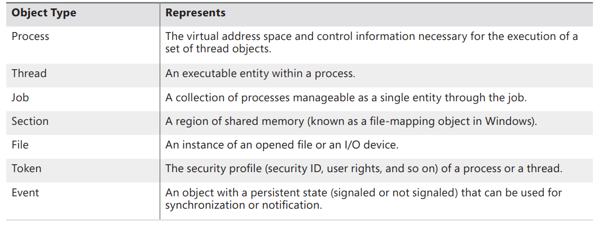</p>

### Object Structure

- Each object has an object **header** and an object **body**.
  - The object body format and contents are **unique** to its object type; all objects of the same type **share the same object body format**.
  - Each object header contains an **index** to a special object, called the *type object*, that contains information common to each instance of the object. <p align="center">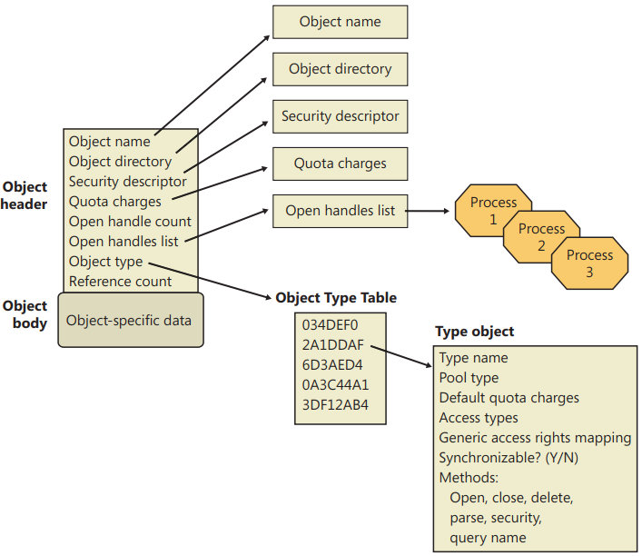</p>
- Each object header can contain up to 5 optional **subheaders** that contains optional information regarding specific aspects of the object.

#### Object Headers and Bodies

Tables below briefly describes the object header fields:

| Field |  Purpose |
|-------|----------|
| Handle count | Maintains a count of the number of currently opened handles to the object|
| Pointer count | Maintains a count of the number of references to the object (including one reference for each handle) Kernel-mode components can reference an object by pointer without using a handle|
| Security descriptor | Determines who can use the object and what they can do with it Note that unnamed objects, by definition, cannot have security.|
| Object type index | Contains the index to a *type object* that contains attributes common to objects of this type. The table that stores all the type objects is `ObTypeIndexTable`. |
| Subheader mask | Bitmask describing which of the optional subheader structures are present, except for the creator information subheader, which, if present, always precedes the object The bitmask is converted to a negative offset by using the `ObpInfoMaskToOffset` table, with each subheader being associated with a 1-byte index that places it relative to the other subheaders present |
| Flags | Characteristics and object attributes for the object.|
| Lock | Per-object lock used when modifying fields belonging to this object header or any of its subheaders. |

- Finally, a number of **attributes** and/or **flags** determine the behavior of the object during creation time or during certain operations. These flags are received by the object manager whenever any new object is being created, in a structure called the **object attributes**.
    - This structure defines the **object name**, the **root object directory** where it should be inserted, the **security descriptor** for the object, and the object attribute **flags**.

| Attributes Flag | Header Flag | Purpose |
|-----------------|-------------|---------|
| OBJ_INHERIT | Saved in the handle table entry | Determines whether the handle to the object will be inherited by child processes, and whether a process can use `DuplicateHandle` to make a copy. |
| OBJ_PERMANENT | OB_FLAG_PERMANENT_OBJECT | Defines object retention behavior related to reference counts. |
| OBJ_EXCLUSIVE | OB_FLAG_EXCLUSIVE_OBJECT | Specifies that the object can be used only by the process that created it. |
| OBJ_CASE_INSENSITIVE | Stored in the handle table entry | Specifies that lookups for this object in the namespace should be case insensitive. It can be overridden by the case insensitive flag in the object type.
| OBJ_OPENIF | Not stored, used at run time | Specifies that a create operation for this object name should result in an open, if the object exists, instead of a failure.|
| OBJ_OPENLINK | Not stored, used at run time | Specifies that the object manager should open a handle to the symbolic link, not the target.|
| OBJ_KERNEL_HANDLE | OB_FLAG_KERNEL_OBJECT | Specifies that the handle to this object should be a kernel handle.|
| OBJ_FORCE_ACCESS_CHECK | Not stored, used at run time | Specifies that even if the object is being opened from kernel mode, full access checks should be performed.|
| OBJ_KERNEL_EXCLUSIVE | OB_FLAG_KERNEL_ONLY_ACCESS | Disables any user-mode process from opening a handle to the object; used to protect the */Device/PhysicalMemory* section object.|
| N/A | OF_FLAG_DEFAULT_SECURITY_QUOTA | Specifies that the object’s security descriptor is using the default 2-KB quota.|
| N/A | OB_FLAG_SINGLE_HANDLE_ENTRY | Specifies that the handle information subheader contains only a single entry and not a database.|
| N/A | OB_FLAG_NEW_OBJECT | Specifies that the object has been created but not yet inserted into the object namespace.|
| N/A | OB_FLAG_DELETED_INLINE | Specifies that the object is being deleted through the deferred deletion worker thread.|

- Because of the **standardized** object header and subheader structures, the object manager is able to provide a small set of **generic services** that can operate on the attributes stored in any object header and can be used on objects of any type, for example:
  - `Close`: Closes a handle to an object.
  - `Duplicate`: Shares an object by duplicating a handle and giving it to another process.
  - `Query object`: Gets information about an object’s standard attributes.

#### Type Objects

- Type objects contains some data that remains **constant** for all objects of a **particular** type.
  - ▶️ By storing these static, **object-type-specific** attributes once when creating a new object, we conserve memory.

<details><summary>🔭 EXPERIMENT: Viewing Object Headers and Type Objects</summary>

1. You can look at the process object type data structure in the kernel debugger by first identifying a process object with the `!process` command:
    ```c
    lkd> !process 0 0
    **** NT ACTIVE PROCESS DUMP ****
    PROCESS fffffa800279cae0
    SessionId: none Cid: 0004 Peb: 00000000 ParentCid: 0000
    DirBase: 00187000 ObjectTable: fffff8a000001920 HandleCount: 541.
    Image: System
    ```
2. Then execute the `!object` command with the process object address as the argument:
    ```c
    lkd> !object fffffa800279cae0
    Object: fffffa800279cae0 Type: (fffffa8002755b60) Process
    ObjectHeader: fffffa800279cab0 (new version)
    HandleCount: 3 PointerCount: 172 3172
    ```
3. Notice that on 32-bit Windows, the object header starts 0x18 (24 decimal) bytes prior to the start of the object body, and on 64-bit Windows, it starts 0x30 (48 decimal) bytes prior—the size of the object header itself. You can view the object header with this command:
    ```c
    lkd> dt nt!_OBJECT_HEADER fffffa800279cab0
    +0x000 PointerCount : 172
    +0x008 HandleCount : 33
    +0x008 NextToFree : 0x000000000x00000000'00000003
    +0x010 Lock : _EX_PUSH_LOCK
    +0x018 TypeIndex : 0x7 ''
    +0x019 TraceFlags : 0 ''
    +0x01a InfoMask : 0 ''
    +0x01b Flags : 0x2 ''
    +0x020 ObjectCreateInfo : 0xfffff800'01c53a80 _OBJECT_CREATE_INFORMATION
    +0x020 QuotaBlockCharged : 0xfffff800'01c53a80
    +0x028 SecurityDescriptor : 0xfffff8a0'00004b29
    +0x030 Body : _QUAD
    ```
4. Now look at the object type data structure by obtaining its address from the `ObTypeIndexTable` table for the entry associated with the `TypeIndex` field of the object header data structure:
    ```c
    lkd> ?? ((nt!_OBJECT_TYPE**)@@(nt!ObTypeIndexTable))[((nt!_OBJECT_
    HEADER*)0xfffffa800279cab0)->TypeIndex]
    struct _OBJECT_TYPE * 0xfffffa80'02755b60
    +0x000 TypeList : _LIST_ENTRY [ 0xfffffa80'02755b60 - 0xfffffa80'02755b60 ]
    +0x010 Name : _UNICODE_STRING "Process"
    +0x020 DefaultObject : (null)
    +0x028 Index : 0x70x7
    +0x02c TotalNumberOfObjects : 0x380x38
    +0x030 TotalNumberOfHandles : 0x1320x132
    +0x034 HighWaterNumberOfObjects : 0x3d
    +0x038 HighWaterNumberOfHandles : 0x13c
    +0x040 TypeInfo : _OBJECT_TYPE_INITIALIZER
    +0x0b0 TypeLock : _EX_PUSH_LOCK
    +0x0b8 Key : 0x636f7250
    +0x0c0 CallbackList : _LIST_ENTRY [ 0xfffffa80'02755c20 - 0xfffffa80'02755c20 ]
    ```
4. The output shows that the object type structure includes the name of the object type, tracks the total number of active objects of that type, and tracks the peak number of handles and objects of that type. The `CallbackList` also keeps track of any object manager filtering callbacks that are associated with this object type. The `TypeInfo` field stores the pointer to the data structure that stores attributes common to all objects of the object type as well as pointers to the object type’s methods:
    ```c
    lkd> ?? ((nt!_OBJECT_TYPE*)0xfffffa8002755b60)->TypeInfo*)0xfffffa8002755b60)->TypeInfo
    +0x000 Length : 0x70
    +0x002 ObjectTypeFlags : 0x4a 'J'
    +0x002 CaseInsensitive : 0y0
    +0x002 UnnamedObjectsOnly : 0y1
    +0x002 UseDefaultObject : 0y0
    +0x002 SecurityRequired : 0y1
    +0x002 MaintainHandleCount : 0y0
    +0x002 MaintainTypeList : 0y0
    +0x002 SupportsObjectCallbacks : 0y1
    +0x004 ObjectTypeCode : 0
    +0x008 InvalidAttributes : 0xb0
    +0x00c GenericMapping : _GENERIC_MAPPING
    +0x01c ValidAccessMask : 0x1fffff
    +0x020 RetainAccess : 0x101000
    +0x024 PoolType : 0 ( NonPagedPool )
    +0x028 DefaultPagedPoolCharge : 0x1000
    +0x02c DefaultNonPagedPoolCharge : 0x528
    +0x030 DumpProcedure : (null)
    +0x038 OpenProcedure : 0xfffff800'01d98d58 long nt!PspProcessOpen+0
    +0x040 CloseProcedure : 0xfffff800'01d833c4 void nt!PspProcessClose+0
    +0x048 DeleteProcedure : 0xfffff800'01d83090 void nt!PspProcessDelete+0
    +0x050 ParseProcedure : (null)
    +0x058 SecurityProcedure : 0xfffff800'01d8bb50 long nt!SeDefaultObjectMethod+0
    +0x060 QueryNameProcedure : (null)
    +0x068 OkayToCloseProcedure : (null)
    ```
</details>

- **Synchronization**, one of the attributes **visible** to Windows applications, refers to a thread’s ability to synchronize its execution by waiting for an object to change from one state to another.
  -  A thread can synchronize with executive *job*, *process*, *thread*, *file*, *event*, *semaphore*, *mutex*, and *timer* objects.
  -  Other executive objects don’t support synchronization.
  -  An object’s ability to support synchronization is based on three possibilities:
        - The executive object is a wrapper for a dispatcher object and contains a dispatcher header.
        - The creator of the object type requested a **default object**, and the object manager provided one.
        ■ The executive object has an **embedded dispatcher object**, such as an *event* somewhere inside the object body, and the object’s owner supplied its offset to the object manager when registering the object type.

#### Object Methods

- Object methods comprises a set of **internal routines** that are **automatically called** when an object is accessed, such as when someone opens or closes a handle to an object or when someone attempts to change the protection on an object.
- The methods that the object manager supports are listed below:
    | Method | When Method Is Called |
    |--------|-----------------------|
    | Open | When an object handle is opened |
    | Close | When an object handle is closed |
    | Delete | Before the object manager deletes an object |
    | Query name | When a thread requests the name of an object, such as a file, that exists in a secondary object namespace |
    | Parse | When the object manager is searching for an object name that exists in a secondary object namespace |
    | Dump | Not used |
    | Okay to close | When the object manager is instructed to close a handle |
    | Security | When a process reads or changes the protection of an object, such as a file, that exists in a secondary object namespace |

<details><summary>🍊 Examples:</summary>

- The **I/O manager** registers a `close` method for the file object type, and the object manager calls the `close` method each time it closes a file object handle. This `close` method checks whether the process that is closing the file handle owns any outstanding locks on the file and, if so, removes them. Checking for file locks isn’t something the object manager itself can or should do ‼️.
- The **memory manager**, for example, registers a `delete` method for the section object type that frees the physical pages being used by the section. It also verifies that any internal data structures the memory manager has allocated for a section are deleted before the section object is deleted. The object manager can’t do this work because **it knows nothing** about the internal workings of the memory manager.
- The `parse` method for device objects is an I/O routine because the **I/O manager** defines the device object type and registers a `parse` method for it. The I/O manager’s parse routine takes the name string and passes it to the appropriate file system, which finds the file on the disk and opens it.
- *Win32k.sys* registers an `okay-to-close` routine for the **Desktop** and **WindowStation** objects to prevent the behavior of closing handles being used for system purposes.
</details>

#### Object Handles and the Process Handle Table

- When a process creates or opens an object **by name**, it receives a **handle** that represents its **access** to the object.
- Referring to an object by its handle is **faster** than using its name because the object manager can **skip the name lookup** and find the object directly.
- Processes can also acquire handles to objects by:
  - **inheriting** handles at process creation time (`CreateProcess(bInheritHandles=TRUE)`) and the handle was marked as **inheritable**: either at the time it was created or afterward by using `SetHandleInformation()`.
  - or by receiving a **duplicated** handle from another process (`DuplicateHandle()`).
- Object handles provide additional benefits:
  - **consistent interface** to reference objects, regardless of their type (file, process, event, ...).
  - object manager has the **exclusive right to create handles** and to locate an object that a handle refers to ▶️ can scrutinize every user-mode action that affects an object.

<details><summary>🔭 EXPERIMENT: Viewing Open Handles</summary>

- You can view open handles by:
    - Using **Process Explorer**: Run Process Explorer, and make sure the lower pane is enabled and configured to show open handles (Click on View, Lower Pane View, and then Handles).
    - **Resource Monitor** also shows open handles to named handles for the processes you select by checking the boxes next to their names Here are the command prompt’s open handles.
    - Using **handle** the command-line tool from Sysinternals: `C:\>handle -p cmd.exe`.
    <p align="center">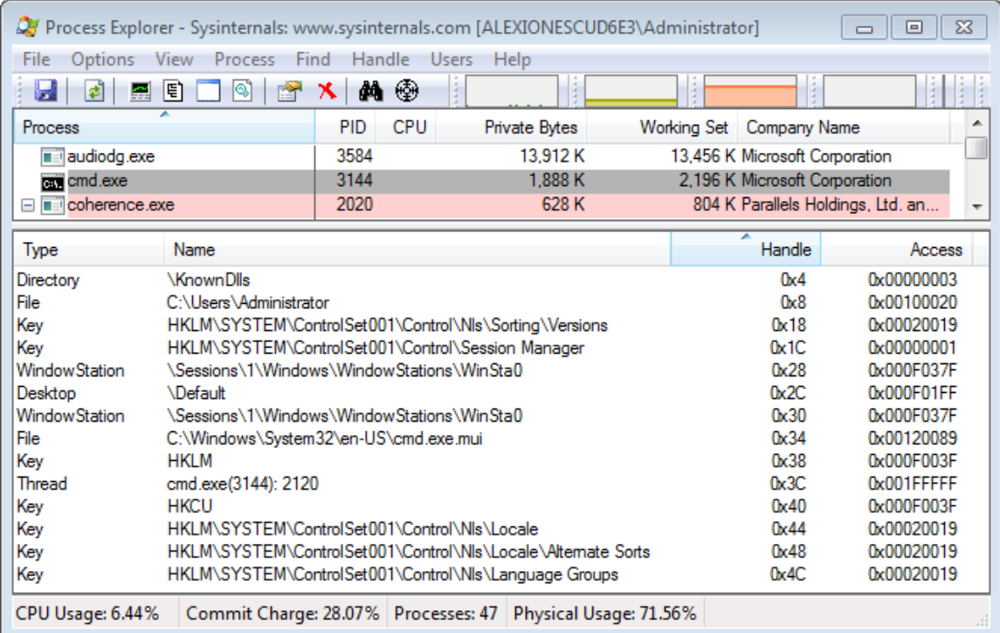</p>
</details>

- An object handle is an index into a process-specific **handle table**, pointed to by the executive process (`EPROCESS`) block.
- A process’ handle table contains **pointers** to all the objects that the process has opened a handle to.
- Handle tables are implemented as a **three-level** scheme, similar to the way that the x86 memory management unit implements virtual-to-physical address translation, giving a maximum of more than 16,000,000 handles per process.
    <p align="center"></p>
- On x86 systems, each handle entry consists of a structure with two **32-bit members**: a pointer to the object (with flags), and the granted **access mask**.
- On 64-bit systems, a handle table entry is 12 bytes long: a **64-bit pointer** to the object header and a **32-bit access mask**.
    <p align="center">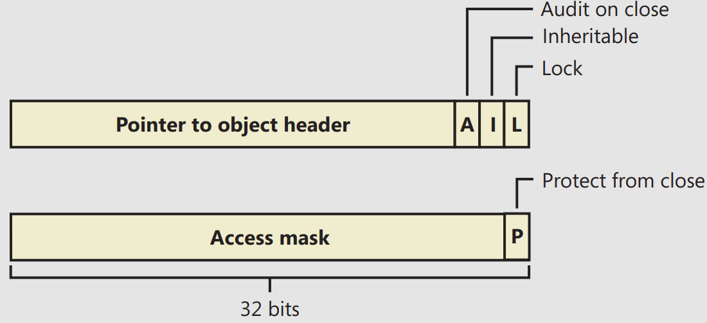</p>
- The first flag is a `lock` bit, indicating whether the entry is currently in use.
- The second flag is the **inheritance** designation.
- The third flag indicates whether closing the object should generate an **audit** message.
- Finally, the **protect-from-close** bit, stored in an unused portion of the
access mask, indicates whether the caller is allowed to close this handle.
- The object manager recognizes references to handles from the **kernel handle table** (`ObpKernelHandleTable`) when the high bit of the handle is set — that is, when references to kernel-handle-table handles have values greater than `0x80000000`.

<details><summary>🔭 EXPERIMENT: Viewing the Handle Table with the Kernel Debugger</summary>

The `!handle` command in the kernel debugger takes three arguments:
!handle <handle index> <flags> <processid>

```c
lkd> !handle 0 7 62c
processor number 0, process 000000000000062c
Searching for Process with Cid == 62c
PROCESS fffffa80052a7060
    SessionId: 1 Cid: 062c Peb: 7fffffdb000 ParentCid: 0558
    DirBase: 7e401000 ObjectTable: fffff8a00381fc80 HandleCount: 111.
    Image: windbg.exe

Handle table at fffff8a0038fa000 with 113 Entries in use
0000: free handle, Entry address fffff8a0038fa000, Next Entry 00000000fffffffe
0004: Object: fffff8a005022b70 GrantedAccess: 00000003 Entry: fffff8a0038fa010
Object: fffff8a005022b70 Type: (fffffa8002778f30) Directory
    ObjectHeader: fffff8a005022b40fffff8a005022b40 (new version)
        HandleCount: 25 PointerCount: 63
        Directory Object: fffff8a000004980 Name: KnownDlls

0008: Object: fffffa8005226070 GrantedAccess: 00100020 Entry: fffff8a0038fa020
Object: fffffa8005226070 Type: (fffffa80027b3080) File
    ObjectHeader: fffffa8005226040fffffa8005226040 (new version)
        HandleCount: 1 PointerCount: 1
        Directory Object: 00000000 Name: \Program Files\Debugging Tools for Windows (x64){HarddiskVolume2}
```
</details>

<details><summary>🔭 EXPERIMENT: Searching for Open Files with the Kernel Debugger</summary>

Although you can use Process Explorer, Handle, and the OpenFiles.exe utility to search for open file handles, these tools are not available when looking at a **crash dump** or analyzing a system **remotely**. You can instead use the `!devhandles` command to search for handles opened to files on a specific volume.
1. First you need to pick the drive letter you are interested in and obtain the pointer to its **Device object**. You can use the `!object` command as shown here:
    ```c
    kd> !object \Global??\C:
    Object: fffff8a00016ea40 Type: (fffffa8000c38bb0) SymbolicLink
        ObjectHeader: fffff8a00016ea10 (new version)
        HandleCount: 0 PointerCount: 1
        Directory Object: fffff8a000008060 Name: C:
        Target String is '\Device\HarddiskVolume1'
        Drive Letter Index is 3 (C:)
    ```
2. Next use the `!object` command to get the **Device object** of the target volume name:
    ```c
    kd> !object \Device\HarddiskVolume1
    Object: fffffa8001bd3cd0 Type: (fffffa8000ca0750) Device
    ```
3. Now you can use the pointer of the Device object with the `!devhandles` command. Each object shown points to a file:
    ```c
    !devhandles fffffa8001bd3cd0
    Checking handle table for process 0xfffffa8000c819e0
    Kernel handle table at fffff8a000001830 with 434 entries in use

    PROCESS fffffa8000c819e0
        SessionId: none Cid: 0004 Peb: 00000000 ParentCid: 0000
        DirBase: 00187000 ObjectTable: fffff8a000001830 HandleCount: 434.
        Image: System

    0048: Object: fffffa8001d4f2a0 GrantedAccess: 0013008b Entry: fffff8a000003120
    Object: fffffa8001d4f2a0 Type: (fffffa8000ca0360) File
        ObjectHeader: fffffa8001d4f270 (new version)
            HandleCount: 1 PointerCount: 19
            Directory Object: 00000000 Name: \Windows\System32\LogFiles\WMI\RtBackup\EtwRTEventLog-Application.etl {HarddiskVolume1}
    ```
</details>

#### Reserve Objects

- Object creation is **essential** to the normal and desired runtime behavior of any piece of Windows code.
- Failing to allocate object causes anywhere from **loss of functionality** to **data loss** or **crashes** 🤷.
- Windows implements two special **reserve objects** to deal with this situation:
  - **User APC** reserve object and the **I/O Completion** packet reserve object
- When a user-mode app requests a **User APC** to be targeted to another thread, it uses the `QueueUserApc` API in `Kernelbase.dll` ▶️ `NtQueueUserApcThread`.
  - In the kernel, this system call attempts to **allocate** a piece of paged pool in which to store the `KAPC` control object structure associated with an APC.
  - In **low memory** situations, this operation fails, preventing the delivery of the APC 😮‍💨.
  - To prevent this, on startup, use `NtAllocateReserveObject` to request the kernel to **pre-allocate** the `KAPC` structure. Then the application uses a different system call, `NtQueueUserApcThreadEx`, that contains an extra parameter that is used to store the handle to the reserve object.
- A similar scenario can occur when applications need **failure-free** delivery of an **I/O completion** port message, or packet.
    - Typically, packets are sent with the `PostQueuedCompletionStatus` API in `Kernelbase.dll` ▶️ `NtSetIoCompletion`.
    - Similarly to the user APC, the kernel must **allocate** an **I/O manager** structure to contain the completion-packet information, and if this allocation fails, the packet cannot be created.
    - With reserve objects, the app can use the `NtAllocateReserveObject` API on startup to have the kernel **pre-allocate** the I/O completion packet, and the `NtSetIoCompletionEx` system call can be used to supply a handle to this reserve object, guaranteeing a success path.

#### Object Security

- When a process opens a handle to an object, the object manager calls the SRM, sending it the process’ set of desired access rights.
- The security reference monitor checks whether the object’s security descriptor **permits** the type of access the process is **requesting**.
- If it does, the reference monitor returns a set of granted access rights that the process is allowed, and the object manager **stores** them in the **object handle** it creates (for quick access checks 👍).

<details><summary>🔭 EXPERIMENT: Looking at Object Security</summary>

- You can look at the various permissions on an object by using either *Process Explorer*, *WinObj*, or *AccessCheck*, which are all tools from Sysinternals.
- The **Security** tab in *Process Explorer*, *WinObj* cannot decode the specific object directory access rights, so all you’ll see are generic rights: <p align="center">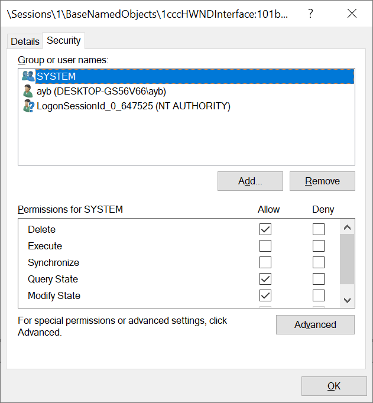</p>
- *AccessCheck* to query the security information of any object by using the `–o` switch as shown in the following output:
    ```
    C:\Windows\system32>accesschk -o \Sessions\1\BaseNamedObjects

    Accesschk v6.15 - Reports effective permissions for securable objects
    Copyright (C) 2006-2022 Mark Russinovich
    Sysinternals - www.sysinternals.com

    \Sessions\1\BaseNamedObjects
    Type: Directory
    RW Window Manager\DWM-1
    RW NT AUTHORITY\SYSTEM
    RW DESKTOP-GS56V66\ayb
    RW DESKTOP-GS56V66\ayb-S-1-5-5-0-647525
    RW BUILTIN\Administrators
    R  Everyone
        NT AUTHORITY\RESTRICTED
    ```
</details>

- Windows also supports Ex (Extended) versions of the APIs— `CreateEventEx`, `CreateMutexEx`, `CreateSemaphoreEx`— that add another argument for specifying the access mask.
  - This makes it possible for apps to properly use DACLs to secure their objects without breaking their ability to use the create object APIs to open a handle to them.
  - Using the open object like `OpenEvent` leads to an inherent **race condition** when dealing with a failure in the open call — which usually is followed by a create call, the `Ex` version of these APIs make it **atomic**.

#### Object Retention

- There are two types of objects: **temporary** and **permanent**:
  - Most objects are temporary — that is, they remain while they are in use and are freed when they are no longer needed.
  - Permanent objects remain until they are **explicitly** freed.
- Because most objects are temporary, this section describes how the object manager implements object retention — that is, retaining temporary objects only as long as they are in use and then deleting them.
- The object manager implements object retention in two phases:
    1. The first phase is called **name retention**, and it is controlled by the **number of open handles** to an object that exist.
      - Every time a process opens a handle to an object, the object manager **increments** the **open handle counter** in the object’s header.
      - As processes finish using the object and close their handles to it, the object manager **decrements** the open handle counter.
      - When the counter **drops to 0**, the object manager deletes the object’s name from its global namespace.
    2. The second phase of object retention is to **stop retaining** the objects themselves (that is, to delete them) when they are no longer in use.
      - Because kernel code usually accesses objects by using **pointers** instead of **handles**, the object manager must also record how many object pointers it has dispensed to kernel processes.
      - It **increments** a **reference count** for an object each time it gives out a pointer to the object.
      - When kernel-mode components finish using the pointer, they call the object manager to **decrement** the object’s reference count.
      - The system also **increments** the **reference count** when it increments the **handle count**, and likewise decrements the reference count when the handle count decrements, because a handle is also a reference to the object that must be tracked.
<p align="center">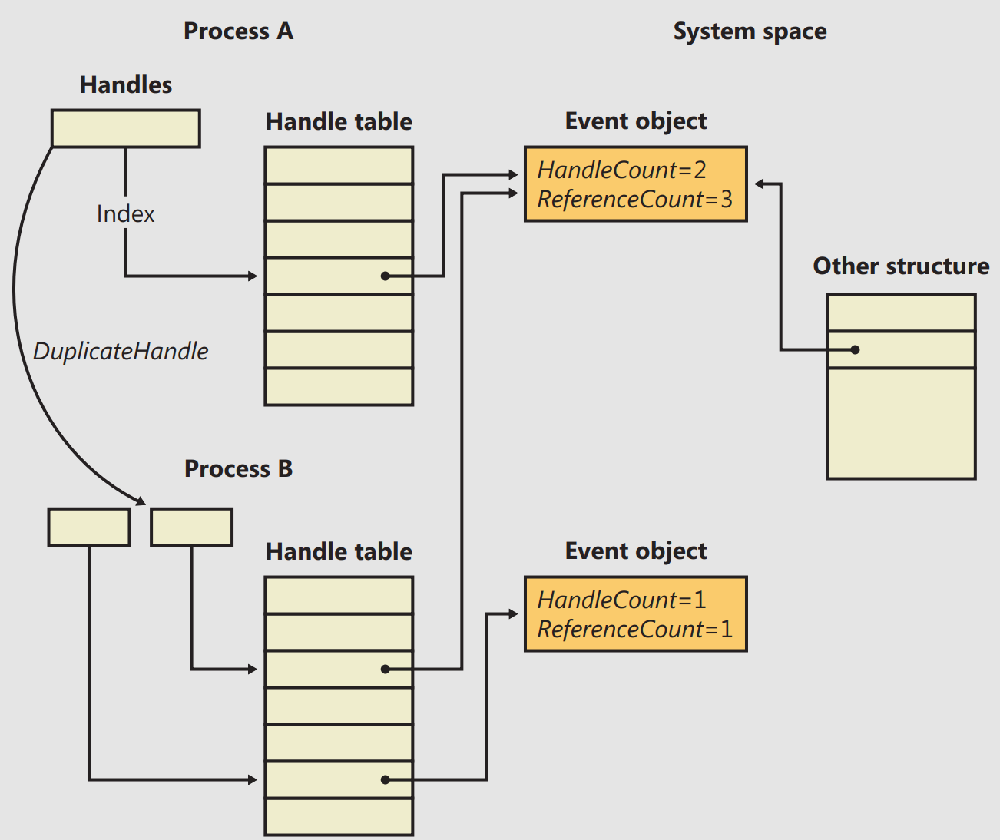</p>

- Ultimately, when the reference count drops to 0, the object manager deletes the object from memory. This deletion has to respect certain rules and also requires cooperation from the caller in certain cases:
  - Because objects can be present both in **paged** or **nonpaged** pool memory, if a dereference occurs at an IRQL level of **dispatch** or higher and this dereference causes the pointer count to drop to 0, the system would crash if it attempted to immediately free the memory of a paged-pool object. In this scenario, the object manager performs a **deferred delete** operation, queuing the operation on a worker thread running at passive level (IRQL 0).
  - Another scenario that requires deferred deletion is when dealing with KTM objects. In some scenarios, certain drivers might **hold a lock** related to this object, and attempting to delete the object will result in the system attempting to acquire this **lock**. However, the driver might never get the chance to release its lock, causing a deadlock When dealing with KTM objects, driver developers must use `ObDereferenceObjectDeferDelete` to force deferred deletion regardless of IRQL level Finally, the I/O manager also uses this mechanism as an optimization so that certain I/Os can complete more quickly, instead of waiting for the object manager to delete the object.
- Windows includes a number of debugging mechanisms that can be enabled to monitor, analyze, and debug issues with handles and objects:
    |Mechanism  | Enabled By | Kernel Debugger Extension |
    |-----------|------------|---------------------------|
    |Handle Tracing Database | Kernel Stack Trace system wide and/or per-process with the User Stack Trace option checked with Gflags.exe. | `!htrace <handle value> <process ID>` |
    |Object Reference Tracing| Per-process-name(s), or per-object-type-pool-tag(s), with Gflags.exe, under Object Reference Tracing. | `!obtrace <object pointer>` |
    |Object Reference Tagging| Drivers must call appropriate API, | N/A |
- **Handle-tracing database** is useful when attempting to understand the use of each handle within an app or the system context. The `!htrace` can display the stack trace captured at the time a specified handle was opened. The stack trace can pinpoint the code that is creating the handle but missed a `CloseHandle()`.
- The **object-reference-tracing** `!obtrace` extension monitors even more by showing the stack trace for each new handle created as well as each time a handle is referenced by the kernel (and also each time it is opened, duplicated, or inherited) and dereferenced. By analyzing these patterns, misuse of an object at the **system** level can be more easily debugged.
  - Tracing processes, for example, display references from all the drivers on the system that have registered callback notifications (such as Process Monitor) and help detect rogue or buggy third-party drivers that might be referencing handles in kernel mode but never dereferencing them.
- For **Object Reference Tagging**, `ObReferenceObjectWithTag` and `ObDereferenceObjectWithTag` should be used by device-driver developers to reference and dereference objects.
  - Using the `!obtrace` extension just described, the tag for each reference or dereference operation is also shown, which avoids solely using the **call stack** as a mechanism to identify where leaks or under-references might occur, especially if a given call is performed thousands of times by the driver.

#### Resource Accounting

- Windows object manager provides a **central** facility for resource accounting.
  - Each object header contains an attribute called **quota charges** that records how much the object manager subtracts from a process’ allotted paged and/or nonpaged pool quota when a thread in the process opens a handle to the object.
- Each process on Windows points to a quota structure that records the **limits** and **current** values for nonpaged-pool, paged-pool, and page-file usage.

#### Object Names

- An important consideration in creating a multitude of objects is the need to devise a successful system for keeping track of them.
- The OM allows names to be assigned to objects:
  - So it can distinguish one object from another;
  - and can find an object by looking up its name.

#### Object Directories

- The object directory object (😵‍💫 ) is the OM’s means for supporting this **hierarchical** naming structure. This object is analogous to a FS directory and contains the **names of other objects**, possibly even other **object directories**.
- The table below lists the standard object directories found on all Windows systems and what types of objects have their
names stored there.
    |Directory | Types of Object Names Stored |
    |----------|------------------------------|
    |\ArcName | Symbolic links mapping ARC-style paths to NT-style paths.
    |\BaseNamedObjects | Global mutexes, events, semaphores, waitable timers, jobs, ALPC ports, symbolic links, and section objects
    |\Callback | Callback objects. |
    |\Device | Device objects. |
    |\Driver | Driver objects. |
    |\FileSystem | File-system driver objects and file-system-recognizer device objects. The Filter Manager also creates its own device objects under the Filters subkey. |
    |\GLOBAL?? | MS-DOS device names. (The \Sessions\0\DosDevices\<LUID>\Global directories are symbolic links to this directory) |
    |\KernelObjects | Contains event objects that signal low resource conditions, memory errors, the completion of certain operating system tasks, as well as objects representing Sessions. |
    |\KnownDlls | Section names and path for known DLLs (DLLs mapped by the system at startup time). |
    |\KnownDlls32 | On a 64-bit Windows installation, \KnownDlls contains the native 64-bit binaries, so this directory is used instead to store Wow64 32-bit versions of those DLLs. |
    |\Nls | Section names for mapped national language support tables. |
    |\ObjectTypes | Names of types of objects. |
    |\PSXSS | If Subsystem for UNIX Applications is enabled (through installation of the SUA component), this contains ALPC ports used by Subsystem for UNIX Applications. |
    |\RPC Control | ALPC ports used by remote procedure calls (RPCs), and events used by Conhost exe as part of the console isolation mechanism. |
    |\Security | ALPC ports and events used by names of objects specific to the security subsystem.|
    |\Sessions | Per-session namespace directory.|
    |\UMDFCommunicationPorts | ALPC ports used by the User-Mode Driver Framework (UMDF).|
    |\Windows  | Windows subsystem ALPC ports, shared section, and window stations.|

- ⚠️ Because the base kernel objects such as mutexes, events, semaphores, waitable timers, and sections have their names stored in a **single object directory**, no two of these objects can have the **same name**, even if they are of a **different type**.
- Although object names in **different sessions** are protected from each other, there’s no standard protection inside the **current session** namespace that can be set with the standard Windows API ▶️ So this enables *object name squatting* acttacks in which the unprivileged app creates the object **before** the privileged app, thus **denying access** to the legitimate app.
- Windows exposes the concept of a **private namespace** to alleviate this issue.
  - It allows user-mode app to create object directories through the `CreatePrivateNamespace` API and associate these directories with **boundary descriptors**, which are special data structures protecting the directories.

<details><summary>🔭 EXPERIMENT: Looking at the Base Named Objects</summary>

You can see the list of base objects that have names with the WinObj tool from `Sysinternals`. Run `Winobj.exe`, and click on `\BaseNamedObjects`, as shown here:
<p align="center">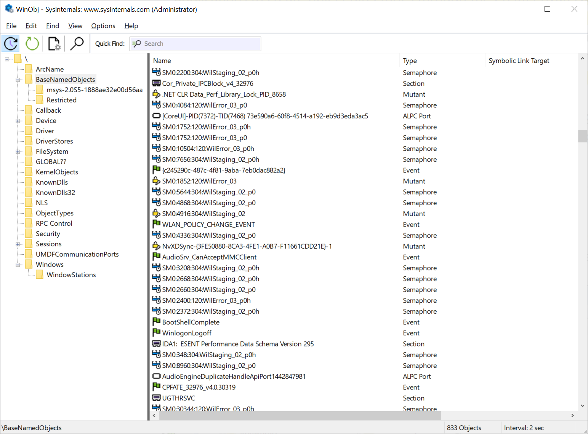</p>
</details>

- The OM implements an object called a **symbolic link object**, which performs a cross-link function for object names in its object namespace, similar to what file symlinks on NTFS or Unix systems.
- One place in which the executive uses symbolic link objects is in translating *MS-DOS* style device names into Windows internal device names.
  - In Windows, a user refers to hard disk drives using the names `C:`, `D:`, and so on and serial ports as `COM1`, `COM2`, and so on.
  - The Windows subsystem makes these symbolic link objects protected, global data by placing them in the OM namespace under the `\Global??` directory.

#### Session Namespace

- Services have access to the **global** namespace, a namespace that serves as the first instance of the namespace. Additional sessions are given a **session-private** view of the namespace known as a **local** namespace.
- The parts of the namespace that are localized for each session include `\DosDevices`, `\Windows`, and `\BaseNamedObjects`.
  - The global `\DosDevices` directory is named `\Global??` and is the directory to which `\DosDevices` points, and local `\DosDevices` directories are identified by the **logon session ID**.
  - The `\Windows` directory is where `Win32k.sys` inserts the interactive window station created by Winlogon: `\WinSta0`. A Terminal Services environment can support multiple interactive users, but each user needs an individual version of `WinSta0` to preserve the illusion that he is accessing the predefined interactive window station in Windows.
  - Apps and the system create shared objects in `\BaseNamedObjects`, including events, mutexes, and memory sections.
- The OM implements a **local** namespace by creating the private versions of the three directories mentioned under a directory associated with the user’s session under `\Sessions\n` (where n is the session identifier).
- Th OM provides the special override “`\Global`” that an app can prefix to any object name to access the **global namespace**.
  - For example, an app in session two opening an object named` \Global\ApplicationInitialized` is directed to `\BaseNamedObjects\ApplicationInitialized` instead of `\Sessions\2\BaseNamedObjects\ApplicationInitialized`.
- Session directories are isolated from each other, and **administrative privileges** are required to create a global object (except for section objects).
  - A special privilege named *create global object* is verified before allowing such operations.

<details><summary>🔭 EXPERIMENT: Viewing Namespace Instancing</summary>

- You can see the separation between the session 0 namespace and other session namespaces as soon as you log in. The reason you can is that the first **console user** is logged in to **session 1** (while **services** run in **session 0**).
- Run `Winobj.exe`, and click on the `Sessions` directory. You’ll see a subdirectory with a numeric name for each active session:
<p align="center">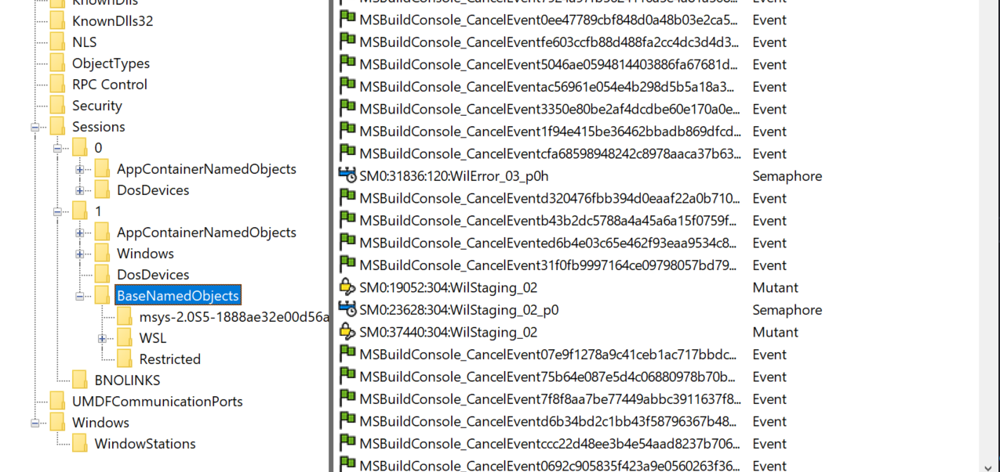</p>
</details>

#### Object Filtering

- Windows includes a filtering model in the object manager, similar to the file system minifilter model.
- One of the primary benefits of this filtering model is the ability to use the **altitude** concept that these existing filtering technologies use, which means that multiple drivers can filter object-manager events at appropriate locations in the filtering **stack**.
    - Drivers are permitted to intercept calls such as `NtOpenThread` and `NtOpenProcess` and even to modify the access masks being requested from the process manager
- Drivers are able to take advantage of both `pre` and `post` **callbacks**, allowing them to prepare for a certain operation before it occurs, as well as to react or finalize information after the operation has occurred.
  - These callbacks can be registered with the `ObRegisterCallbacks` API and unregistered with the `ObUnregisterCallbacks` API.

## Synchronization

- The concept of **mutual exclusion** is a crucial one in OS development It refers to the guarantee that one, and only one, thread can access a particular resource at a time.
- Resources that aren’t subject to **modification** can be shared without worrying about synchronization.
- Developers have to worry about shared data in multi-threading program even in **single-processor** system.

### High-IRQL Synchronization

- Before using a global resource, the kernel **temporarily masks** the interrupts whose interrupt handlers also use the resource.
- It does so by **raising** the processor’s IRQL to the highest level used by any potential interrupt source that accesses the global data.
- 🤷‍♂️ This strategy is fine for a **single-processor** system, but it’s inadequate for a **multiprocessor** configuration.
    - Raising the IRQL on one processor doesn’t prevent an interrupt from occurring on another processor.

#### Interlocked Operations

- Rely on **hardware** support for multiprocessor safe manipulation of integer values and for performing comparisons.

#### Spinlocks

- The mechanism the kernel uses to achieve multiprocessor mutual exclusion is called a **spinlock**.
- Before entering a critical code region, the kernel must acquire the spinlock.
    - If the spinlock isn’t free, the kernel keeps trying to acquire the lock until it succeeds.
    - The spinlock gets its name from the fact that the kernel (and thus, the processor) waits, *spinning* until it gets the lock.
- Are implemented with a hardware-supported *test-and-set* operation, which tests the value of a lock variable and acquires the lock in one **atomic** instruction.
- Additionally, the `lock` instruction can also be used on the *test-and-set* operation, resulting in the combined `lock bts` assembly operation, which also locks the **multiprocessor bus**; otherwise, it would be possible for more than one processor to atomically perform the operation.

<details><summary>All kernel-mode spinlocks in Windows have an associated IRQL that is always DPC/dispatch level or higher. 🚩</summary>

-  When a thread is trying to acquire a spinlock, all other activity at the spinlock’s IRQL or lower ceases on that processor.
    - Because thread dispatching happens at DPC/dispatch level, a thread that holds a spinlock is **never preempted** because the IRQL masks the dispatching mechanisms.
    - This masking allows code executing in a CS protected by a spinlock to **continue executing** so that it will release the lock quickly.
    - Any processor that attempts to acquire the spinlock will essentially be busy, waiting indefinitely, **consuming power** (a busy wait results in 100% CPU usage 😣) and performing no actual work.
    - 👍 In x86/x64, the `PAUSE` asm instruction can be inserted in busy wait loops to offer a hint to the processor that the loop instructions it is processing are part of a spinlock (or a similar construct) acquisition loop.
</details>

- The kernel provides a set of kernel functions including: `KeAcquireSpinLock` and `KeReleaseSpinLock`.
- The kernel also exports the `KeAcquireInterruptSpinLock` and `KeReleaseInterruptSpinLock` for device drivers, because raising the IRQL only to DPC/dispatch level this isn’t enough to protect against **interrupts**.
- Devices can use the `KeSynchronizeExecution` API to synchronize an entire function with an ISR, instead of just a CS.
- ⚠️ Because spinlocks always have an IRQL of DPC/dispatch +, code holding a spinlock will crash the system if it attempts to make the **scheduler perform a dispatch operation** or if it causes a **page fault**.

#### Queued Spinlocks

- To increase the scalability of spinlocks, a special type of spinlock, called a **queued spinlock**, is used in most circumstances instead of a standard spinlock.
    - When a processor wants to acquire a queued spinlock (`KeAcquireQueuedSpinLock`) that is currently held, it places its identifier in a **queue** associated with the spinlock.
    - When the processor that’s holding the spinlock **releases** it, it hands the lock over to the **first processor** identified in the queue.
    - In the meantime, a processor waiting for a busy spinlock checks the status not of the **spinlock itself** but of a **per-processor flag** that the processor ahead of it in the queue sets to indicate that the waiting processor’s turn has arrived.
    - 👍 The multiprocessor’s bus isn’t as **heavily trafficked** by interprocessor synchronization.
    - 👍 Enforces **FIFO** ordering to the lock. FIFO ordering means more **consistent performance** across processors accessing the same locks.
- 💁 These locks are reserved for the kernel’s own internal use. Device drivers should use **Instack Queued Spinlocks**.
- Device drivers can use dynamically allocated queued spinlocks with the `KeAcquireInStackQueuedSpinLock` and `KeReleaseInStackQueuedSpinLock` functions.

### Low-IRQL Synchronization

- Because waiting for a spinlock literally **stalls a processor**, spinlocks can be used only under the following strictly limited circumstances:
    - The protected resource must be accessed **quickly** and without complicated interactions with other code
    - The CS code can’t be **paged out of memory**, can’t make references to **pageable data**, can’t call **external procedures** (including system services), and can’t generate interrupts or exceptions.
- The following Kernel Synchronization Mechanisms are available for Kernel mode:
<p align="center"></p>

#### Kernel Dispatcher Objects

- The kernel furnishes additional synchronization mechanisms to the executive in the form of kernel objects, known collectively as **dispatcher objects**.
- Each Windows API-visible object that supports synchronization **encapsulates** at least one kernel dispatcher object.
- The executive’s synchronization semantics are visible to Windows programmers through the `WaitForSingleObject` and `WaitForMultipleObjects` functions, which the Windows subsystem implements by calling analogous system services that the object manager supplies.

### Waiting for Dispatcher Objects

- A thread can synchronize with a dispatcher object by waiting for the object’s handle. Doing so causes the kernel to put the thread in a **wait state**.
- At any given moment, a synchronization object is in one of two states: **signaled state** or **nonsignaled state**.
- A thread can’t resume its execution until its wait is satisfied, a condition that occurs when the dispatcher object whose handle the thread is waiting for also undergoes a state change, from the nonsignaled state to the signaled state.

### What Signals an Object?

- The signaled state is defined differently for different objects
<p align="center"></p>

- Whether a thread’s wait ends when an object is set to the signaled state varies with the type of object the thread is waiting for:
<p align="center"></p>

- When an object is set to the **signaled** state, **waiting** threads are generally **released** from their wait states immediately.

### Data Structures

- Three data structures are key to tracking **who is waiting**, **how they are waiting**, **what they are waiting for**, and **which state the entire wait operation is at**. These three structures are the *dispatcher header*, the *wait block*, and the *wait status register*.
- The **dispatcher header** is a packed structure because it needs to hold lots of information in a fixed-size structure.
    - It contains some fields which applies only to some specific dispatcher object ;
    - but it also contain information generic for any dispatcher object: the object type, signaled state, and a list of the threads waiting for that object.
- The **wait block** represents a thread waiting for an object:
    - Each thread that is in a wait state has a **list of the wait blocks** that represent the objects the thread is waiting for.
    - Each dispatcher object has a list of the wait blocks that represent **which threads** are waiting for the **object**.
    - The wait block has a pointer to the object being waited for, a pointer to the thread waiting for the object, and a pointer to the next wait block (if the thread is waiting for more than one object).
-The wait block also contains a volatile **wait block state**, which defines the current state of this wait block in the transactional wait operation it is currently being engaged in.
<p align="center"></p>

- An object undergoes a different wait states:
    - When a thread is instructed to wait for a given object (`WaitForSingleObject()`), it first attempts to enter the in-progress wait state (**WaitInProgress**) by beginning the wait.
        - If there are no pending alerts to the thread, this operation succeeds.
        - Otherwise the thread now enters the **WaitInProgress** state.
    - Once the wait is in progress, the thread can initialize the wait blocks as needed and mark them as **WaitBlockActive** in the process and then proceed to **lock** all the objects that are part of this wait.
    - The next step is to check for immediate satisfaction of the wait, such as an mutex that has already been released or a timer that already expired, in this cases, the wait is not "satisfied", ▶️ perform a wait exit.
    - If none of these shortcuts were effective, the wait block is inserted into the thread’s wait list, and the thread now attempts to **commit** its wait.
    - it is possible and likely that the thread attempting to commit its wait has experienced a change while its wait was still in progress, this causes the associated wait block to enter the **WaitBlockBypassStart** state, and the thread’s wait status register now shows the **WaitAborted** wait state.
    - Another possible scenario is for an alert or `APC` to have been issued to the waiting thread, which does not set the **WaitAborted** state but enables one of the corresponding bits in the wait status register. Because **APCs can break waits** (depending on the type of APC, wait mode, and alertability), the APC is delivered and the wait is **aborted**. Other operations that will modify the wait status register without generating a full abort cycle include **modifications** to the **thread’s priority** or **affinity**, which will be processed when exiting the wait due to failure to commit, as with the previous cases mentioned.

### :telescope: Looking at Wait Queues

- You can see the list of objects a thread is waiting for with the kernel debugger’s `!process` command:

```c
kd> !process
THREAD fffffa8005292060 Cid 062c062c.0660 Teb: 000007fffffde000 Win32Thread:
fffff900c01c68f0 WAIT: (WrUserRequest) UserMode Non-Alertable
fffffa80047b8240 SynchronizationEvent
```
<details><summary>You can use the dt command to interpret the dispatcher header of the object like this:</summary>

```c
lkd> dt nt!_DISPATCHER_HEADER fffffa80047b8240
+0x000 Type : 0x1 ''
+0x001 TimerControlFlags : 0 ''
+0x001 Absolute : 0y0
+0x001 Coalescable : 0y0
+0x001 KeepShifting : 0y0
+0x001 EncodedTolerableDelay : 0y00000 (0)
+0x001 Abandoned : 0 ''
+0x001 Signalling : 0 ''
+0x002 ThreadControlFlags : 0x6 ''
+0x002 CpuThrottled : 0y0
+0x002 CycleProfiling : 0y1
+0x002 CounterProfiling : 0y1
+0x002 Reserved : 0y00000 (0)
+0x002 Hand : 0x6 ''
+0x002 Size : 0x6
+0x003 TimerMiscFlags : 0 ''
+0x003 Index : 0y000000 (0)
+0x003 Inserted : 0y0
+0x003 Expired : 0y0
+0x003 DebugActive : 0 ''
+0x003 ActiveDR7 : 0y0
+0x003 Instrumented : 0y0
+0x003 Reserved2 : 0y0000
+0x003 UmsScheduled : 0y0
+0x003 UmsPrimary : 0y0
+0x003 DpcActive : 0 ''
+0x000 Lock : 393217
+0x004 SignalState : 0
+0x008 WaitListHead : _LIST_ENTRY [ 0xfffffa80'047b8248 - 0xfffffa80'047b8248 ]
```
</details>

- Apart from these flags, the `Type` field contains the identifier for the object. This identifier corresponds to a number in the `KOBJECTS` enumeration.
<details><summary>Which you can dump with the debugger like this:</summary>

```c
lkd> dt nt!_KOBJECTS

EventNotificationObject = 0
EventSynchronizationObject = 1
MutantObject = 2
ProcessObject = 3
QueueObject = 4
SemaphoreObject = 5
ThreadObject = 6
GateObject = 7
TimerNotificationObject = 8
TimerSynchronizationObject = 9
Spare2Object = 10
Spare3Object = 11
Spare4Object = 12
Spare5Object = 13
Spare6Object = 14
Spare7Object = 15
Spare8Object = 16
Spare9Object = 17
ApcObject = 18
DpcObject = 19
DeviceQueueObject = 20
EventPairObject = 21
InterruptObject = 22
ProfileObject = 23
ThreadedDpcObject = 24
MaximumKernelObject = 25
```
</details>

- When the wait list head pointers are **identical**, there are either **zero** threads or one **thread** waiting on this object. Dumping a wait block for an object that is part of a multiple wait from a thread, or that multiple threads are waiting on, can yield the following:

```c
dt nt!_KWAIT_BLOCK 0xfffffa80'053cf628
+0x000 WaitListEntry : _LIST_ENTRY [ 0xfffffa80'02efe568 - 0xfffffa80'02803468 ]
+0x010 Thread : 0xfffffa80'053cf520 _KTHREAD
+0x018 Object : 0xfffffa80'02803460
+0x020 NextWaitBlock : 0xfffffa80'053cf628 _KWAIT_BLOCK
+0x028 WaitKey : 0
+0x02a WaitType : 0x1 ''
+0x02b BlockState : 0x2 ''
+0x02c SpareLong : 8
```

### Keyed Events

- Keyed events (which are not documented) were originally implemented to help processes deal with **low-memory** situations when using critical sections (CS).
- They were added to Windows XP as a new kernel object type, and there is always **one global event** `\KernelObjects\CritSecOutOfMemoryEvent`, shared among all processes.
- The implementation of keyed events allows multiple CS (waiters) to use the same **global (per-process) keyed event** handle. This allows the CS functions to operate properly even when memory is temporarily low.
- When a thread waits on or sets the event, they specify a **key**. This key is just a **pointer-sized value**, and represents a unique identifier for the event in question.
    - When a thread sets an event for key `K`, only a single thread that has begun waiting on `K` is woken (like an auto-reset event). Only waiters in the current process are woken, so `K` is effectively isolated between processes although there’s a global event. `K` is most often just a memory address. And there you go: you have an arbitrarily large number of events in the process (bounded by the addressable bytes in the system), but without the cost of allocating a true event object for each one.
- However, keyed events are more than just fallback objects for low-memory conditions, a thread can signal a keyed event **without** any threads on the **waiter list**.
    - In this scenario, the signaling thread instead waits on the **event itself**. Without this fallback, a signaling thread could signal the keyed event during the time that the usermode code saw the keyed event as unsignaled and attempt a wait.
    - The wait might have come after the signaling thread signaled the keyed event, resulting in a **missed pulse**, so the waiting thread would deadlock.
    - By forcing the signaling thread to wait in this scenario, it actually signals the keyed event only when **someone is looking** (waiting).

### Fast Mutexes and Guarded Mutexes

- **Fast mutexes**, which are also known as *executive mutexes*, usually offer better **performance** than mutex objects because, although they are built on **dispatcher event** objects, they perform a wait through the dispatcher only if the fast mutex is **contended** — unlike a standard mutex, which always attempts the acquisition through the dispatcher.
- :warning: Fast mutexes limitations:
    - suitable only when normal kernel-mode APC delivery can be **disabled**.
    - can’t be acquired **recursively**, like mutex objects can.
- **Guarded mutexes** are essentially the same as fast mutexes (although they use a different
synchronization object, the `KGATE`, internally).
    - but instead of disabling APCs by raising the IRQL to APC level, they disable all kernel-mode APC delivery by calling `KeEnterGuardedRegion`.
    - Recall that a **guarded region**, unlike a critical region, **disables both special and normal kernel-mode APCs**, which allows the guarded mutex to avoid raising the IRQL.
- Three differences make guarded mutexes **faster** than fast mutexes:
    - By avoiding raising the IRQL, the kernel can avoid talking to the local `APIC` of every processor on the bus, which is a significant operation on large SMP systems. On uni-processor systems, this isn’t a problem because of lazy IRQL evaluation, but lowering the IRQL might still require accessing the `PIC`.
    - The gate primitive is an **optimized** version of the **event**. By not having both synchronization and notification versions and by being the exclusive object that a thread can wait on, the code for acquiring and releasing a gate is **heavily optimized**. Gates even have their own dispatcher lock instead of acquiring the entire dispatcher database.
    - In the **non-contended** case, the acquisition and release of a guarded mutex works on a single bit, with an atomic bit test-and-reset operation instead of the more complex integer operations fast mutexes perform.

### Executive Resources

- are synchronization mechanism that supports **shared** and **exclusive** access;
- like fast mutexes, they require that normal kernel-mode `APC` delivery be **disabled** before they are acquired.
- Threads waiting to acquire an executive resource for **shared** access wait for a **semaphore**
associated with the resource, and threads waiting to acquire an **executive** resource for exclusive access wait for an **event**.

<details><summary>🔭 Listing Acquired Executive Resources:</summary>

- The kernel debugger `!locks` command searches paged pool for executive resource objects and dumps their state.

```c
lkd> !locks
**** DUMP OF ALL RESOURCE OBJECTS ****
KD: Scanning for held locks.
Resource @ 0x89929320 Exclusively owned
Contention Count = 3911396
Threads: 8952d030-01<*>
KD: Scanning for held locks.......................................
Resource @ 0x89da1a68 Shared 1 owning threads
Threads: 8a4cb533-01<*> *** Actual Thread 8a4cb530
```

- You can examine the details of a specific resource object, including the thread that owns the resource and any threads that are waiting for the resource, by specifying the `–v` switch and the address of the resource:

```c
lkd> !locks -v 0x89929320
Resource @ 0x89929320 Exclusively owned
Contention Count = 3913573
Threads: 8952d030-01<*>
THREAD 8952d030 Cid 0acc.050c Teb: 7ffdf000 Win32Thread: fe82c4c0 RUNNING on processor 0
Not impersonating
DeviceMap 9aa0bdb8
Owning Process 89e1ead8 Image: windbg.exe
Wait Start TickCount 24620588 Ticks: 12 (0:00:00:00.187)
Context Switch Count 772193
UserTime 00:00:02.293
KernelTime 00:00:09.828
Win32 Start Address windbg (0x006e63b8)
Stack Init a7eba000 Current a7eb9c10 Base a7eba000 Limit a7eb7000 Call 0
Priority 10 BasePriority 8 PriorityDecrement 0 IoPriority 2 PagePriority 5
Unable to get context for thread running on processor 1, HRESULT 0x80004001
1 total locks, 1 locks currently held
```
</details>

### Pushlocks

- are another optimized synchronization mechanism built on **gate objects**; like guarded mutexes, they wait for a gate object only when there’s contention on the lock.
- 👍 over the guarded mutex :
    - they can be acquired in **shared** or **exclusive** mode.
    - their main advantage is their **size**: a resource object is *56 bytes*, but a pushlock is *pointer-size*.
- There are two types of pushlocks:
    -  A **normal** pushlock: When a thread acquires a normal pushlock, the pushlock code marks the pushlock as owned if it is not currently owned. If the pushlock is owned exclusively or the thread wants to acquire the thread exclusively and the pushlock is owned on a shared basis, the thread allocates a wait block on the thread’s stack, initializes a gate object in the wait block, and adds the wait block to the wait list associated with the pushlock When a thread releases a pushlock, the thread wakes a waiter, if any are present, by signaling the event in the waiter’s wait block
    - A **cache-aware** pushlock adds layers to the normal (basic) pushlock by allocating a pushlock for **each processor** in the system and associating it with the cache-aware pushlock.
- 👍 Other than a much smaller memory footprint, one of the large advantages that pushlocks have over **executive resources** is that in the *non-contended* case they do not require lengthy accounting and integer operations to perform acquisition or release.
- pushlocks use several algorithmic tricks to avoid **lock convoys** (a situation that can occur when multiple threads of the same priority are all waiting on a lock and little actual work gets done), and they are also **self-optimizing**: the list of threads waiting on a pushlock will be periodically rearranged to provide fairer behavior when the pushlock is released.

### Critical Sections

- are one of the main synchronization primitives that Windows provides to user-mode applications on top of the kernel-based synchronization primitives.
- have one major advantage over their kernel counterparts, which is saving a **round-trip** to **kernel** mode in cases in which the lock is *non-contended*, which is typically **99%** of the time or more.
- performs the locking logic using interlocked CPU operations.
- in contended cases, the kernel must be called to put the thread in a wait state.
- because CSs are **not kernel objects**, they have certain limitations 👎:
    - you cannot obtain a kernel handle to a CS; as such, **no security**, **naming**, or other object manager functionality can be applied to a CS.
    - Two processes cannot use the same CS to coordinate their operations, nor can duplication or inheritance be used.

### User-Mode Resources

- also provide more fine-grained locking mechanisms than kernel primitives.
- not exposed through the Windows API for standard apps but you can use `ntdll` alternatives (`RtlAcquireResourceExclusive`, ..) 🤓.
- can be acquired for shared mode or for exclusive mode, allowing it to function as a **multiple-reader** (shared), **single-writer** (exclusive) lock for data structures such as databases.
- no trip to the kernel is required because none of the threads will be waiting. Only when a thread attempts to acquire the resource for **exclusive** access, or the resource is **already locked** by an exclusive owner, will this be required.
- A resource data structure (`RTL_RESOURCE`) contains handles to a **kernel mutex** as well as a **kernel semaphore** object.
    - When the resource is acquired **exclusively** by more than one thread, the resource uses the mutex because it permits only one owner.
    - When the resource is acquired in shared mode by more than one thread, the resource uses a semaphore because it allows multiple owner counts.

### Condition Variables

- Condition variables provide a Windows native implementation for synchronizing a set of threads that are waiting on a specific result to a **conditional test**.
- Although this operation was possible with other user-mode synchronization methods, there was **no atomic** mechanism to check the result of the conditional test and to begin waiting on a change in the result.
- Before condition variables, it was common to use either a **notification** event or a **synchronization** event (recall that these are referred to as **auto-reset** or **manual**-reset in the Windows API) to signal the change to a variable, such as the state of a worker queue.
    - Waiting for a change required a CS to be acquired and then released, followed by a wait on an event.
    - After the wait, the CS had to be re-acquired. During this series of acquisitions and releases, the thread might have switched contexts, causing problems if one of the threads called `PulseEvent` (a similar problem to the one that keyed events solve by **forcing a wait** for the signaling thread if there is **no waiter**).
- With condition variables, acquisition of the CS can be maintained by the app while `SleepConditionVariableCS` is called and can be released only after the actual work is done.
    - ▶️ This makes writing work-queue code (and similar implementations) much simpler and predictable.
- Internally, condition variables can be thought of as a **port** of the existing **pushlock** algorithms present in kernel mode, with the additional complexity of acquiring and releasing CSs in the `SleepConditionVariableCS` API.
    - 👍 condition variables are **pointer-size** (just like pushlocks),
    - 👍 avoid using the **dispatcher** (which requires a ring transition to kernel mode in this scenario, making the advantage even more noticeable),
    - 👍 automatically optimize the wait list during wait operations, and protect against **lock convoys**,
    - 👍 Additionally, condition variables make full use of **keyed events** instead of the regular **event object** that developers would have used on their own, which makes even **contended** cases more **optimized**.

### Slim Reader-Writer Locks

- If condition variables share a lot of similarities with pushlocks, Slim Reader-Writer (SRW) Locks are nearly identical.
- They are also **pointer-size**, use **atomic** operations for acquisition and release, rearrange their **waiter lists**, protect against lock **convoys**, and can be acquired both in **shared** and **exclusive** mode.
- Some differences from pushlocks, however:
    - SRW Locks cannot be **“upgraded”** or **converted** from **shared** to **exclusive** or vice versa,
    - they cannot be recursively acquired,
    - are exclusive to **user-mode** code, while pushlocks are exclusive to **kernel-mode** code, and the two cannot be shared or exposed from one layer to the other.
- SRW Locks entirely replace CSs in application code, but they also offer **multiple-reader**, **single-writer** functionality.

### Run Once Initialization

- Windows implements *init once*, or *one-time initialization* (also called *run once initialization* internally).
- This mechanism allows for both **synchronous** (meaning that the other threads must wait for initialization to complete) execution of a certain piece of code, as well as **asynchronous** (meaning that the other threads can attempt to do their own initialization and race) execution.
- For the **synchronous case**:  call `InitOnceExecuteOnce` with the *parameter*, *context*, and *run-once* function pointer after initializing an `INIT_ONCE` object with `InitOnceInitialize` API The system will take care of the rest.
- For the  **asynchronous case**: the threads call `InitOnceBeginInitialize` and receive a `BOOLEAN` *pending status* and the *context*.
    - If the *pending status* is `FALSE`, initialization has already taken place, and the thread uses the *context* value for the result (It’s also possible for the function itself to return `FALSE`, meaning that initialization failed ).
    - If the *pending status* comes back as `TRUE`, the thread **should race** to be the first to create the object.
        1. The code that follows performs whatever initialization tasks are required, such as creating objects or allocating memory.
        2. When this work is done, the thread calls `InitOnceComplete` with the result of the work as the context and receives a `BOOLEAN` status.
            - If the *status* is `TRUE`, the thread **won the race**, and the object that it created or allocated is the one that will be the global object. The thread can now save this object or return it to a caller, depending on the usage.
            - In the more complex scenario when the status is `FALSE`, this means that the thread lost the race. The thread must **undo** all the work it did, such as deleting objects or freeing memory, and then call `InitOnceBeginInitialize` again. However, instead of requesting to start a race as it did initially, it uses the `INIT_ONCE_CHECK_ONLY` flag, knowing that it has lost, and requests the winner’s context instead (for example, the objects or memory that were created or allocated by the winner). This returns another status, which can be `TRUE`, meaning that the context is valid and should be used or returned to the caller, or `FALSE`, meaning that initialization failed and nobody has actually been able to perform the work (such as in the case of a low-memory condition, perhaps) 🤷‍♂️.
- The *init once* structure is **pointer-size**, and **inline assembly** versions of the **SRW** acquisition/release code are used for the non-contended case, while **keyed events** are used whe contention has occurred (which happens when the mechanism is used in synchronous mode) and the other threads must wait for initialization. In the asynchronous case, the locks are used in shared mode, so multiple threads can perform initialization at the same time.

## System Worker Threads

- During system initialization, Windows creates several threads in the System process, called **system worker threads**, which exist solely to perform work on behalf of other threads.
- Some device drivers and executive components create their **own** threads dedicated to processing work at **passive** level; however, most use system worker threads instead:
    - 👍 avoids the unnecessary scheduling and memory overhead associated with having additional threads in the system.
- `IoQueueWorkItem` requests a system worker thread’s services by placing a work item on a **queue dispatcher** object where the threads look for work. At some stage, a system worker thread will remove the work item from its queue and execute the driver’s routine. If there aren’t any more, the system worker thread blocks until a work item is placed on the queue.
- There are three types of system worker threads:
    - *Delayed worker threads* execute at **priority 12**, process work items that **aren’t** considered **time-critical**, and can have their **stack paged out** to a paging file while they wait for work items.
    - *Critical worker threads* execute at **priority 13**, process **time-critical** work items, and on Windows Server systems have their **stacks present in physical memory** at all times.
    - A *single hypercritical worker thread* executes at **priority 15** and also keeps its stack in memory.
- The number of delayed and critical worker threads created by the executive’s `ExpWorkerInitialization` function, which is called **early in the boot process**, depends on the amount of **memory present** on the system and whether the system is a **server**.

🔭 EXPERIMENT: Listing System Worker Threads

- You can use the `!exqueue` kernel debugger command to see a listing of system worker threads classified by their type.
- <details><summary>lkd> !exqueue</summary>

```c
Dumping ExWorkerQueue: 820FDE40
**** Critical WorkQueue( current = 0 maximum = 2 )
THREAD 861160b8 Cid 0004.001c Teb: 00000000 Win32Thread: 00000000 WAIT
THREAD 8613b020 Cid 0004.0020 Teb: 00000000 Win32Thread: 00000000 WAIT
THREAD 8613bd78 Cid 0004.0024 Teb: 00000000 Win32Thread: 00000000 WAIT
THREAD 8613bad0 Cid 0004.0028 Teb: 00000000 Win32Thread: 00000000 WAIT
THREAD 8613b828 Cid 0004.002c Teb: 00000000 Win32Thread: 00000000 WAIT
**** Delayed WorkQueue( current = 0 maximum = 2 )
THREAD 8613b580 Cid 0004.0030 Teb: 00000000 Win32Thread: 00000000 WAIT
THREAD 8613b2d8 Cid 0004.0034 Teb: 00000000 Win32Thread: 00000000 WAIT
THREAD 8613c020 Cid 0004.0038 Teb: 00000000 Win32Thread: 00000000 WAIT
THREAD 8613cd78 Cid 0004.003c Teb: 00000000 Win32Thread: 00000000 WAIT
THREAD 8613cad0 Cid 0004.0040 Teb: 00000000 Win32Thread: 00000000 WAIT
THREAD 8613c828 Cid 0004.0044 Teb: 00000000 Win32Thread: 00000000 WAIT
THREAD 8613c580 Cid 0004.0048 Teb: 00000000 Win32Thread: 00000000 WAIT
**** HyperCritical WorkQueue( current = 0 maximum = 2 )
THREAD 8613c2d8 Cid 0004.004c Teb: 00000000 Win32Thread: 00000000 WAIT
```
</details>

## Windows Global Flags

- Windows has a set of flags stored in a **systemwide global variable** named `NtGlobalFlag` that enable various internal debugging, tracing, and validation support in the OS.
- In addition, each image has a set of **global flags** that also turn on internal tracing and validation code
-`Gflags.exe` can be used to view and change the system global flags (either in the registry or in the running system) as well as image global flags.
- You can use the `!gflag` kernel debugger command to view and set the state of the `NtGlobalFlag` kernel variable.

## Advanced Local Procedure Call

-  Windows implements an internal IPC mechanism called *Advanced Local Procedure Call*, or **ALPC**, which is a high-speed, scalable, and secured facility for message passing arbitrary-size messages.
- ALPC superceded the legacy IPC system called **LPC**. LPC is now emulated on top of ALPC for **compatibility** and has been removed from the kernel (legacy system calls still exist, which get wrapped into ALPC calls).
- Although it is internal, and thus not available for third-party developers, ALPC is widely used in various parts of Windows:
    - **RPC**, a documented API, indirectly use ALPC when they specify local-RPC over the *ncalrpc* transport, a form of RPC used to communicate between processes on the same system Kernel-mode RPC, used by the network stack, also uses ALPC.
    - Whenever a Windows **process and/or thread** starts, as well as during any Windows **subsystem** operation (such as all console I/O), ALPC is used to communicate with the subsystem process (`CSRSS`). ▶️ All subsystems communicate with the session manager (SMSS) over ALPC.
    - Winlogon uses ALPC to communicate with LSASS.
    - The SRM uses ALPC to communicate with the LSASS process.
    - The user-mode **power manager** and **power monitor** communicate with the kernel-mode power manager over ALPC, such as whenever the LCD brightness is changed.
    - **Windows Error Reporting** uses ALPC to receive context information from crashing processes
    - The UMDF enables user-mode drivers to communicate using ALPC.

### Connection Model

- An ALPC connection can be established between two or more user-mode processes or between a kernel-mode component and one or more user-mode processes.
- ALPC exports a single executive object called the **port object** to maintain the state needed for communication.
- A server first creates a server connection port (`NtAlpcCreatePort`), while a client attempts to connect to it (`NtAlpcConnectPort`).
    - If the server was in a listening state, it receives a connection request message and can choose to accept it (`NtAlpcAcceptPort`).
    - In doing so, both the client and server communication ports are created, and each respective endpoint process receives a handle to its communication port.
    - Messages are then sent across this handle (`NtAlpcSendWaitReceiveMessage`), typically in a **dedicated thread**, so that the server can continue listening for connection requests on the original connection port.
- Once a connection is made, a connection information structure (actually, a **blob**) stores the linkage between all the different ports. <p align="center"></p>

### Message Model

- Using ALPC, a client and thread using blocking messages each take turns performing a loop around the `NtAlpcSendWaitReplyPort` system call, in which one side sends a request and waits for a reply while the other side does the opposite.
- ALPC supports **asynchronous** messages, so it’s possible for **either side** not to block and choose instead to perform some other work.
- ALPC supports the following three methods of exchanging payloads sent with a message:
    1. A message can be sent to another process through the standard **double-buffering** mechanism, in which the kernel maintains a copy of the message, switches to the target process, and copies the data from the kernel’s buffer.
    2. A message can be stored in an ALPC **section** object from which the client and server processes **map views**.
    3. A message can be stored in a **message zone**, which is an MDL that backs the physical pages containing the data and that is mapped into the kernel’s address space.

<details><summary>🔭 EXPERIMENT: Viewing Subsystem ALPC Port Objects</summary>
<p align="center"></p>
</details>

### Asynchronous Operation

- The synchronous model of ALPC is tied to the original **LPC** architecture in the early NT design, and is similar to other blocking IPC mechanisms, such as *Mach ports*.
- ALPC was primarily designed to support **asynchronous** operation as well, which is a requirement for **scalable** RPC and other uses, such as support for **pending I/O** in user-mode drivers.
- ALPC also introduced a feature where blocking calls can have a **timeout** parameter.
- ALPC is more optimized for asynchronous messages and provides three different models for asynchronous notifications:
    1. The first doesn’t actually notify the client or server, but simply copies the data payload.
        - up to the implementor to choose a reliable synchronization method (events, polling. etc..).
        - The data structure used by this model is the ALPC completion list.
    2. The second is a waiting model that uses the Windows **completion port** mechanism (on top of the ALPC completion list).
        - The RPC system in Windows, when using Local RPC (over *ncalrpc*), also makes use of this functionality to provide efficient message delivery by taking advantage of this kernel support.
    3. The third model provides a mechanism for a more basic, kernel-based notification using **executive callback** objects.
        - A driver can register its own callback and context with `NtSetInformationAlpcPort`, after which it will get called whenever a message is received.

### Views, Regions, and Sections

- Instead of sending message buffers between their two respective processes, a server and client can choose a more efficient data-passing mechanism that is at the core of Windows’ memory manager: the **section object**.
- Section objects allow more flexibility on securing the IPC communication against attacks on shared memory.

### Attributes

- ALPC also enables specific **contextual information** to be added to each message and have the kernel track the validity, lifetime, and implementation of that information. ALPC calls this data **attributes**:
  - **security** attribute: holds key information to allow impersonation of clients.
  - **data view** attribute: responsible for managing the different views associated with the regions of an ALPC section.
  - **handle** attribute: contains information about which handles to associate with the message.
  - **context** attribute: supports the traditional, LPC-style, user-specific context pointer that could be associated with a given message, and it is still supported for scenarios where custom data needs to be associated with a client/server pair.

### Blobs, Handles, and Resources

- Instead of using the Object Manager’s routines for **data management**, ALPC implements its own lightweight objects called **blob**.
- In the ALPC model, **messages are blobs**, for example, and their constructor generates a message ID, which is itself a handle into ALPC’s handle table. Other ALPC blobs include the following:
  - The **connection** blob, which stores the client and server communication ports, as well as the server connection port and ALPC handle table.
  - The **security** blob, which stores the security data necessary to allow impersonation of a client. It stores the security attribute.
  - The **section, region, and view** blobs, which describe ALPC’s shared-memory model. The view blob is ultimately responsible for storing the data view attribute.
  - The **reserve** blob, which implements support for ALPC *Reserve* Objects.
  - The **handle data** blob, which contains the information that enables ALPC’s handle attribute support.
- Message can have **multiple views** associated with it, the views must be tracked with the messages that reference them. ALPC implements this functionality by using a concept of **resources**.

### Security

- At a base level, ALPC port objects are managed by the same object manager interfaces that manage object security, preventing nonprivileged apps from obtaining handles to server ports with ACL.
- On top of that, ALPC provides a **SID-based** trust model, inherited from the original LPC design.

### Performance

- ALPC uses several strategies to enhance performance, primarily through its support of **completion lists**:
  - which is essentially a user MDL that’s been probed and locked and then mapped to an address. Because it’s associated with an MDL, the payload copy can happen directly at the physical level, instead of requiring the kernel to double-buffer the message, as is common in other IPC mechanisms.
  - use of **message zones** which is simply a pre-allocated kernel buffer (also backed by an MDL) in which a message can be stored until a server or client retrieves it.
  - instead of copying data as soon as it is sent, the kernel sets up the payload for a **delayed copy**, capturing only the needed information, but without any copying.

### Debugging and Tracing

- On checked builds of the kernel, ALPC messages can be logged usin the undocumented `!alpc` command.
- On retail systems, Admins can enable the ALPC **ETW logger** to monitor ALPC messages (just headers, not payloads).

<details><summary>🔭 EXPERIMENT: Dumping a Connection Port:</summary>

- In this experiment, you’ll use the **CSRSS API** port for Windows processes running in Session 1, which is the typical interactive session for the console user. Whenever a Windows application launches, it connects to CSRSS’s API port in the appropriate session.
- Start by obtaining a pointer to the connection port with the `!object` command:

```c
kd> !object \Sessions\1\Windows\ApiPort
Object: fffffa8004dc2090 Type: (fffffa80027a2ed0) ALPC Port
ObjectHeader: fffffa8004dc2060 (new version)
HandleCount: 1 PointerCount: 50
Directory Object: fffff8a001a5fb30 Name: ApiPort
```

- Now dump information on the port object itself with `!alpc /p``. This will confirm, for example, that CSRSS is the owner:
```c
kd> !alpc /p fffffa8004dc2090
Port @ fffffa8004dc2090
Type : ALPC_CONNECTION_PORT
CommunicationInfo : fffff8a001a22560
ConnectionPort : fffffa8004dc2090
ClientCommunicationPort : 0000000000000000
ServerCommunicationPort : 0000000000000000
OwnerProcess : fffffa800502db30 (csrss.exe)
SequenceNo : 0x000003C9 (969)
CompletionPort : 0000000000000000
...
```
- You can see what **clients** are connected to the **port**, which will include all Windows processes running in the session, with the undocumented `!alpc /lpc` command . You will also see the server and client communication ports associated with each connection and any pending messages on any of the queues:
```c
kd> !alpc /lpc fffffa8004dc2090
Port @fffffa8004dc2090 has 14 connections
SRV:fffffa8004809c50 (m:0, p:0, l:0) <-> CLI:fffffa8004809e60 (m:0, p:0, l:0),
Process=fffffa8004ffcb30 ('winlogon.exe')
SRV:fffffa80054dfb30 (m:0, p:0, l:0) <-> CLI:fffffa80054dfe60 (m:0, p:0, l:0),
Process=fffffa80054de060 ('dwm.exe')
```
</details>

## Kernel Event Tracing

- ETW (*Event Tracing for Windows*) is a common infrastructure in the kernel that provides ability to trace various components of the Kernel and its device drivers for use in system troubleshooting.
- An application that uses ETW falls into one or more of three categories:
  - **Controller**: starts and stops logging sessions and manages buffer pools.
  - **Provider**: defines GUIDs for the event classes it can produce traces for and registers them with ETW.
  - **Consumer** selects one or more trace sessions for which it wants to read trace data.
- When a controller in user mode enables the kernel logger, the ETW library (implemented in Ntdll.dll) calls the `NtTraceControl` function, telling the ETW code in the kernel which event classes the controller wants to start tracing.
  - If file logging is configured (as opposed to in-memory logging to a buffer), the kernel creates a **system thread** in the system process that creates a log file.
  - When the kernel receives trace events from the enabled trace sources, it records them to a buffer.
  - If it was started, the file logging thread **wakes up once per second** to dump the contents of the buffers to the log file.

## WOW64

- Wow64 (Win32 emulation on 64-bit Windows) refers to the software that permits the execution of 32-bit x86 applications on 64-bit Windows.
- implemented as a set of **user-mode DLLs**, with some support from the kernel for creating 32-bit versions of what would normally only be 64-bit data ­structures, such as the PEB and TEB.
­- Here are the user-mode DLLs responsible for Wow64:
    - `Wow64.dll` Manages **process** and **thread creation**, and hooks **exception-dispatching** and base **system calls** exported by `Ntoskrnl.exe`. It also implements **file-system redirection** and **registry redirection**.
    - `Wow64Cpu.dll` Manages the **32-bit CPU context** of each running **thread** inside Wow64, and provides **processor architecture-specific** support for switching CPU mode from 32-bit to 64-bit and vice versa.
    - `Wow64Win.dll` Intercepts the **GUI system calls** exported by `Win32k.sys`.
    - `IA32Exec.bin` and `Wowia32x.dll` on **IA64** systems Contain the IA-32 software­ **emulator** and its interface library.
- Wow64 processes can load only **32-bit DLLs** and can’t load native **64-bit DLLs**. Likewise, native 64-bit processes **can’t load 32-bit** DLLs 🤓.

<p align="center">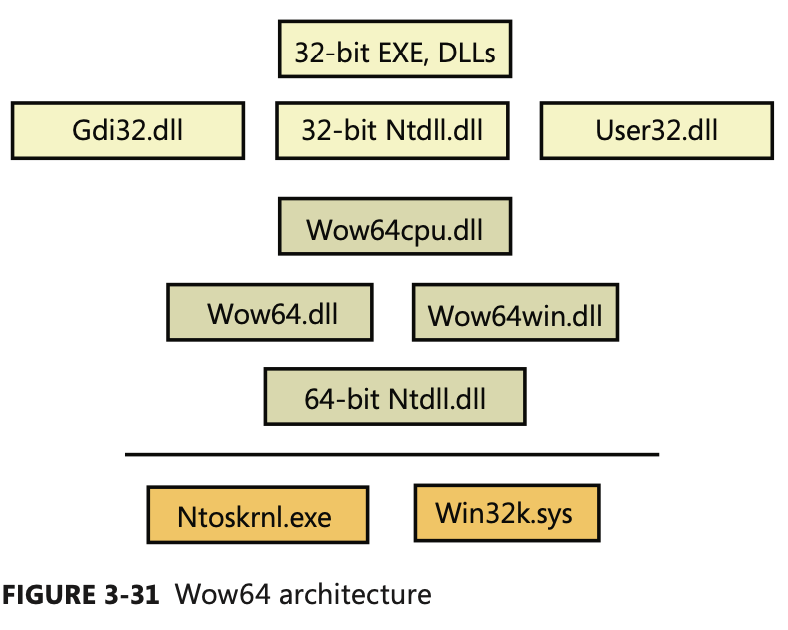</p>

- **Wow64 Process Address Space Layout**:
  - Wow64 processes can run with 2 GB or 4 GB of virtual space (depending on the **large-address-aware** flag).
- **System Calls**:
  - Wow64 hooks all the code paths where 32-bit code would **transition** to the native 64-bit system or when the native system needs to call into 32-bit user-mode code.
  - During process creation, the process manager maps into the process address space the **native** 64-bit `Ntdll.dll`, as well as the **32-bit** `Ntdll.dll` for Wow64 processes. When the loader initialization is called, it calls the Wow64 initialization code inside `Wow64.dll`. Wow64 then sets up the **startup context** required by the 32-bit Ntdll, **switches the CPU mode** to 32-bits, and starts executing the **32-bit loader**. From this point onward, execution continues as if the process is running on a native 32-bit system.
  - Wow64 transitions to native 64-bit mode, **captures the parameters** associated with the system call (converting 32-bit pointers to 64-bit pointers), and issues the corresponding native 64-bit system call. When the native
system call returns, Wow64 converts any output parameters if necessary from 64-bit to 32-bit formats before returning to 32-bit mode ✨.
- **Exception Dispatching**:
  - Wow64 hooks exception dispatching through Ntdll’s `KiUserExceptionDispatcher`.
  - Whenever the 64-bit kernel is about to dispatch an exception to a Wow64 process, Wow64 captures the native exception and context record in user mode and then **prepares a 32-bit exception** and context record and dispatches it the same way the native 32-bit kernel would.
- **User APC Dispatching**:
  - Wow64 also hooks user-mode APC delivery through Ntdll’s `KiUserApcDispatcher`.
  - Whenever the 64-bit kernel is about to dispatch a user-mode APC to a Wow64 process, it maps the 32-bit APC address to a higher range of 64-bit address space. The 64-bit Ntdll then captures the native APC and context record in user mode and **maps it back to a 32-bit address**.
  - It then prepares a 32-bit usermode APC and context record and dispatches it the same way the native 32-bit kernel would.
- **Console Support**:
  - Because console support is implemented in user mode by `Csrss.exe`, of which **only a single native** binary exists, 32-bit applications would be unable to perform console I/O while on 64-bit Windows.
  - Similarly to how a special `rpcrt4.dll` exits to thunk 32-bit to 64-bit RPCs, the 32-bit Kernel dll for Wow64 contains special code to call into Wow, for **thunking parameters** during interaction with `Csrss` and `Conhost.exe`.
- **User Callbacks**:
    - Wow64 intercepts all callbacks from the kernel into user mode Wow64 treats such calls as **system calls**.
    - However, the data conversion is done in the reverse order: **input** parameters are converted from **64 to 32 bits**, and **output** parameters are converted when the callback returns from **32 to 64 bits**.
- **File System Redirection**:
  -  Wow64, as it hooks all the system calls, translates all the path-related APIs and replaces the path name of:
     - `\Windows\System32` ▶️ `\Windows\Syswow64`.
     - `\Windows\LastGood` ▶️ `\Windows\LastGood\syswow64`.
     - `\Windows\Regedit.exe` ▶️ `\Windows\syswow64\Regedit.exe`.
     - `%PROGRAMFILES%` ▶️ `\Program Files (x86)` for 32-bits apps, and `\Program Files` for 64-bits apps.
     - `CommonProgramFiles` and `CommonProgramFiles (x86)` also exist, which always point to the 32-bit location;
     - `ProgramW6432` and `CommonProgramW6432` point to the 64-bit locations **unconditionally**.
   - `\Windows\Sysnative`, allows any I/Os originating from a 32-bit app to this directory to be **exempted** from file redirection. This directory doesn’t actually exist—it is a **virtual path** that allows access to the real `System32` directory, even from an app running under Wow64.
  - Directories exempted from being redirected such that access attempts to them made by 32-bit app actually access the real one:
    - `%indir%\system32\drivers\etc`
    - `%windir%\system32\spool`
    - `%windir%\system32\catroot and %windir%\system32\catroot2`
    - `%windir%\system32\logfiles`
    - `%windir%\system32\driverstore`
  - Wow64 provides a mechanism to control the FS redirection built into Wow64 on a **per-thread** basis through the `Wow64DisableWow64FsRedirection` and `Wow64RevertWow64FsRedirection` functions.
- **Registry Redirection**:
  - Wow64 intercepts all the system calls that open registry keys and retranslates the key path to point it to the Wow64 view of the registry.
  - Wow64 splits the registry at these points:
    `- HKLM\SOFTWARE`
    - `HKEY_CLASSES_ROOT`
    - Many of the subkeys are actually **shared** between 32-bit and 64-bit apps — that is, not the entire hive is split ⚠️.
    - Under each of these keys, Wow64 creates a key called `Wow6432Node`. Under this key is stored 32-bit configuration information. All other portions of the registry are shared between 32-bit and 64-bit apps (for example, `HKLM\SYSTEM`)
    - `HKEY_WOW64_64KEY` **explicitly** opens a 64-bit key from either a 32-bit or 64-bit app, and disables the `REG_SZ` or `REG_EXPAND_SZ` interception.
    - `KEY_WOW64_32KEY` **explicitly** opens a 32-bit key from either a 32-bit or 64-bit app.
- **I/O Control Requests**:
  - The kernel driver is expected to convert the associated pointer-dependent structures sent via (`DeviceIOControl`). Drivers can call the `IoIs32bitProcess` to detect whether or not an I/O request originated from a Wow64 process.

## User-Mode Debugging

- Support for user-mode debugging is split into three different modules:
  - The first one is located in the **executive** itself and has the prefix `Dbgk`, which stands for **Debugging Framework**.
    - It provides the necessary internal functions for registering and listening for debug events, managing the debug object, and packaging the information for consumption by its user-mode counterpart.
  - The user-mode component that talks directly to `Dbgk` is located in the native system library, `Ntdll.dll`, under a set of APIs that begin with the prefix `DbgUi`.
    - These APIs are responsible for **wrapping** the underlying **debug object** implementation (which is opaque), and they allow all subsystem apps to use debugging by wrapping their own APIs around the `DbgUi` implementation.
  - Finally, the third component in user-mode debugging belongs to the **subsystem DLLs**:
    - It is the exposed, documented API (located in `KernelBase.dll`) that each subsystem supports for performing debugging of other apps.

### Kernel Support

- The kernel supports user-mode debugging through an object mentioned earlier, the **debug object**.
- The debug object itself is a simple construct, composed of:
  - a **series of flags** that determine **state**,
  - an **event** to notify any waiters that debugger events are present,
  - a **doubly linked list** of debug events waiting to be processed,
  - and a fast **mutex** used for locking the object.
- Each debugged process has a **debug port** member in its structure pointing to this debug object.
- Examples of KM debugging events: `DbgKmExceptionApi`(An exception has occurred), `DbgKmLoadDllApi`(A DLL was loaded), etc.
- The basic model for the framework is a simple matter of **producers** code in the kernel that generates the debug events in the previous table - and **consumers** - the debugger waiting on these events and acknowledging their
receipt.

### Native Support

- The functions that this component provides are mostly analogous to the Windows API functions and related **system calls**.
- Internally, the code also provides the functionality required to to **create a debug object** associated with the thread.
- The handle to a debug object that is created is never **exposed**. It is saved instead in the TEB of the debugger thread that performs the attachment in `DbgSsReserved[1]`.
- When a debugger attaches to a process, it expects the process to be broken into - that is, an `int 3` (breakpoint) operation should have happened, generated by a thread injected into the process.
- If this didn’t happen, the debugger would never actually be able to take control of the process and would merely see debug events flying by.
- `Ntdll.dll` is responsible for creating and injecting that thread into the target process.

### Windows Subsystem Support

- This component provides the documented Windows APIs. Apart from this trivial **conversion** of one function name to another, there is one important management job that this side of the debugging infrastructure is responsible for: managing the **duplicated file and thread handles**.

## Image Loader

- The image loader lives in the user-mode system DLL `Ntdll.dll` (`Ldr` APIs) and not in the kernel library.
- `Ntdll.dll` is always loaded and that it is the **first** piece of code to run in user mode as part of a new app.
- Some of the main tasks the loader is responsible for include these:
  - Initializing the user-mode state for the app, such as creating the **initial heap** and setting up the **thread-local storage** (TLS) and **fiber-local storage** (FLS) slots
  - Parsing the **import table** (IAT) of the app to look for all DLLs that it requires (and then **recursively** parsing the IAT of each DLL), followed by parsing the **export table** of the DLLs to make sure the function is actually present (Special forwarder entries can also redirect an export to yet another DLL )/
  - **Loading and unloading** DLLs at run time, as well as on demand, and maintaining a list of all loaded modules (the module database).
  - Allowing for run-time patching (called **hotpatching**) support.
  - Handling **manifest files**.
  - Reading the **application compatibility database** for any shims, and loading the shim engine DLL if required.
  - Enabling support for **API sets** and **API redirection**, a core part of the **MinWin** refactoring effort.
  - Enabling dynamic runtime compatibility mitigations through the **SwitchBranch** mechanism.

### Early Process Initialization

- Let's start by covering the work that takes place in **user mode**, independent of any subsystem, as soon as the first user-mode instruction starts execution. When a process starts, the loader performs the following steps:
  1. Build the image path name for the app, and query the **Image File Execution Options** key for the app, as well as the **DEP** and **SEH** validation linker settings.
  2. Look inside the executable’s header to see whether it is a .NET application (specified by the presence of a .NET-specific image directory).
  3. Initialize the **National Language Support** (NLS for internationalization) tables for the process.
  4. Initialize the **Wow64** engine if the image is 32-bit and is running on 64-bit Windows.
  5. Load any configuration options specified in the executable’s header. These options, which a developer can define when compiling the app, control the behavior of the executable.
  6. Set the **affinity mask** if one was specified in the executable header.
  7. Initialize **FLS** and **TLS**
  8. Initialize the **heap manager** for the process, and create the **first process heap**.
  9. Allocate an **SxS** (*Side-by-Side* Assembly)/Fusion **activation context** for the process. This allows the system to use the appropriate DLL version file, instead of defaulting to the DLL that shipped with the OS.
  10. Open the `\KnownDlls` object directory, and build the **known DLL** path. For a Wow64 process, `\KnownDlls32` is used instead.
  11. Determine the process' current directory and **default load path** (used when loading images and opening files).
  12. Build the first loader data table entries for the app executable and `Ntdll.dll`, and insert them into the module database.
- ▶️ At this point, the image loader is ready to start parsing the import table of the executable and start loading any DLLs that were dynamically linked during the compilation of the app.

### DLL Name Resolution and Redirection

- Name resolution is the process by which the system **converts** the name of a PE-format binary to a physical file in situations where the caller has not specified or cannot specify a unique file identity.
- When resolving binary dependencies, the basic Windows app model locates files in a **search path**: a **list of locations** that is searched sequentially for a file with a matching base name.
- However, the placement of the **current directory** in this ordering allowed load operations on system binaries to be overridden by placing **malicious binaries** with the same base name in the app’s current directory.
- To prevent security risks associated with this behavior, a feature known as **safe DLL search** mode was added to the path search computation and, starting with *Windows XP SP2*  enabled by default for all processes. Under safe search mode, the **current directory** is **moved behind** the three system directories, resulting in the following path ordering:
  1. The directory from which the application was launched
  2. The native Windows system directory (for example, `C:\Windows\System32`)
  3. The 16-bit Windows system directory (for example, `C:\Windows\System`)
  4. The Windows directory (for example, C:\Windows)
  5. The current directory at application launch time
  6. Any directories specified by the `%PATH%` environment variable.
- Apps can change specific path elements by editing the `%PATH%` variable using the `SetEnvironmentVariable` API, changing the current directory using the `SetCurrentDirectory` API, or using the `SetDllDirectory` API to specify a DLL directory for the process. When a DLL directory is specified, the loader ignores the safe DLL search mode setting for the process
- Callers can also modify the DLL search path for specific load operations by supplying the `LOAD_WITH_ALTERED_SEARCH_PATH` flag to the` LoadLibraryEx` API.
  - When this flag is supplied and the DLL name supplied to the API specifies a **full path** string, the path containing the DLL file is used in place of the app directory when computing the search path for the operation.

#### DLL Name Redirection

- Before attempting to **resolve a DLL name** string to a file, the loader attempts to apply DLL name **redirection rules**.
- These redirection rules are used to extend or override portions of the DLL namespace—which normally corresponds to the Win32 file system namespace—to extend the Windows application model.
- In order of application, they are:
  - **MinWin API Set Redirection**: The API set mechanism is designed to allow the Windows team to change the binary that exports a given system API in a manner that is transparent to apps.
  - **.LOCAL Redirection**: allows apps to redirect all loads of a specific DLL base name, regardless of whether a full path is specified, to a local copy of the DLL in the app directory.
  - **Fusion (SxS) Redirection**: Fusion (also referred to as *side-by-side*, or SxS) is an extension to the Windows application model that allows components to express more detailed binary **dependency** information (usually versioning information) by embedding binary resources known as **manifests**.
    - The Fusion runtime tool reads embedded dependency information from a binary’s **resource section** using the Windows resource loader, and it packages the dependency information into lookup structures known as **activation contexts**.
    - The per-thread activation context stack is managed both explicitly, via the `ActivateActCtx` and `DeactivateActCtx` APIs, and implicitly by the system at certain points, such as when the DLL main routine of a binary with embedded dependency information is called.
  - **Known DLL Redirection**: is a mechanism that **maps specific DLL** base names to **files** in the system directory, preventing the DLL from being replaced with an alternate version in a different location.

### Loaded Module Database

- The loader maintains a list of all modules (**DLLs** as well as the **primary executable**) that have been loaded by a process.
- This information is stored in a per-process structure called the **process environment block**, or *PEB*, namely, in a substructure identified by `Ldr` and called `PEB_LDR_DATA`.
- In the structure, the loader maintains three **doubly-linked** lists, all containing the same information but **ordered differently** (either by load order, memory location, or initialization order).
- These lists contain structures called loader data table entries (`LDR_DATA_TABLE_ENTRY`) that store information about each **module**.

<details><summary>🔭 EXPERIMENT: Dumping the Loaded Modules Database</summary>

- You can look at the PEB of the current process with the `!peb` command:
```sh
0: kd> !peb
PEB at 000007fffffda000
InheritedAddressSpace: No
ReadImageFileExecOptions: No
BeingDebugged: No
ImageBaseAddress: 00000000ff590000
Ldr 0000000076e72640
Ldr.Initialized: Yes
Ldr.InInitializationOrderModuleList: 0000000000212880 . 0000000004731c20
Ldr.InLoadOrderModuleList: 0000000000212770 . 0000000004731c00
Ldr.InMemoryOrderModuleList: 0000000000212780 . 0000000004731c10
Base TimeStamp Module
ff590000 4ce7a144 Nov 20 11:21:56 2010 C:\Windows\Explorer.EXE
76d40000 4ce7c8f9 Nov 20 14:11:21 2010 C:\Windows\SYSTEM32\ntdll.dll
76870000 4ce7c78b Nov 20 14:05:15 2010 C:\Windows\system32\kernel32.dll
7fefd2d0000 4ce7c78c Nov 20 14:05:16 2010 C:\Windows\system32\KERNELBASE.dll
7fefee20000 4a5bde6b Jul 14 02:24:59 2009 C:\Windows\system32\ADVAPI32.dll
```

- You can also analyze each module entry on its own by going through the module list and then dumping the data at each address, formatted as a `LDR_DATA_TABLE_ENTRY`
structure Instead of doing this for each entry, however, WinDbg can do most of the work by using the `!list` extension and the following syntax:
```sh
> !list -t ntdll!_LIST_ENTRY.Flink -x "dt ntdll!_LDR_DATA_TABLE_ENTRY @$extret\"" 001c1cf8
+0x000 InLoadOrderLinks : _LIST_ENTRY [ 0x1c1d68 - 0x76fd4ccc ]
+0x008 InMemoryOrderLinks : _LIST_ENTRY [ 0x1c1d70 - 0x76fd4cd4 ]
+0x010 InInitializationOrderLinks : _LIST_ENTRY [ 0x0 - 0x0 ]
+0x018 DllBase : 0x00d80000
+0x01c EntryPoint : 0x00d831ed
+0x020 SizeOfImage : 0x28000
+0x024 FullDllName : _UNICODE_STRING "C:\Windows\notepad.exe"
+0x02c BaseDllName : _UNICODE_STRING "notepad.exe"
+0x034 Flags : 0x4010
```
</details>

- Although this section covers the user-mode loader in `Ntdll.dll`, note that the **kernel** also employs its **own loader** for drivers and dependent DLLs, with a similar loader entry structure.
- Likewise, the kernel-mode loader has its own database of such entries, which is directly accessible through the `PsActiveModuleList` global data variable.
- To dump the kernel’s loaded module database, you can use a similar `!list` command as shown in the preceding experiment by replacing the pointer at the end of the command with “`nt!PsActiveModuleList`”.

### Import Parsing

- During this step, the loader will do the following:
  1. Load each DLL referenced in the **import table** (IT) of the process’ executable image.
  2. Check whether the DLL has already been loaded by checking the module database. If it doesn’t find it in the list, the loader opens the DLL and maps it into memory.
  3. During the mapping operation, the loader first looks at the various paths where it should attempt to find this DLL, as well as whether this DLL is a “known DLL,” meaning that the system has already loaded it at startup and provided a global memory mapped file for accessing it. Certain deviations from the standard lookup algorithm can also occur, either through the use of a .local file or through a manifest file, which can specify a redirected DLL to use to guarantee a specific version.
  4. After the DLL has been found on disk and mapped, the loader checks whether the kernel has loaded it somewhere else (**relocation**). If the loader detects relocation, it parses the relocation information in the DLL and performs the operations required. If no relocation information is present, DLL loading fails.
  5. The loader then creates a loader **data table entry** for this DLL and inserts it into the database.
  6. After a DLL has been mapped, the process is repeated for this DLL to parse its IT and all its **dependencies**.
  7. After each DLL is loaded, the loader parses the **IAT** to look for specific functions that are being imported. Usually this is done by name, but it can also be done by ordinal (an index number). For each name, the loader parses the **export table** of the imported DLL and tries to locate a match. If no match is found, the operation is aborted.
  8. The IT of an image can also be bound. This means that at link time, the developers already assigned **static** addresses pointing to imported functions in external DLLs. This removes the need to do the lookup for each name, but it assumes that the DLLs the app will use will always be located at the **same address**. Because Windows uses address space randomization (Address Space Load Randomization, or ASLR), this is usually not the case for system apps and libraries.
  9. The export table of an imported DLL can use a **forwarder** entry, meaning that the actual function is implemented in another DLL. This must essentially be treated like an import or dependency, so after parsing the export table, each DLL referenced by a forwarder is also loaded and the loader goes back to step 1.
- After all **imported DLLs** (and their own dependencies, or imports) have been **loaded**, all the required **imported functions** have been **looked up and found**, and all **forwarders** also have been **loaded and processed**, the step is complete: all dependencies that were defined at compile time by the app and its various DLLs have now been fulfilled.
- During execution, **delayed** dependencies (called **delay load**), as well as run-time operations (such as calling `LoadLibrary`) can call into the loader and essentially repeat the same tasks.

### Post-Import Process Initialization

- After the required dependencies have been loaded, several initialization tasks must be performed to fully finalize launching the app. In this phase, the loader will do the following:
  1. Check if the app is a **.NET** app, and redirect execution to the .NET runtime entry point instead, assuming the image has been validated by the framework
  2. Check if the **app itself** requires **relocation**, and process the relocation entries for the app.
  3. Check if the app makes use of **TLS**, and look in the app executable for the TLS entries it needs to allocate and configure.
  4. If this is a Windows app, the Windows subsystem **thread-initialization thunk code** is located after loading `kernel32 dll`, and the **Authz/AppLocker** enforcement is enabled. If `Kernel32.dll` is not found, the system is presumably assumed to be running in **MinWin** and only` Kernelbase.dll` is loaded.
  5. Any static imports are now loaded
  6. At this point, the initial **debugger breakpoint** will be hit when using a debugger such as WinDbg.
  7. Make sure that the app will be able to run properly if the system is a **multiprocessor** system.
  8. Set up the default **data execution prevention** (DEP) options, including for exception-chain validation, also called “software” DEP.
  9. Check whether this app requires any app **compatibility** work, and load the **shim engine** if required.
  10. Detect if this app is protected by `SecuROM`, `SafeDisc`, and other kinds of wrapper or protection utilities that could have issues with DEP (and reconfigure DEP settings in those cases).
  11. Run the **initializers** for all the loaded modules
  12. Run the post-initialization **Shim Engine callback** if the module is being shimmed for app compatibility
  13. Run the associated subsystem DLL **post-process initialization routine** registered in the **PEB** For Windows apps, this does Terminal Services–specific checks, for example.

- Running the initializers is the last main step in the loader’s work: This is the step that calls the `DllMain` routine for each DLL (allowing each DLL to perform its own **initialization** work) as well as processes the **TLS initializers** of each DLL. As a very last step, the loader calls the **TLS initializer** of the **actual app**.

### SwitchBack

- SwitchBack, implemented in the loader, enables software developers to embed a `GUID` specific to the Windows version they are targeting in their executable’s associated manifest.
- SwitchBack parses this information and correlates it with embedded information in **SwitchBack-compatible DLLs** (in the `.sb_data` image section) to decide which version of an affected API should be called by the module.
- Whenever a Windows API is affected by changes that might break compatibility, the function’s entry code calls the `SbSwitchProcedure` to invoke the SwitchBack logic.  It passes along a pointer to the **SwitchBack Module Table**, which contains information about the SwitchBack mechanisms employed in the module.
- The table also contains a pointer to an array of entries for each **SwitchBack point**. This table contains a description of each branch-point that identifies it with a symbolic name and a comprehensive description, along with an associated mitigation tag.

### API Sets

- While SwitchBack uses **API redirection** for specific **application-compatibility** scenarios, there is a much more pervasive redirection mechanism used in Windows for all applications, called API Sets 👍.
- Its purpose is to enable **fine-grained categorization** of Windows APIs into **sub-DLLs** instead of having **large multipurpose DLLs** that span nearly thousands of APIs that might not be needed on all types of Windows systems today and in the future.
- For example, the following graphic shows that `Kernel32.dll`, which is a core Windows library, imports from many other DLLs, beginning with `API-MS-WIN`. Each of these DLLs contain a small
subset of the APIs that `Kernel32` normally provides, but together they make up the entire API surface exposed by `Kernel32.dll`. The `CORE-STRING` library, for instance, provides only the Windows base **string** functions.
<p align="center">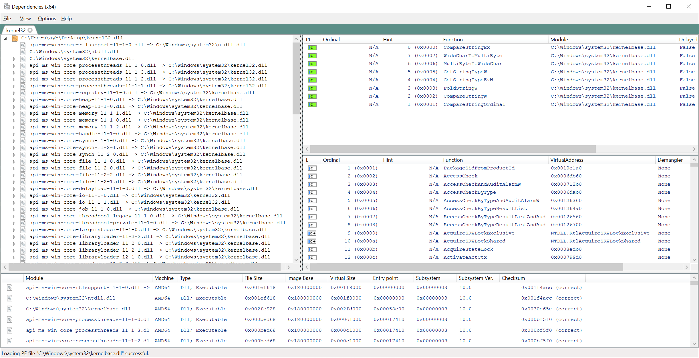</p>

- When the process manager initializes, it calls the `PspInitializeApiSetMap` function, which is responsible for creating a section object of the **API Set redirection table**,
which is stored in `%SystemRoot%\System32\ApiSetSchema.dll`. The DLL contains no executable code, but it has a section called `.apiset` that contains API Set mapping data that **maps virtual API Set DLLs** to **logical DLLs** that implement the APIs. Whenever a new process starts, the process manager maps the section object into the process’ address space and sets the `ApiSetMap` field in the process’ PEB to point to the base address where the section object was mapped.
- In turn, the loader’s `LdrpApplyFileNameRedirection` function, which is normally responsible for the local and SxS/Fusion manifest redirection, also checks for API Set redirection data whenever a new import library that has a name starting with “*API-*“ loads (either dynamically or statically). The API Set table is organized by library with each entry describing in which logical DLL the function can be found, and that DLL is what gets loaded.

## Hypervisor (Hyper-V)

<p align="center">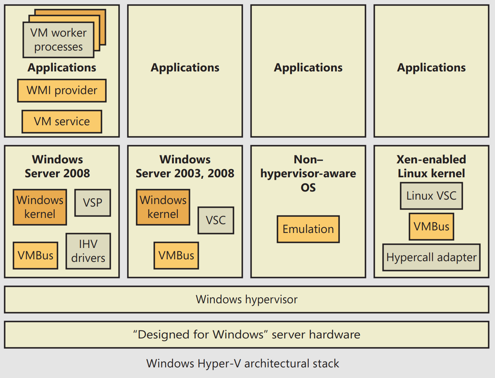</p>

### Partitions

- One of the key architectural components behind the Windows hypervisor is the concept of a **partition**.
- A partition essentially references an **instance** of an OS installation, which can refer either to what’s traditionally called the **host** or to the **guest**.
- Under the Windows hypervisor model, these two terms are not used; instead, we talk of either a **parent partition** or a **child partition**, respectively.

### Parent Partition

- The hypervisor uses the existing **Windows driver architecture** and talks to actual Windows device drivers. This architecture results in several components that provide and manage this behavior, which are collectively called the **hypervisor stack**.
<p align="center">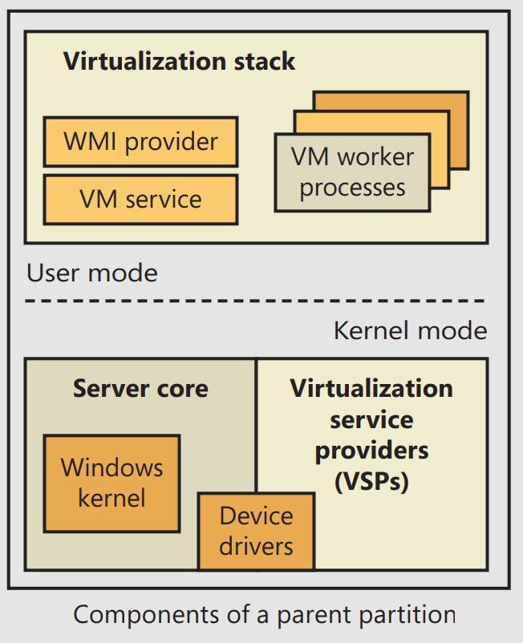</p>

### Parent Partition Operating System

- The Windows installation (typically the minimal footprint server installation, called **Windows Server Core**, to minimize resource usage) is responsible for providing the hypervisor and the device drivers for the hardware on the system (which the hypervisor will need to access), as well as for running the hypervisor stack. It is also the management point for all the child partitions