# Chapter 5: Processes, Threads, and Jobs

## Process Internals

### Data Structures

- Each Windows process is represented by an **executive** process (`EPROCESS`) structure.
- Each process has one or more threads, each represented by an executive thread (`ETHREAD`) structure.
- The `EPROCESS` and most of its related data structures exist in **system** address space. One exception is the **PEB**, which exists in the **process** address space (because it contains information accessed by user-mode code).
- Some of the process data structures used in memory management, such as the **working set list**, are valid only within the context of the **current process**, because they are stored in **process-specific** system space.
- For each process that is executing a Win32 program, the Win32 subsystem process (`Csrss`) maintains a parallel structure called the `CSR_PROCESS`.
- Finally, the kernel-mode part of the Win32 subsystem (`Win32k.sys`) maintains a per-process data structure, `W32PROCESS`.
- Every `EPROCESS` structure is encapsulated as a process object by the **executive** object manager.
<p align="center">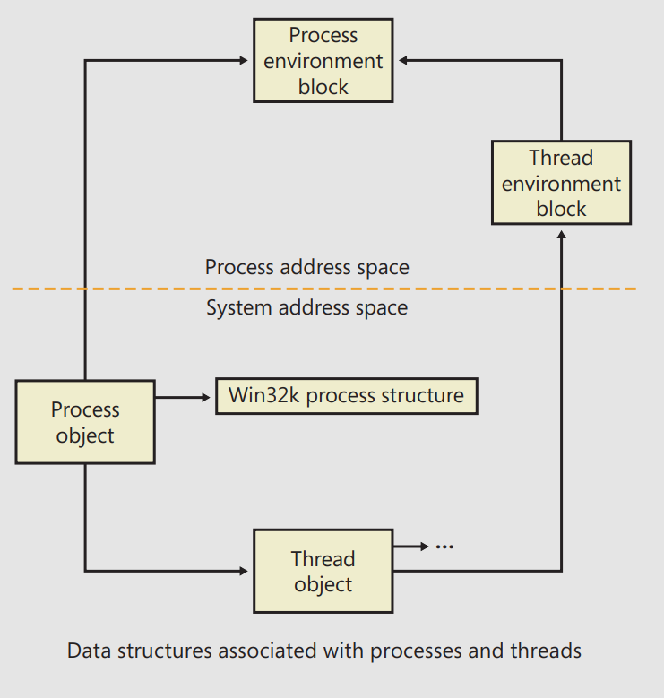</p>

- The first member of the executive process structure is called **Pcb**.
- It is a structure of type `KPROCESS`, for kernel process. Although routines in the **executive** store information in the `EPROCESS`, the **dispatcher**, **scheduler**, and **interrupt/time** accounting code - being part of the OS kernel - use the `KPROCESS` instead.
- This allows a layer of abstraction to exist between the executive’s high-level functionality and its underlying low-level implementation of certain functions, and it helps prevent unwanted **dependencies** between the layers.
<p align="center">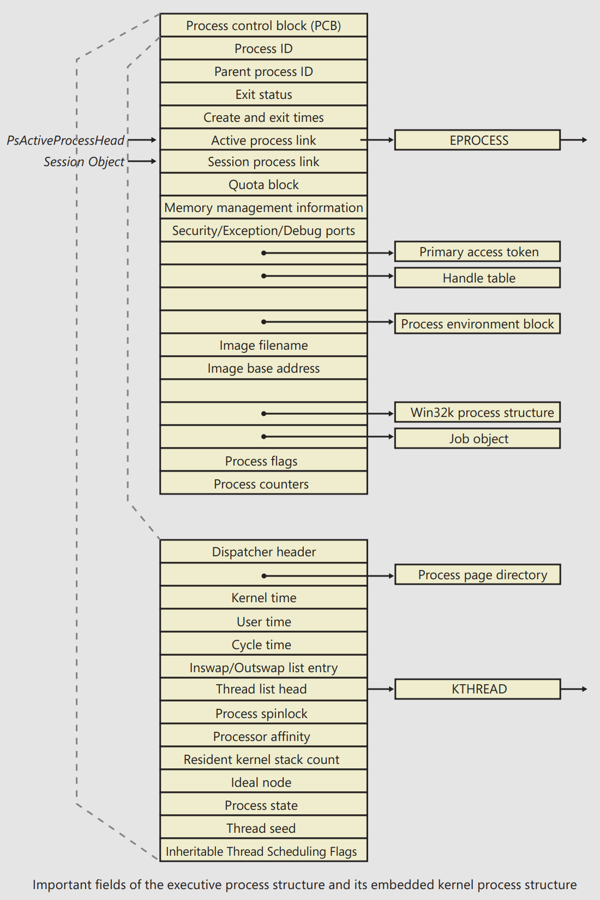</p>

- The PEB lives in the user-mode address space of the process it describes. It contains information needed by the **image loader**, the **heap manager**, and other Windows components that need to access it from user mode.
- The `EPROCESS` and `KPROCESS` structures are accessible only from kernel mode. The important fields of the PEB are illustrated below:
<p align="center">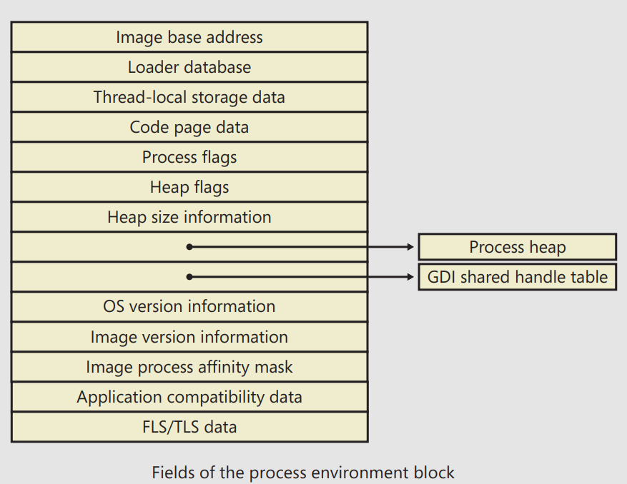</p>

- Because each session has its own instance of the Windows subsystem, the `CSR_PROCESS` structures are maintained by the *Csrss* process within each individual session.
<p align="center">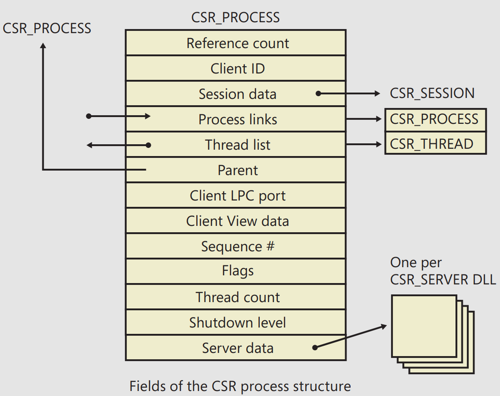</p>

- You can dump the `CSR_PROCESS` structure with the `!dp` command in the `user`-mode debugger.
  - The `!dp` command takes as input the **PID** of the process whose `CSR_PROCESS` structure should be dumped
  - Alternatively, the structure pointer can be given directly as an argument Because `!dp` already performs a dt command internally, there is no need to use `dt` on your own: `0:000> !dp v 0x1c0aa8-8`
- The `W32PROCESS` structure contains all the information that the **Windows graphics** and **window management** code in
the kernel (Win32k) needs to maintain state information about GUI processes.
<p align="center">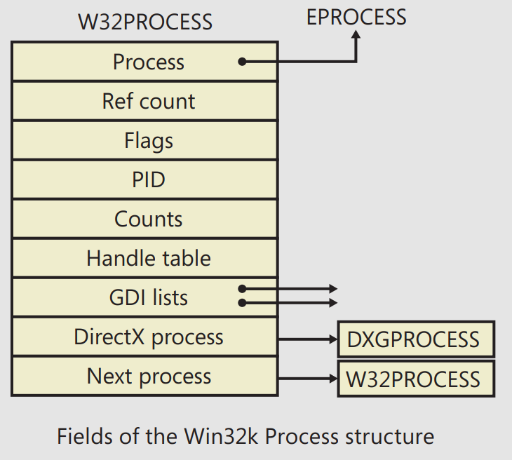</p>

- There is no command provided by the debugger extensions to dump the `W32PROCESS` structure, but it is present in the symbols of the Win32k driver.
  - As such, by using the `dt` command with the appropriate symbol name `win32k!_W32PROCESS`, it is possible to dump the
fields as long as the pointer is known.
  - Because the `!process` does not actually output this pointer (even though it is stored in the `EPROCESS` object), the field must be inspected manually with dt `nt!_EPROCESS Win32Process` followed by an `EPROCESS` pointer.

## Protected Processes

- In the Windows security model, any process running with a token containing the **debug** privilege (such as an **administrator**’s account) can request **any** access right that it desires to any other process running on the machine.
  - For example, it can RW **arbitrary** process memory, inject code, suspend and resume threads, and query information on other processes 🤸‍♀️.
- This logical behavior (which helps ensure that administrators will always have full control of the running code on the system) **clashes** with the system behavior for DRM requirements imposed by the media industry 🤷.
- To support reliable and protected playback of such content, Windows uses **protected processes**.
- The OS will allow a process to be protected only if the image file has been **digitally signed** with a special Windows Media Certificate ‼️
- Example of protected processes:
  - The Audio Device Graph process (`Audiodg.exe`) because protected music content can be decoded through it.
  - WER client process (`Werfault.exe`) can also run protected because it needs to have access to protected processes in case one of them crashes.
  - The System process itself is protected because some of the decryption information is generated by the` Ksecdd.sys` driver and stored in its UM memory. Additionally, it protects the integrity of all kernel **handles**.
- At the kernel level, support for protected processes is twofold:
  1. The bulk of process creation occurs in KM to avoid injection attacks.
  2. Protected processes have a special bit set in their `EPROCESS` structure that modifies the behavior of security-related routines in the process manager to deny certain access rights that would normally be granted to administrators. In fact, the only access rights that are granted for protected processes are `PROCESS_QUERY`/`SET_LIMITED_INFORMATION`, `PROCESS_TERMINATE`, and `PROCESS_SUSPEND_RESUME`. Certain access rights are also disabled for threads running inside protected processes.

## Flow of CreateProcess

- A Windows subsystem process is created when a call is make to one of the process-creation functions, such as `CreateProcess`, `CreateProcessAsUser`, `CreateProcessWithTokenW`, or `CreateProcessWithLogonW`.
- Here is an overview of the stages Windows follows to create a process:
  1. **Validate parameters**; convert Windows subsystem flags and options to their native counterparts; parse, validate, and convert the attribute list to its native counterpart.
  2. Open the image file (.exe) to be executed inside the process.
  3. Create the Windows **executive** process object.
  4. Create the **initial thread** (stack, context, and Windows **executive** thread object)
  5. Perform post-creation, **Windows-subsystem-specific** process initialization.
  6. Start execution of the initial thread (unless the `CREATE_SUSPENDED` flag was specified).
  7. In the context of the new process and thread, complete the initialization of the address space (such as load **required DLLs**) and begin execution of the program.
<p align="center">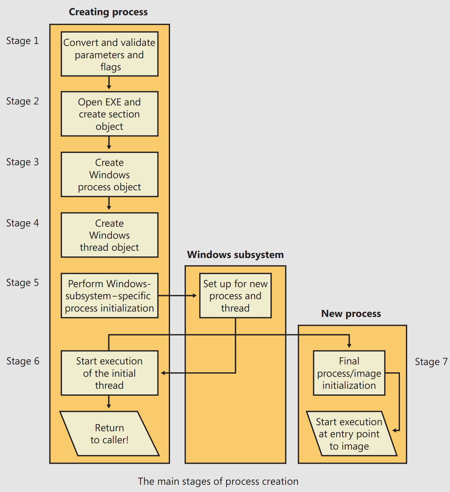</p>

### Stage 1: Converting and Validating Parameters and Flags

- You can specify more than one **priority class** for a single `CreateProcess` call but Windows chooses the lowest-priority class set.
- If no priority class is specified for the new process, the priority class defaults to **Normal** unless the priority class of the process that created it is **Idle** or **Below Normal**, in which case the priority class of the new process will have the same priority as the creating class.
- If a **Real-time** priority class is specified for the new process and the process’ caller doesn’t have the *Increase Scheduling Priority* privilege, the **High** priority class is used instead.
- If no desktop is specified in `CreateProcess`, the process is associated with the caller’s **current desktop**.
- If the creation flags specify that the process will be **debugged**, `Kernel32` initiates a connection to the native debugging code in `Ntdll.dll` by calling `DbgUiConnectToDbg` and gets a handle to the debug object from the current TEB.
- The user-specified attribute list is **converted** from Windows subsystem format to **native** format and internal attributes are added to it.

<details><summary>Process Attributes:</summary>


| Native Attribute      | Equivalent Windows Attribute                                   | Type   | Description                                                                                                                                                                                |
| --------------------- | -------------------------------------------------------------- | ------ | ------------------------------------------------------------------------------------------------------------------------------------------------------------------------------------------ |
| PS_CP_PARENT_PROCESS  | PROC_THREAD_ATTRIBUTE_PARENT_PROCESS. Also used when elevating | Input  | Handle to the parent process                                                                                                                                                               |
| PS_CP_DEBUG_OBJECT    | N/A – used when using DEBUG_PROCESS as a flag                  | Input  | Debug object if process is being started debugged                                                                                                                                          |
| PS_CP_PRIMARY_TOKEN   | N/A – used when using `CreateProcessAsUser/WithToken`          | Input  | Process token if `CreateProcessAsUser` was used                                                                                                                                            |
| PS_CP_CLIENT_ID       | N/A – returned by Win32 API as a parameter                     | Output | Returns the TID and PID of the initial thread and the process                                                                                                                              |
| PS_CP_TEB_ADDRESS     | N/A – internally used and not exposed                          | Output | Returns the address of the TEB for the initial thread                                                                                                                                      |
| PS_CP_FILENAME        | N/A – used as a parameter in `CreateProcess` API               | Input  | Name of the process that should be created                                                                                                                                                 |
| PS_CP_IMAGE_INFO      | N/A – internally used and not exposed                          | Output | Returns `SECTION_IMAGE_INFORMATION`, which contains information on the version, flags, and subsystem of the executable, as well as the stack size and entry point                          |
| PS_CP_MEM_RESERVE     | N/A – internally used by SMSS and CSRSS                        | Input  | Array of virtual memory reservations that should be made during initial process address space creation, allowing guaranteed availability because no other allocations have taken place yet |
| PS_CP_PRIORITY_CLASS  | N/A – passed in as a parameter to the CreateProcess API        | Input  | Priority class that the process should be given                                                                                                                                            |
| PS_CP_ERROR_MODE      | N/A – passed in through `CREATE_DEFAULT_ERROR_MODE` flag       | Input  | Hard error-processing mode for the process                                                                                                                                                 |
| PS_CP_STD_HANDLE_INFO |                                                                | Input  | Specifies if standard handles should be duplicated, or if new handles should be created                                                                                                    |
| PS_CP_HANDLE_LIST     | `PROC_THREAD_ATTRIBUTE_HANDLE_LIST`                            | Input  | List of handles belonging to the parent process that should be inherited by the new process                                                                                                |
| PS_CP_GROUP_AFFINITY  | `PROC_THREAD_ATTRIBUTE_GROUP_AFFINITY`                         | Input  | Processor group(s) the thread should be allowed to run on                                                                                                                                  |
| PS_CP_PREFERRED_NODE  | `PROC_THREAD_ATTRIBUTES_PRFERRED_NODE`                         | Input  | Preferred (ideal) node that should be associated with the process. It affects the node on which the initial process heap and thread stack will be created                                  |
| PS_CP_IDEAL_PROCESSOR | `PROC_THREAD_ATTTRIBUTE_IDEAL_PROCESSOR`                       | Input  | Preferred (ideal) processor that the thread should be scheduled on                                                                                                                         |
| PS_CP_UMS_THREAD      | `PROC_THREAD_ATTRIBUTE_UMS_THREAD`                             | Input  | Contains the UMS attributes, completion list, and context                                                                                                                                  |
| PS_CP_EXECUTE_OPTIONS | `PROC_THREAD_MITIGATION_POLICY`                                | Input  | Contains information on which mitigations (SEHOP, ATL Emulation, NX) should be enabled/disabled for the process                                                                            |

</details>

### Stage 2: Opening the Image to Be Executed

- The first stage in `NtCreateUserProcess` is to find the appropriate Windows image that will run the executable file specified by the caller and to create a section object to later map it into the address space of the new process.
<p align="center">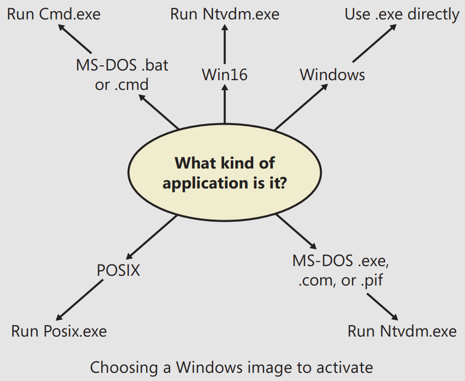</p>

- Now that `NtCreateUserProcess` has found a valid Windows executable image, it looks in the registry under `HKLM\SOFTWARE\Microsoft\Windows NT\CurrentVersion\Image File Execution Options` to see whether a subkey with the file name and extension of the executable image exists there.
  - If it does, `PspAllocateProcess` looks for a value named *Debugger* for that key. If this value is present, the image to be run becomes the string in that value and `CreateProcess` restarts at Stage 1.

<details><summary>Decision Tree for Stage 1 of CreateProcess:</summary>

| If the Image ...                                                            | Create State Code           | This Image Will Run                | ... and This Will Happen                                                                    |
| --------------------------------------------------------------------------- | --------------------------- | ---------------------------------- | ------------------------------------------------------------------------------------------- |
| Is a POSIX executable file                                                  | PsCreateSuccess             | `Posix.exe`                        | CreateProcess restarts Stage 1                                                              |
| Is an MS-DOS application with an exe, com, or pif extension                 | PsCreateFailOnSectionCreate | `Ntvdm.exe`                        | CreateProcess restarts Stage 1                                                              |
| Is a Win16 application                                                      | PsCreateFailOnSectionCreate | `Ntvdm.exe`                        | CreateProcess restarts Stage 1                                                              |
| Is a Win64 application on a 32-bit system (or a PPC, MIPS, or Alpha Binary) | PsCreateFailMachineMismatch | N/A                                | CreateProcess will fail                                                                     |
| Has a Debugger key with another image name                                  | PsCreateFailExeName         | Name specified in the Debugger key | CreateProcess restarts Stage 1                                                              |
| Is an invalid or damaged Windows EXE                                        | PsCreateFailExeFormat       | N/A                                | CreateProcess will fail Cannot be opened PsCreateFailOnFileOpen N/A CreateProcess will fail |
| Is a command procedure (application with a bat or cmd extension)            | PsCreateFailOnSectionCreate | `Cmd.exe`                          | CreateProcess restarts Stage 1                                                              |

</details>

### Stage 3: Creating the Windows Executive Process Object (PspAllocateProcess)

- At this point, `NtCreateUserProcess` has opened a valid Windows executable file and created a **section object** to map it into the new process address space. Next it creates a Windows executive process object to run the image by calling the internal system function `PspAllocateProcess`. Creating the executive process object involves the following substages:
  - Setting up the `EPROCESS` object
  - Creating the initial process address space
  - Initializing the kernel process structure(`KPROCESS`)
  - Setting up the PEB
  - Concluding the setup of the process address space (which includes initializing the working set list and VA space descriptors and mapping the image into address space).

#### Stage 3A: Setting Up the EPROCESS Object

- **Affinity & Node Setup**: The process inherits the CPU affinity and NUMA node from the parent, unless explicitly set during creation.
- **Priority Inheritance**: The I/O and page priority are inherited from the parent, or default values are used if no parent exists.
- **Exit Status**: The new process is marked as pending.
- **Error Handling**: Error handling modes are set, either inherited from the parent or defaulting to showing all errors.
- **Parent Process Info**: The parent process ID is stored in the new process.
- **Execution Options**: The process checks execution options for settings like **large page** mapping or **NUMA** assignments.
- **ASLR & Privileges**: Stack randomization is disabled if necessary, and the system acquires privileges required for process creation.
- **Token & Security**: The process inherits the parent’s security token or uses a specified token, ensuring privilege checks are passed.
- **Session Handling**: If the process spans across sessions, the parent temporarily attaches to handle resources correctly.
- **Quota & Working Set**: The process inherits or gets new resource quotas, including working set sizes (memory limits).
- **Address Space & Affinity**: The process address space is initialized, and **group affinity** is set based on inheritance or system settings.
- **KPROCESS Initialization**: The `KPROCESS` part of the process object is initialized.
- **Priority & Handle Table**: The process inherits or sets its own priority class, and the handle table is initialized with inheritable handles.
- **Final Settings**: Performance options, process priority, and other settings are finalized, including the **PEB** and mitigation options like **No-Execute** (NX) support.
- **Process Creation Time**: The process ID and creation time are set, but the process is not yet inserted into the system's process table.

#### Stage 3B: Creating the Initial Process Address Space

- The initial address space includes:
  - **Page Directory**: Creates the main page directory, which may involve multiple directories for systems with more complex page tables (e.g., PAE mode or 64-bit systems).
  - **Hyperspace Page**: Allocates a special memory page used for managing the process's memory.
  - **VAD Bitmap Page**: Allocates a page for tracking the Virtual Address Descriptors (VAD) in the process.
  - **Working Set List**: Allocates memory for the process’s working set, which tracks the active memory pages.

#### Stage 3C: Creating the Kernel Process Structure

- Involves initializing the `KPROCESS` (Pcb) part of the process object. This is done through `KeInitializeProcess`, which sets up various kernel-level attributes of the process. Key steps include:
    - **Thread List**: Initializes an empty doubly-linked list to track all threads within the process.
    - **Default Quantum**: Sets an initial thread scheduling quantum value (default is 6), which will later be adjusted based on system settings.
    - **Base Priority**: Sets the process's base priority as calculated in *Stage 3A*.
    - **Processor & Group Affinity**: Configures the default processor and group affinity for the process's threads, either inherited or set in earlier stages.
    - **Swapping State**: Marks the process as **resident** in memory.
    - **Thread Seed**: Assigns an ideal processor for the process based on the system's **round-robin** algorithm, ensuring load balancing across processors.

#### Stage 3D: Concluding the Setup of the Process Address Space

- Setting up a new process's address space in Windows involves several steps coordinated by the memory manager:
  - The virtual memory manager sets the process's **last trim time**, which the working set manager uses to determine when to trim the process's working set.
  - The **working set list** for the process is initialized, allowing page faults to be handled.
  - The **section** created when opening the image file is mapped into the process’s address space, setting the **base address**.
  - `Ntdll.dll` is mapped, and for *Wow64* processes, the 32-bit `Ntdll.dll` is mapped as well.
  - A new **session** is created if required, typically for session-based processes managed by SMSS.
  - Standard **handles** are **duplicated** and stored in the process's parameter structure.
  - **Memory reservations** are processed, with options to reserve the first 1 or 16 MB for low-address requirements.
  - **User parameters** are added, with relative memory adjustments.
  - **Affinity** details are written into the PEB.
  - The **MinWin** API redirection set is mapped into the process/

#### Stage 3E: Setting Up the PEB

- `NtCreateUserProcess` calls `MmCreatePeb`, which first maps the systemwide NLS tables into the process’ address space.
- It next calls `MiCreatePebOrTeb` to allocate a page for the PEB and then initializes a number of fields, most of them based on internal variables that were configured through the registry, such as `MmHeap*` values, `MmCriticalSectionTimeout`, and `MmMinimumStackCommitInBytes`.
- Some of these fields can be **overridden** by settings in the linked executable image, such as the Windows version in the PE header or the affinity mask in the load configuration directory of the PE header.

#### Stage 3F: Completing the Setup of the Executive Process Object (PspInsertProcess)

- In the final stage of process creation, `PspInsertProcess` completes setup for the executive process object with these steps:
  - If system-wide process **auditing** is enabled, it logs the process creation in the Security event log.
  - If the parent process is part of a **job**, the job is inherited by the new process and added to the job’s session.
  - The new process is added to the list of **active processes**.
  - The parent’s **debug port** is inherited unless specified otherwise, or a new debug port is attached if one is provided.
  - The function checks that the process’s **group affinity** aligns with any restrictions set by its job object, preventing conflicts between job and process permissions.
  - Finally, `ObOpenObjectByPointer` creates a handle for the process and returns it, with process creation callbacks triggered only once the first thread is created.

### Stage 4: Creating the Initial Thread and Its Stack and Context

- At this point, the Windows executive process object is completely set up. It still has no thread, however, so it can’t do anything yet.
- Normally, the `PspCreateThread` routine is responsible for all aspects of thread creation and is called by `NtCreateThread` when a new thread is being created.
- However, because the **initial thread** is created **internally** by the kernel without user-mode input, the two helper routines that `PspCreateThread` relies on are used instead:
`PspAllocateThread` and `PspInsertThread`.
- `PspAllocateThread` handles the actual creation and initialization of the executive thread object itself, while `PspInsertThread` handles the creation of the thread handle and security attributes and the call to `KeStartThread` to turn the executive object into a schedulable thread on the system.
- However, the thread won’t do anything yet—it is created in a **suspended** state and isn’t resumed until the process is completely initialized.
- `PspAllocateThread` creates a thread in a Windows process and includes these steps:
  - Prevents **UMS** threads in Wow64 processes and disallows user-mode thread creation in system processes.
  - Creates and initializes an executive thread object.
  - Sets up CPU **rate limiting** if enabled.
  - Initializes lists for **LPC**, **I/O** management, and **Executive**.
  - Sets the thread **creation time** and **ID**.
  - Prepares the thread's **stack and context**, initializing the Wow64 context if necessary.
  - Allocates the **TEB**.
  - Sets the user-mode start address (`RtlUserThreadStart`) in the **ETHREAD**.
  - Calls `KeInitThread` to initialize `KTHREAD` with process priorities, affinity, and **machine-dependent hardware context** (context, trap, exception frames).
  - Initializes the UMS state via `PspUmsInitThread` if the thread is a UMS thread.
- After `NtCreateUserProcess` completes preliminary setup, it calls `PspInsertThread` to finalize thread creation with these steps:
  - Checks the thread’s **group affinity** to ensure it aligns with **job limits**.
  - Verifies the process and thread are still active; fails if either has been terminated.
  - Initializes `KTHREAD` (via `KeStartThread`) by inheriting scheduler settings from the owner process, setting the ideal node and processor, updating group affinity, and inserting it in process lists maintained by `KPROCESS`. On x64. another system-wide list of processes, `KiProcessListHead`, is used by PatchGuard to maintain the integrity of the executive’s `PsActiveProcessHead`.
  - Increments the process’s thread count, updates the high watermark if this is a new maximum, and freezes the primary token if this is the second thread.
  - Increments the UMS thread count if applicable.
  - Inserts the thread into the process’s list, suspending it if requested.
  - Sets up **CPU rate** control if enabled.
  - Calls registered thread and process callbacks.
  - The handle is created with `ObOpenObjectByPointer`
  - The thread is readied for execution by calling `KeReadyThread` It enters the deferred ready queue, the process is paged out, and a page in is requested.

### Stage 5: Performing Windows Subsystem–Specific PostInitialization

`Kernel32.dll` then performs various operations related to Windows subsystem–specific operations to finish initializing the process.
- Before an executable runs in Windows, multiple checks are performed:
  - **Validation Checks**: Verifies the executable's image version and applies group policy restrictions (e.g., **application certification**). On certain Windows Server editions, additional checks prevent use of **disallowed APIs**.
  - **Restricted Token Creation**: If software restriction policies apply, a restricted token is created.
  - **Compatibility Check**: The application-compatibility database is queried for entries related to the process. Compatibility settings are stored but applied later.
- Next, `Kernel32.dll` sends a message to the Windows subsystem to initialize structures for **SxS**, including **manifest** information and** DLL redirection** paths. The subsystem receives process and thread handles, creation flags, UI language, and other initialization data, performing these steps:
  - **Process and Thread Initialization**: `CsrCreateProcess` duplicates handles, sets process priority, and allocates structures (`CSR_PROCESS` and `CSR_THREAD`) to track the new process and thread.
  - **Session Management**: Updates session process count and assigns a default shutdown level.
  - **Exception Handling**: Links the exception port to notify the subsystem of second-chance exceptions.
  - **GUI Initialization**: Shows the application start cursor, allowing five seconds for a GUI response before reverting to a standard cursor.
- For **elevated processes**, further checks include whether the process was launched via `ShellExecute` with *AppInfo* service elevation. If so, the token’s virtualization flag is enabled, or an elevation request is sent for re-evaluation.
- **Protected processes** skip most **compatibility** and **elevation** checks since they are designed with built-in security to avoid vulnerabilities associated with **shimming** and **virtualization**.

### Stage 6: Starting Execution of the Initial Thread

- At this point, the process environment has been determined, resources for its threads to use have been allocated, the process has a thread, and the Windows subsystem knows about the new process.
- Unless the caller specified the CREATE_ `SUSPENDED` flag, the **initial** thread is now **resumed** so that it can start running and perform the remainder of the process initialization work that occurs in the context of the new process (Stage 7).

### Stage 7: Performing Process Initialization in the Context of the New Process

The new thread begins by running the kernel-mode routine KiThreadStartup, which lowers the IRQL level (DPC ➡️ APC) and calls `PspUserThreadStartup`, passing the user-defined start address. `PspUserThreadStartup` then:
  - Disables **swapping** of the primary process **token** at runtime, intended only for *POSIX* support.
  - Sets Locale ID and the **ideal processor** in the TEB using kernel-mode data structures.
  - Checks if thread creation **failed**; if so, it proceeds with **cleanup**.
  - Calls `DbgkCreateThread` to send debugger and image notifications. If image notifications weren't previously sent, notifications are sent for the process and for `Ntdll.dll`. These notifications occur now because the process ID wasn’t available during earlier image mapping.
- If the process is being debugged, `PspUserThreadStartup` ensures debug events, such as `CREATE_PROCESS_DEBUG_INFO` and thread startup events, are sent to the debugger using `DbgkCreateThread`. It then waits for the debugger’s response via `ContinueDebugEvent`.
- If the thread was marked for termination on startup, it terminates after the debugger and image notifications, ensuring they are not missed, even if the thread **does not fully execute**.
- `PspUserThreadStartup` checks for application **prefetching**. If enabled, it invokes prefetcher and Superfetch to load pages referenced during the first 10 seconds of the process's last run. It then verifies if the systemwide cookie in `SharedUserData` is set. If not, it creates it from a hash of system data, used to encode pointers for security, especially in the heap manager.
- Next, `PspUserThreadStartup` prepares the thread context to run `LdrInitializeThunk` in `Ntdll.dll` and `RtlUserThreadStart`. The `LdrInitializeThunk` routine handles **loader** setup, initializing the **heap manager**, **NLS** tables, **TLS** and **FLS** arrays, and **critical sections**. It loads necessary DLLs and triggers DLL entry points with `DLL_PROCESS_ATTACH`.
- Finally, `NtContinue` restores the context to user mode, starting actual thread execution. `RtlUserThreadStart` calls the app EP, having already set up the process environment. This approach enables **exception handling** from `Ntdll.dll` and `Kernel32.dll` for any unhandled exceptions, and it coordinates thread exit and cleanup. This also allows developers to register their own unhandled exception handlers via `SetUnhandledExceptionFilter`.

## Thread Internals

### Data Structures

- At the OS level, a Windows thread is represented by an **executive** thread object. The executive thread object encapsulates an `ETHREAD` structure, which in turn contains a `KTHREAD`
structure as its **first member**.
- Similar to a Windows process, the `ETHREAD` structure and the other structures it points to exist in the **system** address space, with the exception of the **TEB**, which exists in the process address space.
- The **Csrss** subsystem maintains a parallel structure for each thread created in a Windows subsystem application, called the `CSR_THREAD`.
- For threads that have called a Windows subsystem `USER` or `GDI` function, the kernel-mode portion of the Windows subsystem (`Win32k.sys`) maintains a per-thread data structure (called the `W32THREAD`) that the `KTHREAD` structure points to.
<p align="center">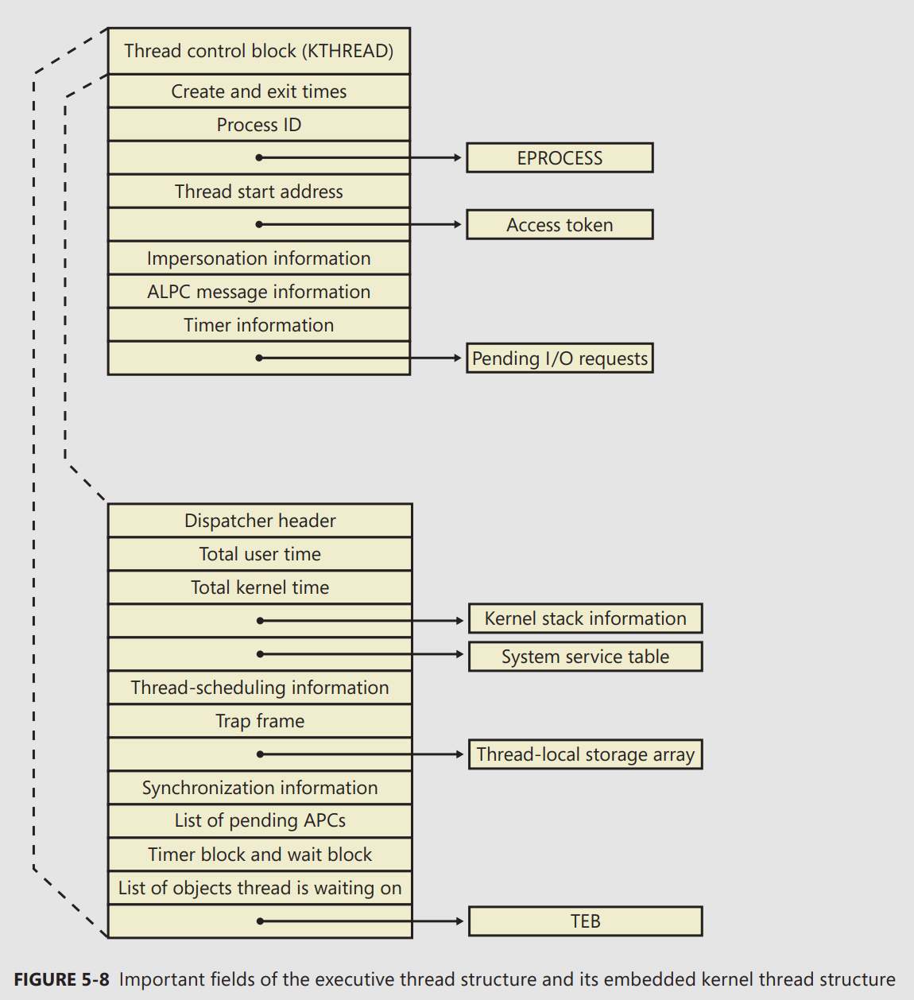</p>

- The first member of the `ETHREAD` is called the **Tcb** (Thread control block).
- The `KTHREAD` structure (which is the Tcb member of the `ETHREAD`) contains information that the Windows kernel needs to perform thread **scheduling**, **synchronization**, and **timekeeping** functions.
- 🔭 Use `dt nt!_ethread` and `dt nt!_kthread` or `dt nt!_ETHREAD Tcb` to dump these structures.
- 🔭 To display thread information, use either the `!process` command (which displays all the threads of a process after displaying the process information) or the `!thread` command with the address of a thread object to display a specific thread.
- 🔭 `Tlist` (utility from Debugging Tools for Windows) to display thread information, it shows `Win32StartAddr` which is the address passed to the `CreateThread`. All the other utilities, except *Process Explorer*, that show the thread start address show the actual start address (a function in `Ntdll.dll`), not the application-specified start address.
- The **TEB** exists in the process address space (as opposed to the system space, because it needs to be writable from user-mode).
- The TEB stores context information for the image loader and various Windows DLLs.
- Internally, it is made up of a header called the **TIB (Thread Information Block)**, which mainly existed for **compatibility** with *OS/2* and *Win9x* apps. It also allows exception and stack information to be kept into a smaller structure when creating new threads by using an `Initial TIB`.
<p align="center">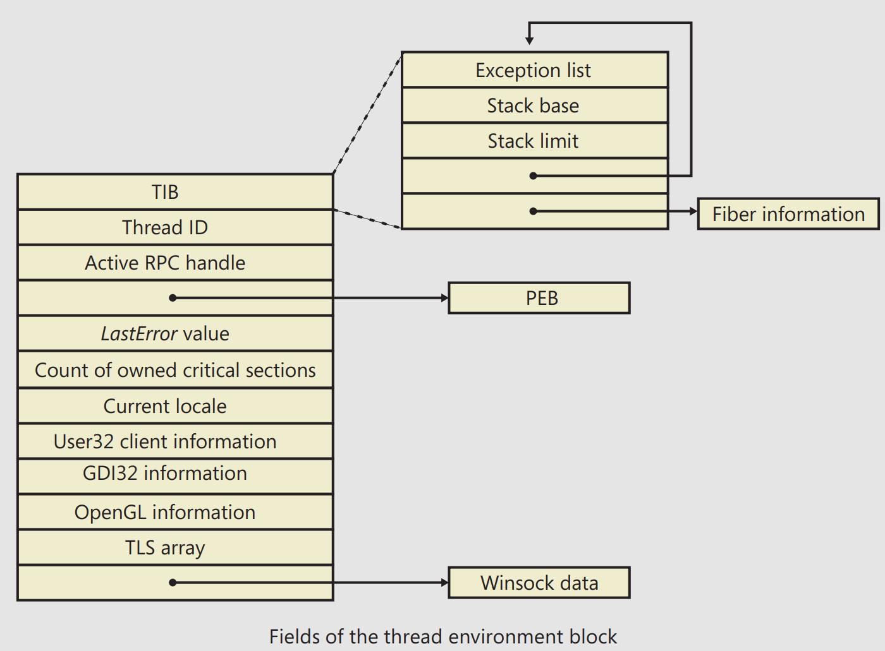</p>

- 🔭 You can dump the TEB structure with the `!teb` command.
- The `CSR_THREAD` is analogous to the data structure of `CSR_PROCESS`, but
it’s applied to threads. It stores a handle that `Csrss` keeps for the thread, various flags, and a pointer to the `CSR_PROCESS` for the thread.

<p align="center">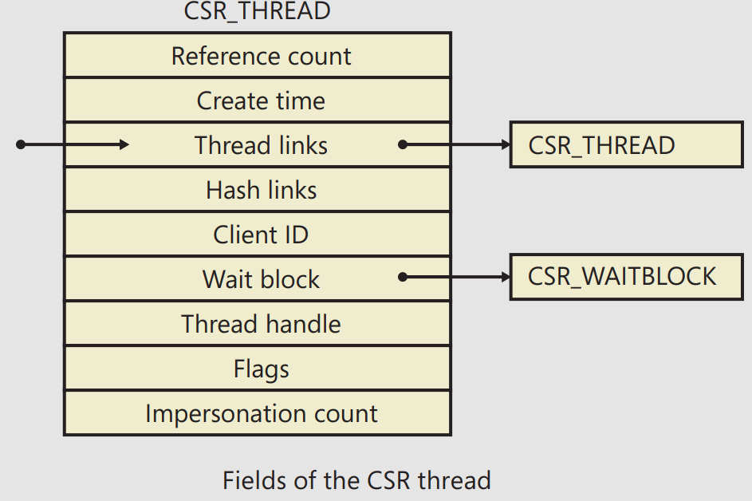</p>

- 🔭 You can dump the `CSR_THREAD` structure with the `!dt` command in the user-mode debugger while attached to a `Csrss` process: `!dt v 001c7630`.
- Finally, the `W32THREAD` structure is analogous to the data structure of `WIN32PROCESS`, but it’s applied to threads. This structure mainly contains information useful for the GDI subsystem (**brushes and DC attributes**) as well as for the **User Mode Print Driver framework** (UMPD) that vendors use to write user-mode printer drivers. Finally, it contains a **rendering state** useful for desktop **compositing** and **anti-aliasing**.
<p align="center">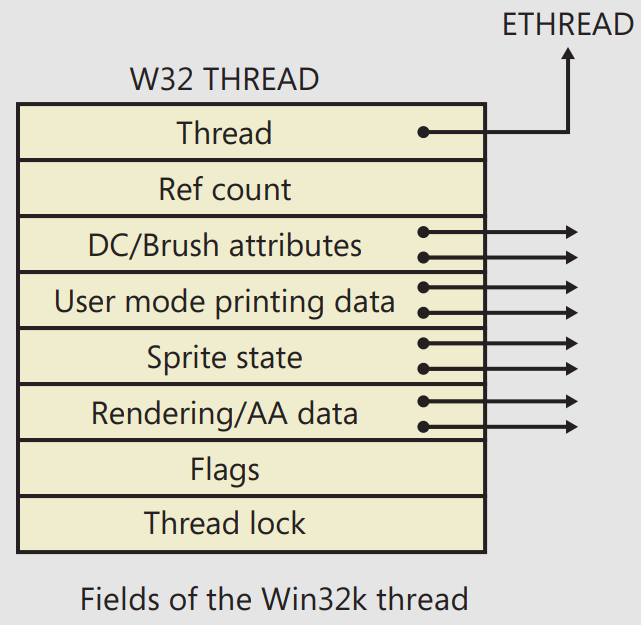</p>

- 🔭 You can dump the `W32THREAD` structure by looking at the output of the `!thread` command, which gives a pointer to it in the `Win32Thread` output field: `dt win32k!_w32thread ffb79dd8`.

### Birth of a Thread

- The steps in the following list are taken inside the Windows `CreateThread()` to create a Windows thread:
  - The `CreateThread` function in `Kernel32.dll `converts Windows API parameters to native flags and sets up object parameters (`OBJECT_ATTRIBUTES`).
  - It builds an **attribute list** containing the **client ID** and **TEB** address, which helps manage thread-specific data.
  - `NtCreateThreadEx` is called to create the user-mode context, capture the attribute list, and invoke `PspCreateThread` to initialize a suspended executive thread object.
  - The function allocates an **activation context** for the thread, checking and managing any required activation in the thread's TEB.
  - The Windows subsystem is informed about the new thread, performing setup work.
  - The thread handle and ID are returned to the caller.
  - If not created with the `CREATE_SUSPENDED` flag, the thread resumes execution performing process initialization before starting at the specified **entry point**.

### Examining Thread Activity

- There are several tools that expose various elements of the state of Windows threads: **WinDbg** (in user-process attach and kernel-debugging mode), **Performance Monitor**, and **Process Explorer**.
- :bookmark_tabs: Threads should be created at process **startup**, not every time a request is processed inside a process.
- Unlike *Task Manager* and all other process/processor monitoring tools, Process Explorer uses the **clock cycle counter** designed for thread run-time accounting instead of the **clock interval timer**, so you will see a significantly different view of CPU consumption using Process Explorer. This is because many threads run for such a **short amount** of time that they are seldom (if ever) the **currently running thread** when the clock interval timer interrupt occurs, so they are not charged for much of their CPU time, leading clock-based tools to perceive a CPU usage of 0%.
- ⚠️ Note For threads created by `CreateThread()` , Process Explorer displays the function passed to `CreateThread`, not the actual thread start function. That is because all Windows threads start at a common thread startup wrapper function (`RtlUserThreadStart` in `Ntdll.dll`). If Process Explorer showed the actual start address, most threads in processes would appear to have started at the **same address**, which would not be helpful in trying to understand what code the thread was executing. However, if Process Explorer can’t query the user-defined startup address (such as in the case of a **protected process**), it will show the wrapper function, so you will see all threads starting at `RtlUserThreadStart`.
- Viewing the **thread stack** can also help you determine why a process is **hung**.
- Finally, when looking at Wow64 process, Process Explorer shows both the **32-bit** and **64-bit stack** for threads. Because at the time of the **system call** proper, the thread has been switched to a 64-bit stack and context, simply looking at the thread’s 64-bit stack would reveal only half the story.

### Limitations on Protected Process Threads

- Protected processes have several limitations in terms of which **access rights** will be granted, even to the users with the **highest privileges** on the system. These limitations also apply to threads inside such a process ‼️.
- The only permissions granted are `THREAD_SUSPEND_RESUME` and `THREAD_SET/QUERY_ LIMITED_INFORMATION`.

### Worker Factories (Thread Pools)

- Worker factories refer to the internal mechanism used to implement user-mode thread pools.
- This kernel-managed thread pool functionality in Windows is managed by an object manager type called **TpWorkerFactory**, as well as:
  - four native system calls for managing the factory and its workers (`NtCreateWorkerFactory`, `NtWorkerFactoryWorkerReady`, `NtReleaseWorkerFactoryWorker`, `NtShutdownWorkerFactory`)
  - two query/set native calls (`NtQueryInformationWorkerFactory` and `NtSetInformationWorkerFactory`),
  - and a wait call (`NtWaitForWorkViaWorkerFactory`).
- Because the kernel dynamically creates new threads as needed, based on minimum and maximum numbers provided, this also increases the scalability of apps using the new thread-pool implementation. A worker factory will create a new thread whenever all of the following conditions are met:
  - The number of available workers is **lower** than the **maximum number of workers** configured for the factory (default of 500).
  - The worker factory has **bound objects** (a bound object can be, for example, an ALPC port that this worker thread is waiting on) or a thread has been activated into the pool
  - There are **pending I/O** request packet associated with a worker thread
  - **Dynamic** thread creation is **enabled**.
- And it will terminate threads whenever they’ve become **idle** for more than **10 seconds** (by default).
- The job of the worker factory code is to manage either a **persistent**, **static**, or **dynamic** thread pool; wrap the **I/O completion port model** into interfaces that try to prevent stalled worker queues by automatically creating dynamic threads; and to **simplify global cleanup** and **termination** operations during a factory shutdown request (as well as to easily block new requests against the factory in such a scenario).

### 🔭 EXPERIMENT: Looking at Thread Pools

- Because of the advantages of using the thread-pool mechanism, many core system components and apps make use of it, especially when dealing with resources such as **ALPC ports** (to dynamically process incoming requests at an appropriate and scalable level).
- In process explorer, double-click `Lsm.exe` in the list of processes, and click on the *Threads* tab You should see something similar to the image here:
- The worker factory has created six worker threads at the request of Lsm.exe and based on its usage and the count of processors on the machine. These threads are identified as `TppWorkerThread`, which is `Ntdll.dll`’s worker entry point when calling the worker factory system calls.
<p align="center">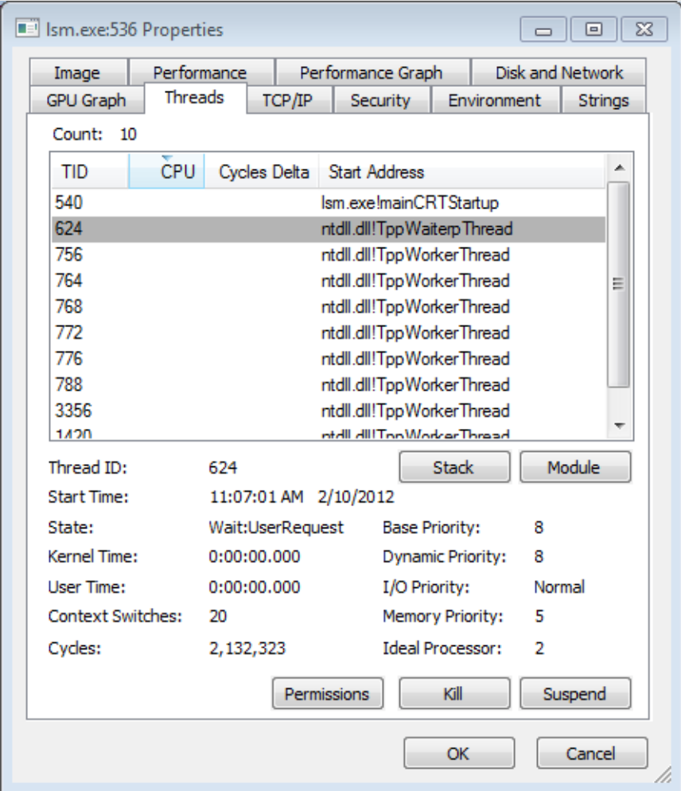</p>

## Thread Scheduling

- Windows uses a **priority-based**, **preemptive** scheduling system, meaning it always tries to run the most important (**highest-priority**) thread that's ready to work.
- However, this gets a little more complicated when we consider **processor affinity** — a setting that determines which processors (or CPU cores) a thread is allowed or prefers to run on.
-  By default, threads can run only on any available processors **within the processor group** associated with the process (to maintain compatibility with older versions of
Windows which supported only 64 processors), but developers can alter processor affinity by using the **appropriate APIs** or by setting an affinity mask in the **image header**.

### 🔭 EXPERIMENT: Viewing Ready Threads

```c
kd> !ready
Processor 0: Ready Threads at priority 8
THREAD 857d9030 Cid 0ec8.0e30 Teb: 7ffdd000 Win32Thread: 00000000 READY
THREAD 855c8300 Cid 0ec8.0eb0 Teb: 7ff9c000 Win32Thread: 00000000 READY
Processor 1: Ready Threads at priority 10
THREAD 857c0030 Cid 04c8.0378 Teb: 7ffdf000 Win32Thread: fef7f8c0 READY
Processor 1: Ready Threads at priority 9
THREAD 87fc86f0 Cid 0ec8.04c0 Teb: 7ffd3000 Win32Thread: 00000000 READY
THREAD 88696700 Cid 0ec8.0ce8 Teb: 7ffa0000 Win32Thread: 00000000 READY
Processor 1: Ready Threads at priority 8
THREAD 856e5520 Cid 0ec8.0228 Teb: 7ff98000 Win32Thread: 00000000 READY
THREAD 85609d78 Cid 0ec8.09b0 Teb: 7ffd9000 Win32Thread: 00000000 READY
THREAD 85fdeb78 Cid 0ec8.0218 Teb: 7ff72000 Win32Thread: 00000000 READY
```

- After a thread is selected to run, it runs for an amount of time called a **quantum**.
- A quantum is the length of time a thread is allowed to run before another thread at the same priority level is given a turn to run.
- Quantum values can vary from system to system and process to process for any of three reasons:
  - **System configuration settings** (long or short quantums, variable or fixed quantums, and priority separation)
  - **Foreground** or **background** status of the process
  - Use of the **job** object to alter the quantum
- A thread might not get to complete its quantum, however, because Windows implements a preemptive scheduler: if another thread with a **higher priority** becomes **ready** to run, the currently running thread might be preempted before finishing its time slice. In fact, a thread can be selected to run next and be preempted before even beginning its quantum ⚠️.
- The routines that perform scheduling related-events are collectively called the **kernel’s dispatcher**:
- The following events might require thread dispatching:
  - A thread becomes **ready to execute** — for example, a thread has been **newly created** or has just been released from the **wait state**.
  - A thread leaves the running state because its time quantum ends, it **terminates**, it **yields** execution, or it enters a **wait state**
  - A thread’s **priority changes**, either because of a system service call or because Windows itself changes the priority value
  - A thread’s **processor affinity changes** so that it will no longer run on the processor on which it was running.
- Windows schedules at the **thread granularity**:
  - This approach makes sense when you consider that processes don’t run but only provide resources and a context in which their threads run 😐.
  - Because scheduling decisions are made strictly on a thread basis, **no consideration** is given to **what process the thread belongs** to.
  - For example, if process A has 10 runnable threads, process B has 2 runnable threads, and all 12 threads are at the **same priority**, each thread would theoretically receive **one-twelfth** of the CPU time — Windows wouldn’t give 50 percent of the CPU to process A and 50 percent to process B 🪓.

### Priority Levels

- Windows uses **32 priority levels**, ranging from 0 through 31. These values divide up as follows:
  - Sixteen **real-time** levels (16 through 31)
  - Sixteen **variable levels** (0 through 15), out of which level 0 is reserved for the zero page thread.
<p align="center">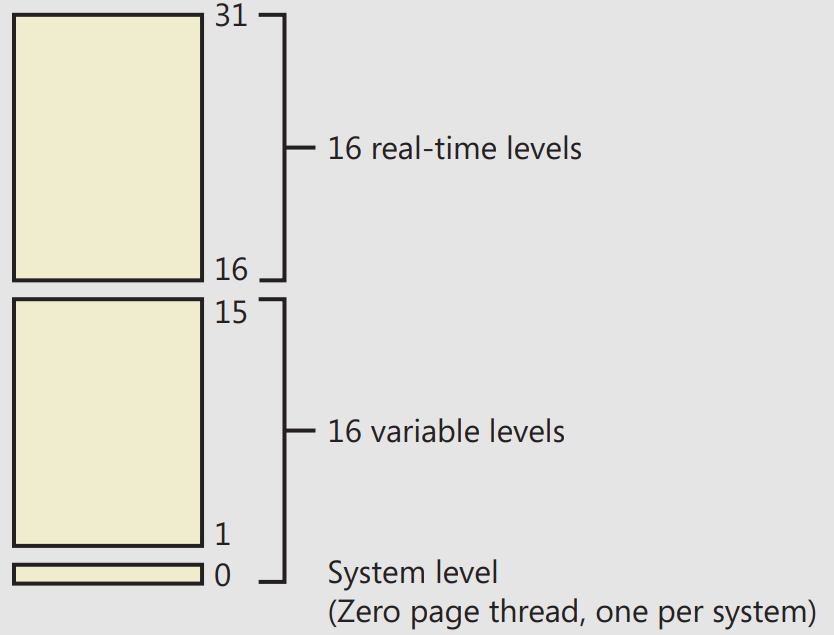</p>

- The Windows API first organizes processes by the priority class (`PROCESS_PRIORITY_CLASS_`) to which they are assigned at creation:
  - ▶️ Real-time (4), High (3), Above Normal (7), Normal (2), Below Normal (5), and Idle (1).
- It then assigns a **relative priority** of the individual threads within those processes. Here, the numbers represent a **priority delta** that is applied to the **process base priority**:
  - ▶️ Time-critical (15), Highest (2), Above-normal (1), Normal (0), Below-normal (–1), Lowest (–2), and Idle (–15)
- ▶️ Therefore, in the Windows API, each thread has a **base priority** that is a function of its **process priority class** and its **relative thread priority**.
- For example, a “Highest” thread will receive a thread base priority of two levels higher than the base priority of its process.
- Whereas a process has only a single base priority value, each thread has two priority values: **current and base**.
- Scheduling decisions are made based on the **current** priority. As explained in the following section on **priority boosting**, the system under certain circumstances increases the priority of threads in the **dynamic** range (0 through 15) for brief periods.
- Windows never adjusts the priority of threads in the **real-time** range (16 through 31), so they always have the **same base** and **current priority**.

### Real-Time Priorities

- You must have the increase scheduling priority **privilege** to enter the real-time range.
- Many important Windows **KM system threads** run in the real-time priority range.
- Using standard API `SetThreadPriority` (which calls the native `NtSetInformationThread` with `ThreadBasePriority` information class) allows priorities to remain only in the same range ▶️ We can't mix thread priorities with documented APIs.
- However, by calling this API with `ThreadActualBasePriority` information class, the kernel base priority for the thread can be directly set, including in the dynamic range for a real-time process 😮‍💨.

#### Interrupt Levels vs. Priority Levels

- ⚠️ User-mode code always runs at passive level. Because of this, no user-mode thread, regardless of its priority, can ever **block hardware interrupts** (although high-priority, real-time threads can block the execution of important system threads) ‼️
- ⭐ If a thread does raise IRQL to dispatch level or above, no further thread-scheduling behavior will occur on its processor until it lowers IRQL below dispatch level. A thread executing at dispatch level or above blocks the activity of the thread scheduler and prevents thread context switches on its processor.

### Thread States

The thread states are as follows:
- **Ready**: A thread in the ready state is waiting to execute.
- **Deferred ready** This state is used for threads that have been selected to run on a **specific processor** but have not actually started running there This state exists so that the kernel can minimize the amount of time the per-processor lock on the scheduling database is held.
- **Standby** A thread in the standby state has been **selected to run next** on a particular processor. When the correct conditions exist, the dispatcher performs a context switch to this thread. **Only one thread** can be in the standby state for each processor on the system.
- **Running**: Once the dispatcher performs a context switch to a thread, the thread enters the running state and executes The thread’s execution continues until its quantum ends (and another thread at the same priority is ready to run), it is **preempted** by a **higher priority** thread, it terminates, it **yields** execution (`SwitchToThread`), or it voluntarily enters the waiting state.
- **Waiting**: A thread can enter the waiting state in several ways: a thread can **voluntarily** wait for an object to **synchronize** its execution, the OS can wait on the thread’s behalf (such as to resolve a paging I/O), or an environment subsystem can direct the thread to suspend itself. When the thread’s wait ends, depending on the priority, the thread either begins running immediately or is moved back to the ready state.
- **Transition**: A thread enters the transition state if it is ready for execution but its **kernel stack is paged out** of memory. Once its kernel stack is brought back into memory, the thread enters
the **ready** state.
- **Terminated**: When a thread finishes executing, it enters the terminated state.
- **Initialized**: This state is used internally while a thread is **being created**.
- Thread States and Transitions:

|                | Init                                     | Ready                              | Running                                                            | Standby                              | Terminated | Waiting                               | Transition                     | Deferred Ready                                                            | Comment                                                                                          |
| -------------- | ---------------------------------------- | ---------------------------------- | ------------------------------------------------------------------ | ------------------------------------ | ---------- | ------------------------------------- | ------------------------------ | ------------------------------------------------------------------------- | ------------------------------------------------------------------------------------------------ |
| Init           |                                          |                                    |                                                                    |                                      |            |                                       |                                |                                                                           | A thread becomes initialized during the first few moments of its creation (`KeStartThread`).     |
| Ready          |                                          |                                    |                                                                    |                                      |            |                                       |                                | A thread is added in the dispatcher-ready database of its ideal processor |                                                                                                  |
| Running        |                                          | Selected by `KiSearchForNewThread` |                                                                    | Picked up for execution by local CPU |            | Preemption after wait satisfaction    |                                |                                                                           |                                                                                                  |
| Standby        |                                          | Selected by `KiSelectNextThread`   |                                                                    |                                      |            |                                       |                                | Selected by `KiDeferredReadyThread` for remote CPU                        |                                                                                                  |
| Terminated     | Killed before `PspInsertThread` finished |                                    | Killed                                                             |                                      |            |                                       |                                |                                                                           | A thread can kill only itself. It must be in the Running state before entering KeTerminateThread |
| Waiting        |                                          |                                    | Thread enters a wait                                               |                                      |            |                                       |                                |                                                                           | Only running threads can wait.                                                                   |
| Transition     |                                          |                                    |                                                                    |                                      |            | Kernel stack no longer resident       |                                |                                                                           | Only waiting threads can transition.                                                             |
| Deferred Ready | Last step in `PspInsertThread`           | Affinity change                    | Thread becomes preempted (if old processor is no longer available) | Affinity change                      |            | Wait satisfaction (but no preemption) | Kernel stack swap-in completed |                                                                           |                                                                                                  |

<p align="center"></p>

### Dispatcher Database

- To make thread-scheduling decisions, the kernel maintains a set of data structures known collectively as the **dispatcher database**.
- The dispatcher database keeps track of which threads are waiting to execute and which processors are executing which threads.
- The dispatcher **ready queues** (`PRCB.DispatcherReadyListHead`) contain the threads that are in the ready state, waiting to be scheduled for execution. There is one queue for each of the 32 priority levels.
- To speed up the selection of which thread to run or preempt, Windows maintains a 32-bit **bit mask** called the **ready summary** (`PRCB.ReadySummary`). Each bit set indicates one or more threads in the ready queue for that priority level 🧠.

<p align="center">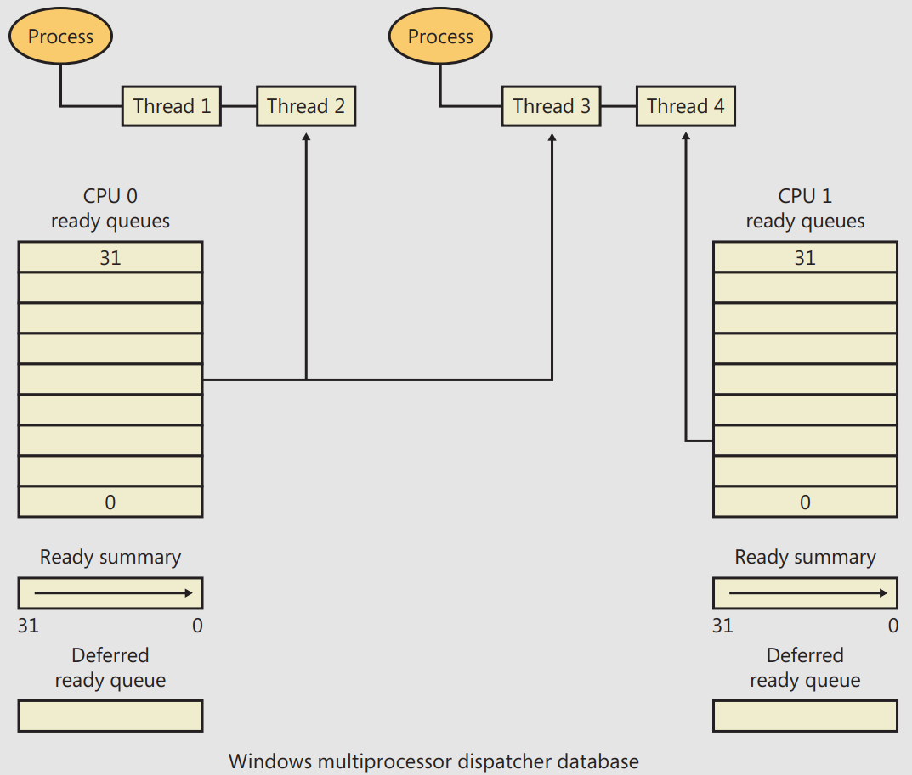</p>

- The dispatcher database is synchronized by raising IRQL to `DISPATCH_LEVEL`. Raising IRQL in this way prevents other threads from interrupting thread dispatching on the processor because threads normally run at IRQL 0 or 1.

### Quantum

- If a thread completes its quantum and there are no other threads at its priority, Windows permits the thread to run for another quantum.
- 📌 The **clock interval** is the period at which the OS's scheduler interrupts to perform tasks like managing threads, updating timers, or checking system state.
- On **client** versions of Windows, threads run by default for **2 clock intervals**; on **server** systems, by default, a thread runs for **12 clock intervals**.
- The length of the clock interval varies according to the hardware platform:
  - most x86 uniprocessors is about **10 milliseconds**.
  - most x86 and x64 multiprocessors it is about **15 milliseconds**.
- This clock interval is stored in the kernel variable `KeMaximumIncrement` as **hundreds of nanoseconds**.
- 🧠 `clock interval != processor cycle` (is a single tick of the processor's clock, representing the smallest unit of computation time, **0.33 nanoseconds** in 3Ghz CPU).
- Because thread run-time **accounting** is based on **processor cycles**, although threads still run in **units of clock intervals**, the system does not use the count of clock ticks as the deciding factor for how long a thread has run and whether its quantum has expired 🤔
- They instead run for a **quantum target**, which represents an estimate of what the number of CPU clock cycles the thread has consumed should be when its turn would be given up.

### Quantum Accounting

- The quantum reset value is stored in terms of actual quantum units, which are then multiplied by the number of **clock cycles per quantum** (*KiCyclesPerClockQuantum*), resulting in the **quantum target**.
- As a thread runs, CPU clock cycles are charged at different events (context switches, interrupts, and certain scheduling decisions):
  - If at a clock interval timer interrupt, the number of CPU clock cycles charged has reached (or passed) the quantum target, quantum end processing is triggered.
- Internally, a **quantum unit** is represented as 1/3 of a clock tick (`1 clock tick = 3 quantum`).
- This means that on client Windows systems, threads, by default, have a quantum reset value of 6 (2 * 3), and that server systems have a quantum reset value of 36 (12 * 3).

<details><summary>🔭 EXPERIMENT: Determining the Clock Cycles per Quantum:</summary>

- Obtain your processor frequency as Windows has detected it: `!cpuinfo` and convert the number to Hz.
- Obtain the clock interval on your system by using **clockres** and convert the obtained number from ms -> s.
- Multiply this count by the number of cycles.
- Remember that each quantum unit is one-third of a clock interval, so divide the number of cycles by three.
- ▶️ This is the number of clock cycles each quantum unit should take on a system running at X MHz with a clock interval of around 15 ms.
- To verify your calculation, dump the value of `KiCyclesPerClockQuantum` on your system - it should match with: `lkd> dd nt!KiCyclesPerClockQuantum L1`
</details>

### Controlling the Quantum

- You can change the thread quantum for all processes, but you can choose only one of two settings:
  - **short, variable quantums** (2 clock ticks, which is the default for **client** machines) or
  - **long, fixed quantums** (12 clock ticks, which is the default for **server** systems, background/server-style workload).

#### Variable Quantums

When variable quantums are enabled, the system uses the `PspVariableQuantums` table to manage thread execution times. This table is loaded into the `PspForegroundQuantum` table, which is used by the `PspComputeQuantum()`. The function assigns a quantum index based on whether a process is a **foreground process** (one containing the thread that owns the foreground window).
- For **background** processes, an index of 0 is chosen, corresponding to the **default thread quantum**.
- For **foreground** processes, the quantum index is determined by the p**riority separation** value, which defines the priority boost applied to foreground threads. This boost increases the thread's quantum: for each additional priority level (up to 2), an extra quantum is added.

By default, Windows sets the maximum **priority boost** for foreground threads (priority separation = 2), resulting in quantum index 2. This gives foreground threads two extra quantums, for a total of three quantums.

Thus, when a **window is brought** into the **foreground** on a client system, all the threads in the process containing the thread that owns the foreground window have their **quantums tripled** !

#### Quantum Settings Registry Value


- The user interface to control quantum settings described earlier modifies the registry value: `HKLM\SYSTEM\CurrentControlSet\Control\PriorityControl\Win32PrioritySeparation`
-  This value consists of 6 bits divided into the three 2-bit fields:
   -  **Short vs Long**: A value of 1 specifies long quantums, and 2 specifies short ones. A setting of 0 or 3 indicates that the default appropriate for the system will be used.
   -  **Variable vs Fixed**: A setting of 1 means to enable the variable quantum table based on the algorithm shown in the “Variable Quantums” section. A setting of 0 or 3 means that the default appropriate for the system will be used.
   -  **Priority Separation**: This field (stored in the kernel variable `PsPrioritySeparation`) defines the priority separation (up to 2).