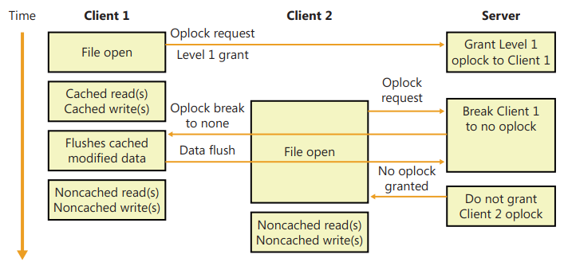

## Chapter 12: File systems

### Windows File System Formats

### File System Driver Architecture

#### Local FSDs

#### Remote FSDs

- Each remote FSD consists of two components: a __client__ and a __server__.
- client-side remote FSD allows apps to access remote files and directories.
- client FSD component accepts I/O requests from apps and translates them into __network FS protocol commands__ (such as SMB) that the FSD sends across the network to a server-side component, which is a remote FSD.
- A server-side FSD listens for commands coming from a network connection and fulfills them by issuing I/O requests to the local FSD that manages the volume on which the file or directory that the command is intended for resides.

- SMB client-side remote FSDs implement a __distributed cache coherency protocol__, called __oplock (opportunistic locking)__, so that the data an app sees when it accesses a remote file is the same as the data apps running on other
computers that are accessing the same file see.

##### Locking

- The locking mechanisms used by all file servers implementing the SMB protocol are the __oplock__ and the __lease__.
- Which mechanism is used depends on the capabilities of both the server and the client, with the lease being the preferred mechanism.

###### Oplocks

- why called opportunistic ? because the server grants such locks whenever __other factors make the locks possible__.
- purpose: reducing network traffic and improving apparent response time.
    - => not all read / writes has to go to the server.
- type of oplock determines what type of caching is allowed.
- An oplock is not necessarily held until a client is finished with the file, and it may be __broken__ at any time if the server receives an operation that is incompatible with the existing granted locks.
- Prior to SMB 2.1, there were four types of oplocks:
    - __Level 1, exclusive access__: This lock allows a client to open a file for exclusive access. The client may perform __read-ahead buffering__ and __read or write caching__.
    - __Level 2, shared access__: This lock allows __multiple, simultaneous readers of a file and no writers__. The client may perform read-ahead buffering and read caching of file data and attributes. A write to the file will cause the holders of the lock to be notified that the lock has been broken.
    - __Batch, exclusive access__: This lock takes its name from the locking used when processing batch (.bat) files, which are opened and closed to process each line within the file. The client may keep a file open on the server, even though the application has (perhaps temporarily) closed the file. This lock supports read, write, and handle caching.
    - __Filter, exclusive access__: This lock provides applications and file system filters with a mechanism to give up the lock when other clients try to access the same file, but unlike a Level 2 lock, the file cannot be opened for delete access, and the other client will not receive a sharing violation. This lock supports read and write caching.
    - locks a file so that it cannot be opened for either write or delete access
- oplock modes are based upon how the file is opened, __not individual I/O requests__.

- If the first client hadn’t written to the file, the first client’s oplock would have been __broken to a Level 2 oplock__, which is the same type of oplock the server would grant to the second client.
-  Now both clients can cache reads, but if either writes to the file, the server revokes their oplocks so that
noncached operation commences.

###### Leases

- In SMB 2.1, the concept of a lease is introduced as a new type of client caching mechanism, similar to an oplock.
- The purpose of a lease and an oplock is the same, but provides __greater flexibility and much better performance__.
- Staring with Windows 7, oplocks (aka leases) are used quite extensively even on local file systems to __prevent sharing violations__.
- __Read (R), shared access__:
    - allows multiple simultaneous readers of a file, and no writers.
    - allows the client to perform read-ahead buffering and read caching.
- __Read-Handle (RH), shared access__:
    - is similar to the Level 2 oplock
    - + allowing the client to keep a file open on the server even though the accessor on the client has closed the file => lease does not need to be broken between opens and closes of the file handle.
    - especially useful for files that are repeatedly opened and closed because the cache is not invalidated when the file is closed and refilled when the file is opened again, providing a big improvement in performance for complex I/O intensive apps.
- __Read-Write (RW), exclusive access__:
    - allows a client to open a file for exclusive access.
    - allows the client to perform read-ahead buffering and read or write caching.
- __Read-Write-Handle (RWH), exclusive access__:
    - This lock allows a client to open a file for exclusive access.
    - This lease supports read, write, and handle caching (similar to the Read-Handle lease)