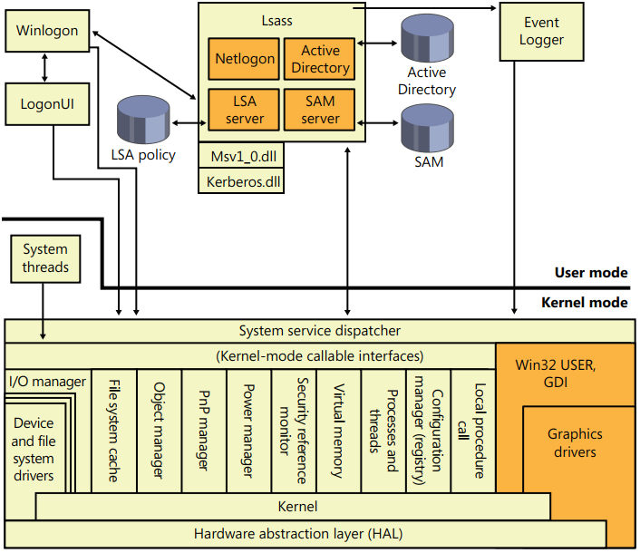

## Chapter 8 Security

### Security System Components

These are the core components and databases that implement Windows security:
- __Security reference monitor (SRM)__:
    - defines the access token data structure to represent a security context;
    - perform security access checks on objects;
    - manipulate privileges (user rights), and generating any resulting security audit messages.
- __Local Security Authority subsystem (LSASS)__:
    - local system security policy (such as which users are allowed to log on to the machine, password policies, privileges granted to users and groups, and the system security auditing settings)
    - user authentication
    - sends security audit messages to the *Event Log The Local Security Authority service (Lsasrv)*
    - Lsasrv.dll is a library that LSASS loads, implements most of this functionality
- __LSASS policy database__:
    - contains the local system security policy settings.
    - stored in the registry in an ACL-protected area under `HKLM\SECURITY`.
    - contains information like:
        - what domains are entrusted to authenticate logon attempts
        - who has permission to access the system and how (interactive, network, and service logons),
        - who is assigned which privileges,
        - what kind of security auditing is to be performed
- __Security Accounts Manager (SAM)__:
    - a service responsible for managing the database that contains the user names and groups defined on the local machine.
    - The SAM service is as _Samsrv.dll_, is loaded into the LSASS process.
- __SAM database__:
    - contains the defined local users and groups, along with their passwords and other attributes.
    - is stored in the registry under `HKLM\SAM`.
- __Active Directory__:
    - ia directory service that contains a database that stores information about objects in a domain.
    - A domain is a collection of computers and their associated security groups that are managed as a single entity.
    - it stores information about the objects in the domain, including users, groups, and computers.
    - The AD server, implemented as _Ntdsa.dll_, runs in the LSASS process.
- __Authentication packages__:
    - include DLLs that run both in the context of the LSASS process and client processes, and implement Windows authentication policy.
    - An authentication DLL is responsible for authenticating a user, by checking whether a given user name and password match.
- __Interactive logon manager (Winlogon)__:
    - user-mode process _Winlogon.exe_ that is responsible for responding to the SAS and for managing interactive logon sessions.
- __Logon user interface (LogonUI)__:
    - user-mode process `LogonUI.exe` that presents users with the user interface they can use to authenticate themselves on the system LogonUI uses credential providers to query user credentials through various methods
- __Credential providers (CPs)__:
    -  In-process COM objects that run in the LogonUI process and used to obtain a user’s name and password, smartcard PIN, or biometric data (such as a fingerprint).
    - The standard CPs are implemented in _authui.dll_ and  _SmartcardCredentialProvider.dll_.
- __Network logon service (Netlogon)__:
    - A Windows service _Netlogon.dll_ that sets up the secure channel to a domain controller, over which security requests—such as an interactive logon or LAN Manager and NT LAN Manager (v1 and v2) authentication validation—are sent.
    - also used for AD logons
- __Kernel Security Device Driver (KSecDD)__:
    - `Ksecdd.sys` is a kernel-mode library of functions that implement the ALPC interfaces that other kernel mode security components, including the Encrypting File System (EFS), use to communicate with LSASS in user mode.
- __AppLocker__:
    - a mechanism that allows administrators to specify which executable files, DLLs, and scripts can be used by specified users and groups.
    - consists of a driver (_AppId.sys_) and a service (_AppIdSvc.dll_) running in a SvcHost process.
<p align="center"></p>

### Protecting Objects

- __object protection__ and access logging is the essence of discretionary access control and auditing.
- objects that are not exposed to user mode (such as driver objects) are usually not protected. however, system resources that are exported to user mode require security validation.
-  when a thread is __impersonating__, security validation mechanisms use the __thread’s security context__ instead of that of the thread’s process. When a thread isn’t impersonating, security validation falls back on using the security context of the thread’s owning process

### Access Checks

- When a process tries to access an object by name or tries to reference an object using an existing handle, access validation by the object manager will be executed.
- `ObpCreateHandle` first calls `ObpGrantAcces`s to see if the thread has permission to access the object; if the thread does, `ObpCreateHandle` calls the executive function `ExCreateHandle` to create the entry in the process handle table `ObpGrantAccess` calls `ObCheckObjectAccess` to initiate the security access check.
- `ObpGrantAccess` passes to `ObCheckObjectAccess` the __security credentials__ of the thread opening the object, the __types of access__ to the object that the thread is requesting (read, write, delete, and so forth), and a __pointer to the object__. `ObCheckObjectAccess` first __locks__ the object’s security descriptor and the security context of the thread. The object security lock prevents another thread in the system from changing the object’s security while the access check is in progress. The lock on the thread’s security context prevents another thread (from that process or a different process) from altering the security identity of the thread while security validation is in progress. `ObCheckObjectAccess` then calls the object’s security method to obtain the security settings of the object.
- After obtaining an object’s security information, `ObCheckObjectAccess` invokes the SRM function
`SeAccessCheck`. `SeAccessCheck` is one of the functions at the heart of the Windows security model. Among the input parameters `SeAccessCheck` accepts are the __object’s security information__, the __security identity of the thread__ as captured by `ObCheckObjectAccess`, and the __access__ that the thread is requesting.

### Security Identifiers

- Instead of using names (which might or might not be unique) to identify entities that perform actions in a system, Windows uses __security identifiers (SIDs)__.
- When displayed textually, each SID carries an S prefix, and its various components are separated with hyphens: `S-1-5-21-1463437245-1224812800-863842198-1128`. In this SID:
	- the revision number is 1,
	- the identifier authority value is 5 (the Windows security authority),
	- and four subauthority values plus one RID (1128) make up the remainder of the SID
- This SID is a domain SID, but a local computer on the domain would have a SID with the same revision number, identifier authority value, and number of subauthority values.

### Integrity Levels

- Integrity levels can __override discretionary access__ to differentiate a process and objects __running as__ and __owned by__ the same user, offering the ability to isolate code and data within a user account.
- Objects also have an integrity level stored as part of their security descriptor, in a structure that is called the __mandatory label__.
- When a process creates an object without specifying an integrity level, the system checks the
integrity level in the token. For tokens with a level of __medium or higher__, the implicit integrity level of the object __remains medium__. However, when a token contains an integrity level lower than medium, the object is created with an explicit integrity level that matches the level in the token.

### Tokens

- The SRM uses an object called a token (or access token) to identify the __security context__ of a process or thread. A security context consists of information that describes the account, groups, and privileges associated with the process or thread.
- You can create a process that runs within the security context of the user logged on through the `LogonUser` function by passing the token to the Windows `CreateProcessAsUser` function. The `CreateProcessWithLogon` function combines these into a single call, which is how the Runas command launches processes under alternative tokens.
- The security mechanisms in Windows use two components to determine what objects can be
accessed and what secure operations can be performed:
	1.  One component comprises the token’s user account SID and group SID fields
	2. The second component in a token that determines what the token’s thread or process can do is the privilege array.
- A token’s __default primary group__ field and __default discretionary access control list (DACL)__ field are security attributes that Windows applies to objects that a process or thread creates when it uses the token.
- Each token’s type distinguishes a __primary token__ (a token that identifies the security context of a process) from an __impersonation token__ (a type of token that threads use to temporarily adopt a different security context, usually of another user).
- Viewing access tokens:
```c
kd> dt nt!_TOKEN
+0x000 TokenSource : _TOKEN_SOURCE
+0x010 TokenId : _LUID
+0x018 AuthenticationId : _LUID
+0x020 ParentTokenId : _LUID
+0x028 ExpirationTime : _LARGE_INTEGER
+0x030 TokenLock : Ptr32 _ERESOURCE
+0x034 ModifiedId : _LUID
+0x040 Privileges : _SEP_TOKEN_PRIVILEGES
+0x058 AuditPolicy : _SEP_AUDIT_POLICY
+0x074 SessionId : Uint4B
+0x078 UserAndGroupCount : Uint4B
+0x07c RestrictedSidCount : Uint4B
+0x080 VariableLength : Uint4B
+0x084 DynamicCharged : Uint4B
+0x088 DynamicAvailable : Uint4B
+0x08c DefaultOwnerIndex : Uint4B
+0x090 UserAndGroups : Ptr32 _SID_AND_ATTRIBUTES
+0x094 RestrictedSids : Ptr32 _SID_AND_ATTRIBUTES
+0x098 PrimaryGroup : Ptr32 Void
+0x09c DynamicPart : Ptr32 Uint4B
+0x0a0 DefaultDacl : Ptr32 _ACL
+0x0a4 TokenType : _TOKEN_TYPE
+0x0a8 ImpersonationLevel : _SECURITY_IMPERSONATION_LEVEL
+0x0ac TokenFlags : Uint4B
+0x0b0 TokenInUse : UChar
+0x0b4 IntegrityLevelIndex : Uint4B
+0x0b8 MandatoryPolicy : Uint4B
+0x0bc ProxyData : Ptr32 _SECURITY_TOKEN_PROXY_DATA
+0x0c0 AuditData : Ptr32 _SECURITY_TOKEN_AUDIT_DATA
+0x0c4 LogonSession : Ptr32 _SEP_LOGON_SESSION_REFERENCES
+0x0c8 OriginatingLogonSession : _LUID
+0x0d0 SidHash : _SID_AND_ATTRIBUTES_HASH
+0x158 RestrictedSidHash : _SID_AND_ATTRIBUTES_HASH
+0x1e0 VariablePart : Uint4B
```
- You can examiine the token for a process with the `!token` command:
```c
lkd> !process d6c 1
Searching for Process with Cid == d6c
PROCESS 85450508 SessionId: 1 Cid: 0d6c Peb: 7ffda000 ParentCid: 0ecc
DirBase: cc9525e0 ObjectTable: afd75518 HandleCount: 18.
Image: cmd.exe
VadRoot 85328e78 Vads 24 Clone 0 Private 148. Modified 0. Locked 0.
DeviceMap a0688138
Token afd48470 <--
ElapsedTime 01:10:14.379
UserTime 00:00:00.000
KernelTime 00:00:00.000
QuotaPoolUsage[PagedPool] 42864
QuotaPoolUsage[NonPagedPool] 1152
Working Set Sizes (now,min,max) (566, 50, 345) (2264KB, 200KB, 1380KB)
PeakWorkingSetSize 582
VirtualSize 22 Mb
PeakVirtualSize 25 Mb
PageFaultCount 680
MemoryPriority BACKGROUND
BasePriority 8
CommitCharge 437

lkd> !token afd48470
_TOKEN afd48470
TS Session ID: 0x1
User: S-1-5-21-2778343003-3541292008-524615573-500 (User: ALEX-LAPTOP\Administrator)
Groups:
00 S-1-5-21-2778343003-3541292008-524615573-513 (Group: ALEX-LAPTOP\None)
Attributes - Mandatory Default Enabled
01 S-1-1-0 (Well Known Group: localhost\Everyone)
Attributes - Mandatory Default Enabled
02 S-1-5-21-2778343003-3541292008-524615573-1000 (Alias: ALEX-LAPTOP\Debugger Users)
Attributes - Mandatory Default Enabled
03 S-1-5-32-544 (Alias: BUILTIN\Administrators)
Attributes - Mandatory Default Enabled Owner
04 S-1-5-32-545 (Alias: BUILTIN\Users)
Attributes - Mandatory Default Enabled
05 S-1-5-4 (Well Known Group: NT AUTHORITY\INTERACTIVE)
Attributes - Mandatory Default Enabled
06 S-1-5-11 (Well Known Group: NT AUTHORITY\Authenticated Users)
Attributes - Mandatory Default Enabled
07 S-1-5-15 (Well Known Group: NT AUTHORITY\This Organization)
Attributes - Mandatory Default Enabled
08 S-1-5-5-0-89263 (no name mapped)
Attributes - Mandatory Default Enabled LogonId
09 S-1-2-0 (Well Known Group: localhost\LOCAL)
Attributes - Mandatory Default Enabled
10 S-1-5-64-10 (Well Known Group: NT AUTHORITY\NTLM Authentication)
Attributes - Mandatory Default Enabled
11 S-1-16-12288 Unrecognized SID
Attributes - GroupIntegrity GroupIntegrityEnabled
Primary Group: S-1-5-21-2778343003-3541292008-524615573-513 (Group: ALEX-LAPTOP\None)
Privs:
05 0x000000005 SeIncreaseQuotaPrivilege Attributes -
08 0x000000008 SeSecurityPrivilege Attributes -
09 0x000000009 SeTakeOwnershipPrivilege Attributes -
10 0x00000000a SeLoadDriverPrivilege Attributes -
11 0x00000000b SeSystemProfilePrivilege Attributes -
12 0x00000000c SeSystemtimePrivilege Attributes -
13 0x00000000d SeProfileSingleProcessPrivilege Attributes -
14 0x00000000e SeIncreaseBasePriorityPrivilege Attributes -
15 0x00000000f SeCreatePagefilePrivilege Attributes -
17 0x000000011 SeBackupPrivilege Attributes -
18 0x000000012 SeRestorePrivilege Attributes -
19 0x000000013 SeShutdownPrivilege Attributes -
20 0x000000014 SeDebugPrivilege Attributes -
22 0x000000016 SeSystemEnvironmentPrivilege Attributes -
23 0x000000017 SeChangeNotifyPrivilege Attributes - Enabled Default
24 0x000000018 SeRemoteShutdownPrivilege Attributes -
25 0x000000019 SeUndockPrivilege Attributes -
28 0x00000001c SeManageVolumePrivilege Attributes -
29 0x00000001d SeImpersonatePrivilege Attributes - Enabled Default
30 0x00000001e SeCreateGlobalPrivilege Attributes - Enabled Default
33 0x000000021 SeIncreaseWorkingSetPrivilege Attributes -
34 0x000000022 SeTimeZonePrivilege Attributes -
35 0x000000023 SeCreateSymbolicLinkPrivilege Attributes -
Authentication ID: (0,be1a2)
Impersonation Level: Identification
TokenType: Primary
Source: User32 TokenFlags: 0x0 ( Token in use )
Token ID: 711076 ParentToken ID: 0
Modified ID: (0, 711081)
RestrictedSidCount: 0 RestrictedSids: 00000000
OriginatingLogonSession: 3e7
```

### Impersonation

- Impersonation lets a server notify the SRM that the server is temporarily adopting the security profile of a client making a resource request.
- If a server communicates with a client through a __named pipe__, the server can use the
`ImpersonateNamedPipeClient` function to tell the SRM that it wants to impersonate the user on the other end of the pipe .
- If the server is communicating with the client through __Dynamic Data Exchange (DDE) or RPC__, it can make similar impersonation requests using `DdeImpersonateClient` and `RpcImpersonateClient`.
- If an entire application must execute in a client’s security context or must access network resources without using impersonation, the client must be logged on to the system via `LogonUser`, which returns a primary token that can be used to call `CreateProcessAsUser`.
- A thread __cannot impersonate__ a token of __higher integrity__ than its own.

### Restricted Tokens

- A __restricted token__ is created from a primary or impersonation token using the `CreateRestrictedToken` function.
- The restricted token is a copy of the token it’s derived from, with the following possible modifications:
	- Privileges can be removed from the token’s privilege array.
	- SIDs in the token can be marked as deny-only.
	- SIDs in the token can be marked as restricted.

### Filtered Admin Token

- Restricted tokens are also used by UAC to create the filtered admin token that all user applications will inherit.
- A __filtered admin token__ has the following characteristics:
	- The integrity level is set to __medium__.
	- The administrator and administrator-like SIDs mentioned previously are marked as __deny-only__ to prevent a security hole if the group was removed altogether.
	- All privileges are stripped except _Change Notify, Shutdown, Undock, Increase Working Set_, and _Time Zone_.
