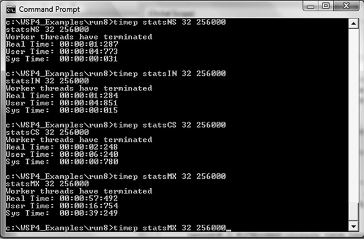
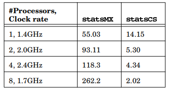

# Chapter 9 : Locking, Performance, and NT6 Enhancements

## Synchronization Performance Impact

- Locking operations, waiting, and even interlocked operations are **inherently time consuming**.
- Locking that requires **kernel** operation and waiting is **expensive**.
- Only one thread at a time can execute a critical code region, reducing concurrency and having the effect of serializing execution of critical code regions.
- Processor contention for memory and cache access on multiprocessor systems can produce **unexpected effects**, such as false sharing (described later).

### Critical Section - Mutex Trade-offs

- Locking is sometimes avoidable or can be minimized with careful program design.
- A common technique is to specify the thread argument data structure so that it contains state data to be maintained by the thread along with a reference to a mutex or other locking object.
- `statsMX.c` carefully aligns the thread argument data structure on **cache line boundaries** (defined to be 64 bytes in the listing).
    - The alignment implementation uses the `__declspec(align)` modifier on the structure definition and the `_aligned_malloc` and `_aligned_free` memory management calls (all are Microsoft extensions).
    - The cache alignment is to avoid a **false-sharing** performance bug, as described after the program listing.

<include >

- The NS (no synchronization) and IN (interlocked functions) versions are always fastest, as is to be expected, and they really cannot be distinguished in this example.
- The CS version is noticeably slower, by a factor of 2 or more compared to IN, showing a typical synchronization slowdown.
- The MX (mutex) version, however, can take 2 to 30 times longer to execute than CS.
- Mutexes are very slow, and unlike the behavior with CSs, performance **degrades rapidly** as the processor count **increases**.
- For instance, table below shows the elapsed and times (seconds) for 64 threads and 256,000 work units on 1-, 2-, 4-, and 8-processor systems.
    - 🧠 CS performance, however, improves with **processor count** and **clock rate**.

### False Sharing

- The array deliberately uses integers in cache-line aligned structures to avoid the potential performance degradation caused by “false- sharing” cache contention on multiprocessor systems.
- The false- sharing problem can occur when:
    - Two or more threads on different processors concurrently modify adjacent (that is, on the same cache line) task counts or other variables, making the modification in their respective cache lines.
    - At the next memory barrier, the system would need to make the cache lines consistent, slowing the program.
- ▶️ False-sharing prevention requires that each thread’s working storage be properly **separated** and **aligned** according to cache line size, at some cost in program complexity and memory.

## Tuning Multiprocessor Performance with CS Spin Counts

-  If the CS is locked, `EnterCriticalSection` enters a tight loop on a multi-processor system, repetitively testing the lock bit without **yielding** the processor (of course, the thread could be preempted).
    - The CS spin count determines the number of times repeats the loop before giving up and calling `WaitForSingleObject`. A single-processor system gives up immediately; spin counts are **useful only on a multiprocessor system** where a different processor could change the lock bit.

### Setting the Spin Count

- MSDN mentions that 4,000 is a good spin count for **heap** management and that you can improve performance with a small spin count when a critical code section has **short** duration.
- The best values will vary according to the **number of processors**, the nature of the **application**, and so on.

## NT6 Slim Reader/Writer Locks

- NT6 supports SRW locks. As the name implies, SRWs add an important feature:
    - they can be locked in exclusive mode (“write”) and shared mode (“read”), and they are light weight (“slim”).
- SRW locks are light weight and small, the size of a pointer (either 32 or 64 bits).
- There is **no associated **kernel** object for waiting, thus SRW locks require minimal resources.
- SRW locks do **not** support **recursion** because there is insufficient state information in the lock.
- You cannot configure or adjust the spin count.
- While you do need to initialize an SRW lock, there is no need to delete it.
- There is no non-blocking call equivalent to `TryEnterCriticalSection`.
- SRW locks, used in exclusive mode (the worst case), are faster than CSs (by a factor of 2 in this case).

### Thread Pools to Reduce Thread Contention

